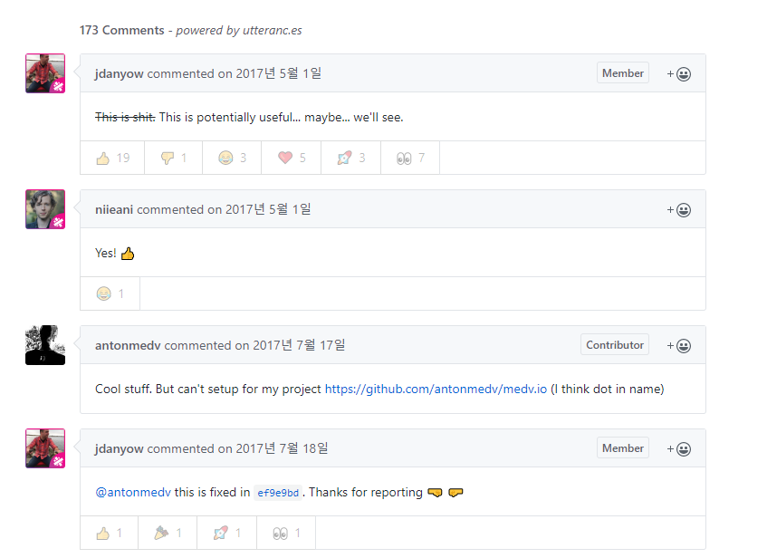

## Github댓글이 뭐예요??
기술 블로그를 열심히 돌아다니던 도중 깃 헙 UI의 신박한 댓글들을 보게 되었습니다.
사실 블로그 댓글 서비스로 페이스북 , 라이브리 등등 다양한 것들이 있지만
그래도 개발자라면 누구나 다 가지고 있는 Github UI의 댓글이 달린다는 것이 참 마음에 들었습니다.



> 블로그 하단 댓글이 위와 같이 심플한 UI 로 제공된다

찾아보니 Utterances 라는 서비스를 통해서 블로그에 Github을 통해 댓글을 달 수 있는 기능을
넣을 수 있다는 것을 알게 되어 실제로 적용을 해보았습니다.

원리는 레포지토리에 이슈를 생성하여 해당 이슈의 댓글을 iframe으로 가져오는 형태로 작동합니다.

## 블로그 적용방법
개발을 하실 줄 안다는 전제하에 블로그에 적용하는 방법은 상대적으로 쉽습니다.

1. Github에 Public Repository를 생성합니다.


> 이름은 `blog-comments` 정도의 네이밍이면 적당한것 같아서 저는 그렇게 설정을 해두었습니다

2. https://github.com/apps/utterances로 들어가서 github 앱을 설치합니다

>1번의 과정에서 만든 `blog-comments` Repository 에게 권한을 줍니다.


3. 아래의 코드를 본인에게 알맞게 수정합니다

```javascript
<script src="https://utteranc.es/client.js"
        repo="[repository 이름]"
        issue-term="[##_article_rep_link"
        theme="github-light"
        crossorigin="anonymous"
        async>
</script>
```
>repository 이름은 제 경우에 `techinpark/blog-comments` 로 넣었으니 자신의 URL 경로에 알맞게 수정하시면 됩니다.

 

4. 스킨 수정 메뉴로 접근하여 댓글 영역에 해당 스크립트를 붙여 넣어주면 끝

위 과정을 통하여 Github의 댓글 UI를 블로그에서도 사용할 수 있게 되었습니다.

## 시행착오 및 꿀팁 
저의 경우 SEO를 위해서 블로그 글 주소를 글의 제목으로 나오게 하는 옵션을 이용하였으나,
그렇게 하게 되면 `blog-comments` 레포지토리에 `issue` 제목이 지저분하게 달리는 문제점이 있습니다.

해결 방법은 블로그 글 주소를 숫자로 바꿔주시면 깔끔하게 적용됩니다.
블로그뿐만 아니라 단일 페이지에서 개발자들의 의견을 받고 싶을 때 유용하게 이용할 수 있을 것 같습니다.
