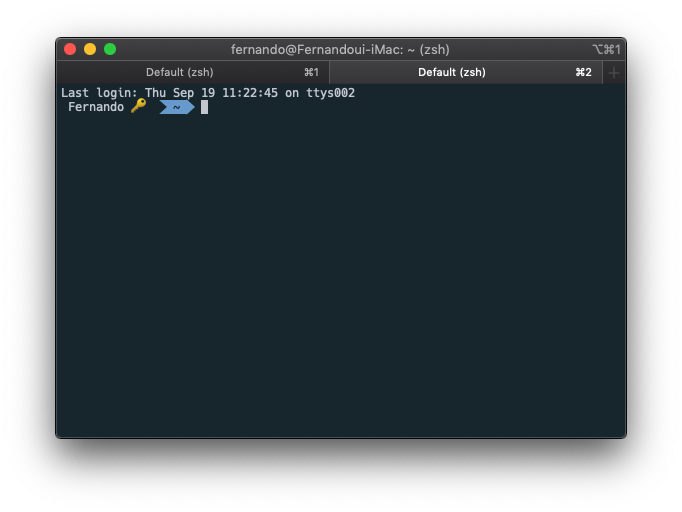

zsh 를 사용하다보면 터미널에 컴퓨터 이름과 사용자이름이 함께 나옵니다   
하지만, 라인도 길어지고 보기에도 별로 좋지가 않아 간단한 팁을 공유할까합니다. 


## 터미널에 적용하기 😎

1\. 먼저 **zshrc** 파일을 vim 으로 열어줍니다.

```bash
$ vim ~/.zshrc
```

  
2\. 파일 하단에 아래의 코드를 붙여 넣어 줍니다.  ( **{하고싶은이름}** 이부분을 원하는 텍스트로 바꾸시면됩니다 ) 

```bash
prompt_context() {
  # Custom (Random emoji)
  emojis=("⚡️" "🔥" "🇰" "👑" "😎" "🐸" "🐵" "🦄" "🌈" "🍻" "🚀" "💡" "🎉" "🔑"  "🚦" "🌙")
  RAND_EMOJI_N=$(( $RANDOM % ${#emojis[@]} + 1))
  prompt_segment black default "{하고싶은이름} ${emojis[$RAND_EMOJI_N]} "
}
```

참 쉽죠?   
간단한 코드 몇줄로 눈이 즐거워지는 아름다운(?!) 터미널을 사용해보세요   
개발이 조금 더 재미있어 집니다.