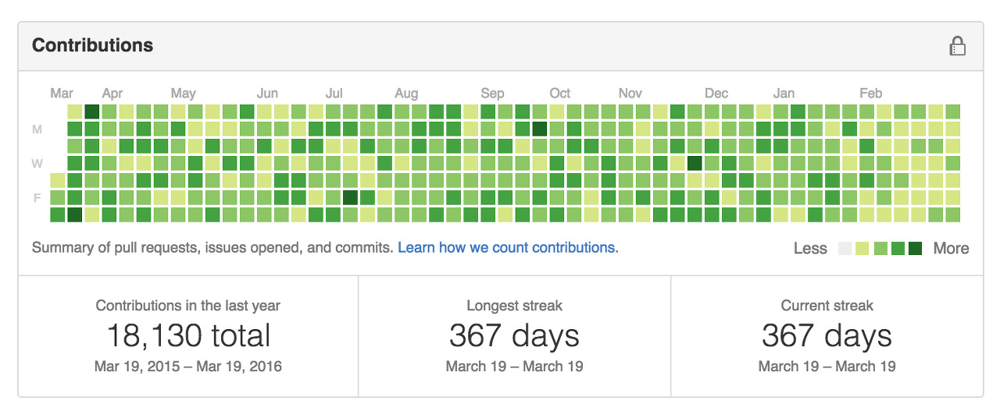
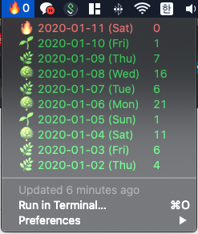

## 🌱 1일 1커밋 도전하기

  
개발자라면 모두가 가지고 있는 `Github`을 사용하게 해주는 가장 큰 동기부여는 잔디가 아닐까 싶습니다.  
꾸준히 개발을 할때마다 `Contributions`에 초록색 박스가 생기게 되는데 이것을 국내에서는 깃헙 잔디 라고 이야기 하는것 같습니다.   
  
신년을 맞아 개발자로써 세울 수 있는 목표중 이룰 수 있을만한것 이 무엇이 있을까 생각해보았을때  
가장 손쉽고 적절하게 할 수 있는것은 바로 깃헙에 1일 1커밋을 하는것이었습니다!   
  
1일 1커밋을 한다는것은 어찌보면 쉬울 수도 있지만 회사일이 아닌일을 매일 매일 커밋한다는 것은 결코 쉽지 않은 일입니다.  그래서 목표를 이루기위해 내가 1일 1커밋을 해야된다는 사실을 늘 상기하고 있어야 했습니다. 

그래서 많은 방법들을 고민하는 가운데 저는 이렇게 생각했습니다.

> 🧐 내가 맥을 사용하므로 메뉴바에 내가 커밋을 얼마나 했는지 나왔으면 좋겠다! 

감사하게도 이 고민을 해결해주는 오픈소스가 있었습니다.  바로 `Bitbar` 이라는 오픈소스 입니다. 

[BitBar - Put anything in your Mac OS X menu bar](https://getbitbar.com/)

이 오픈소스를 사용하면 원하는것을 스크립트로 작성하여 맥의 상단 메뉴바에 띄울 수 가 있습니다!   
여러가지 아이디어가 순간 떠올랐지만 지금의 목표는 깃헙 잔디를 가꾸는 정원사가  되는것이 올해의 목표이기 때문에 깃헙 커밋 유무를 한번 메뉴바에 표시해보도록 할게요   
  

## ☘️ Bitbar 설치 하고 잔디 기르기 

  
먼저 **bitbar**을 설치합니다. 맥에 **Brew**가 설치 되어 있으시다면 단 한줄의 명령으로 설치가 가능합니다. 

```bash 
$ brew cask install bitbar
```

설치 이후 **bitbar**을 실행하면 **Plugin**들을 설치할 디렉토리를 설정하게 됩니다.   
본인의 입맛에 맞게 적당한 디렉토리를 설정해 주시면 됩니다.   
  
  
설치를 하셨다면 Github의 Contribution을 보여줄 수 있는 플러그인을 받아야 합니다.   
> [https://getbitbar.com/plugins/Dev/GitHub/github-contribution.10m.rb](https://getbitbar.com/plugins/Dev/GitHub/github-contribution.10m.rb)


위의 플러그인 소스를 받으셔서 설치시에 설정했던 플러그인 폴더에 넣으셔도 되고,   
그 과정이 복잡하다고 느껴지시는 분들은 [여기](http://bitbar://openPlugin?title=Github%20Contribution&src=https://github.com/matryer/bitbar-plugins/raw/master/Dev%2fGitHub%2fgithub-contribution.10m.rb)를 눌러주세요 😁  
  
저는 위의 코드를 그대로 사용하지 않아요, 이유는 원본 플러그인을 적용하면   
커밋을 안했을 경우 💩 아이콘이 노출 되기때문에 조금 거북한 느낌이 있어서 변경 해서 사용합니다   
  

불꽃으로 바꿔서 사용하니까 좀더 열정이 뜨거워지는 느낌이랄까요?  아무튼 만족스럽습니다   
저처럼 불꽃으로 사용하고 싶으신 분들을 위해서 제가 살짝 수정한 플러그인 코드를 하단에 공유해드립니다.

> 물론 직접 플러그인 코드를 받으셔서 원하는 이모지로 수정하셔도 좋습니다 🎉

Plugin 폴더에 넣어주셨다면 이제 Github 계정을 세팅 해주어야 합니다. 

> plugin 코드의 이름을 보면 **github-contribution.10m.rb** 라고 쓰여있는데 여기에도 나름의 규칙이 있습니다. 10m 이라고 표기된 부분은 메뉴바의 데이터 갱신 주기라서 원하는 데로 적어주시면 되는데,   
> 현재는 10분에 한번씩 새로고침되도록 설정이 되어있는 상태입니다. 


~/.bitbarrc 파일을 생성하고 하단의 내용을 입력해줍니다 

```bash
# ~/.bitbarrc
[github_contribution]
username = GITHUB_ID_HERE
max_contributions = 10
```



설정이 끝났다면 이렇게 표시됩니다   
매일매일 동기부여 받을 수 있는 좋은 방법인것 같습니다.   
그럼 오늘도 즐거운 코딩하세요 궁금한 점이 있으시면 댓글로 남겨주세요 😎