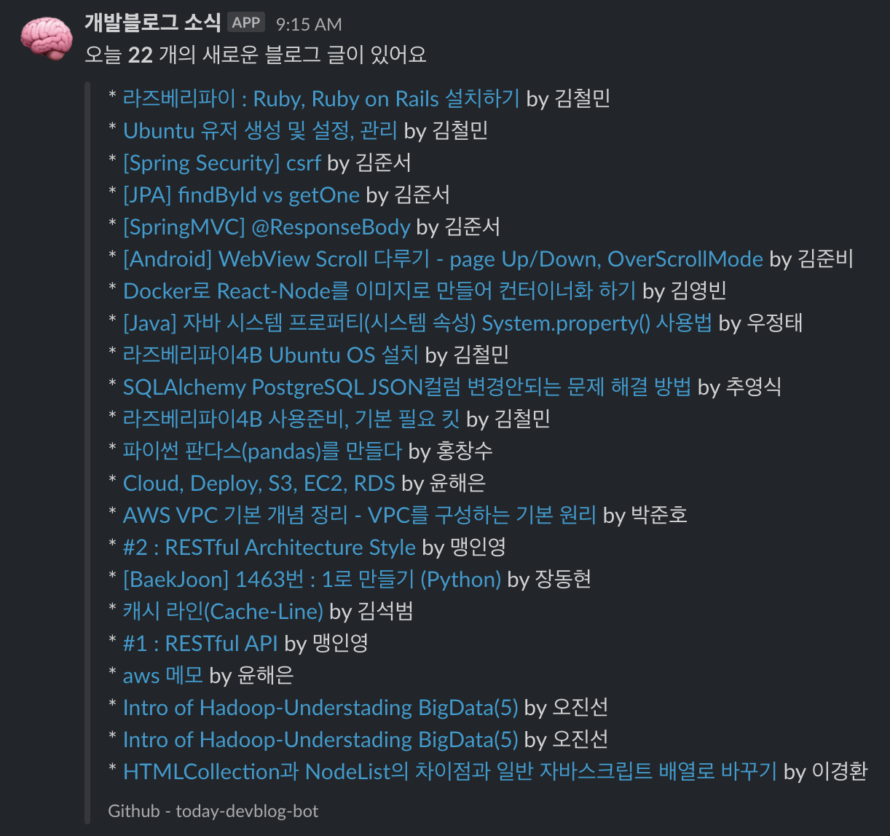

# 📕개발 블로그 글들을 매일 구독할 수는 없을까?
  
요즘에 다양한 개발블로그에서 유용한 포스팅을 자주 접할수 있는 시대가 되었습니다.  
개발블로그 글들을 보면 늘 내가 몰랐던 새로운 기술에 대한 이야기나 경험공유를 받을 수 있어 좋다는 장점이 있습니다.  
  
-   매일 오전 8시 출근시에 매일매일 새로운 글들을 전달 받을 수 있으면 좋겠다.
-   다양한 개발 블로그들의 컨텐츠를 보고싶다.

위 두가지의 주제에 꽃힌 나머지, 구현을 할 수 있을만한 방법을 찾아 보았습니다.  
그러던중 다음과 같은 오픈소스를 발견 하게 되었습니다.

- [sarojaba/awesome-devblog](https://github.com/sarojaba/awesome-devblog)

위 Github Repo에서 국내 개발자들의 블로그 리스트를 정리해주고 계셨고,  
사이트에서는 등록되어있는 블로그들의 새로운 글 목록을 확인할 수 있도록 사이트를 통해 제공해주고 계셨습니다  
README.md 에 쓰여있는것 처럼 사용을 해도 좋다고 쓰여있기 때문에 원 출처를 남기는 조건으로 작업을 시작 해보기로 하였습니다.

# 🛰서버없이 주기적인 실행이 필요하다면? Github Actions 이용기

```
-   매일 오전 8시 컨텐츠들을 받아보기 위해서는 매일 오전 8시 원하는 스크립트가 실행되어야합니다.
-   서버를 별도로 두기는 어렵기 때문에 알아서 실행이 되었으면 좋겠습니다.
```

## 구현하기
위 두가지 조건을 만족해주는 것을 곰곰히 생각해보니, 이번에 추가된 `Github Actions` 기능을 적절히 활용하면 될것 같다는 생각이 들었습니다.  
`Github Actions` 기능을 이용하면 linux 에서 쓰이는 `crontab` 문법을 동일하게 github 내에서 이용할 수 있게 됩니다.

그러므로 주기적인 작업이 필요하면서 서버를 따로 두지 않으려면 `Github Actions` 라는 대안이 생기게 된것입니다. 실제로 사용해보니 간단한 웹훅 봇을 만들때는 너무나 좋은것 같습니다.  
서버문제는 해결되었으니 이제 `어디로?` 전송을 해서 알림을 받을 것인지에 대한 문제가 남아있었습니다.

# 📨 슬랙 Incomming Webhook 을 이용한 메세지 받기

다양한 메신저 API가 있지만 저의 경우에는 슬랙에 있는 Incomming Webhook 기능을 이용하기로 마음 먹었습니다. 그 이유는 같은 개발자들이 많이 있는 슬랙채널에 주기적으로 블로그 포스팅글 을 공유하면 좋겠다는 생각도 있었고 생각보다 사용이 쉽기 때문입니다. 

# 🤖 슬랙봇 개발 결과 공유

- [techinpark/today-devblog-bot](https://github.com/techinpark/today-devblog-bot)
-   위의 조건을 만족시킬만한 봇을 만들었고 다음과 같이 만들어 졌습니다. 
    

## 마치며 
  
위 토이 프로젝트를 통해 매일 오전 8시에 다양한 주제의 개발 블로그 글들을 슬랙 채널안에서 받아볼 수 있게 되었고, 새로운 주제를 쉽고 빠르게 접할수 있게 되었습니다  😄  
  
모든 코드는 깃헙을 통해 오픈소스로 공개되어있으며, Fork 하여 사용하시면 여러분들 모두 동일한 환경으로 사용가능합니다.  안쓸 이유가 없는 **Github Actions** 지금한번 체험해보시는건 어떨까요?