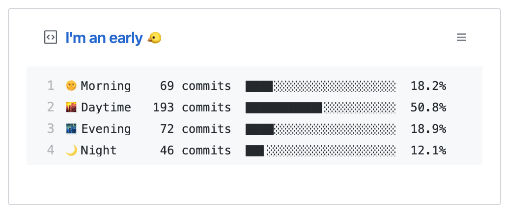
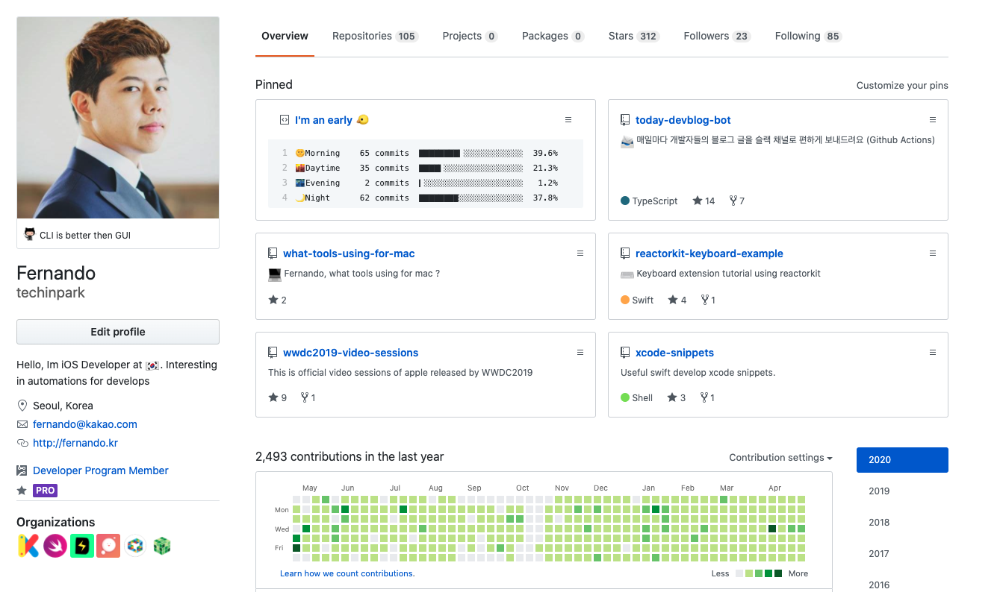

## Github 프로필에 Daliy 코딩시간 적용하기 

위의 사진처럼 내가 언제 `커밋` 을 가장 많이 하는지 알 수 있는 방법이 있습니다.  
손쉽게 적용을 하실 수 있도록 오픈소스를 한가지 소개합니다. 


### 적용해보기 ⚡️ 

- [techinpark/productive-box](https://github.com/techinpark/productive-box) `Repository` 를 `fork` 합니다. 

> 원작자의 `Repository` 에서 `Fork` 받아 국내 실정에 맞게 설정을 약간 변경하였습니다. 

- Github 에 들어가서 새로운 `Gist`를 생성합니다. (https://gist.github.com)
- Github 의 토큰을 생성합니다.  (https://github.com/settings/tokens/new)
> 권한을 이용하는 작업이기 때문에 위험하지만 해당 오픈소스에서는 `Gist` 파일을 `Github Actions`를 이용해 내용 업데이트 할때에만 사용합니다. 

- 새로 생성한 `Gist` 의 URL 주소의 뒷부분을 복사합니다. 
> https://gist.github.com/사용자아이디/"이부분을 복사하시면됩니다"

- `Fork` 해두었던 `Repository` 로 들어가서 `Settings` > `Secrets` 탭에 들어갑니다. 

### Secrets 등록하기 


```
GH_TOKEN : 생성한 GITHUB 토큰을 입력하여 저장합니다.  
GIST_ID :  Gist URL주소의 뒷부분을 입력하여 저장합니다.
```

- `Secrets` 등록이 끝난후 `Actions` 탭을 클릭하여 들어갑니다. 

- 들어간 이후 `Enable` 버튼을 눌러 `Actions`를 활성화 시켜주셔야 합니다. 

- 모든 설정이 끝났습니다 프로필로 돌아가셔서 `Pinned` 처리 해주시면 됩니다. 


## 적용 완료 🤖




생각보다 적용방법이 쉬우면서도 내가 언제 커밋을 가장 많이 하는지 한눈에 알 수 있어 좋습니다.  
물론 깃헙을 매일 이용한다는 전제가 있어야 겠네요 위외 같은 방법을 통해서 깃헙에 취미를 붙이는것도 좋을 것 같습니다. 바로 적용되지는 않고 기다리시면 자연스럽게 내용이 적용이 되실 거에요  
`Github Actions` 를 이용해 매시간 정각 업데이트 됩니다.
