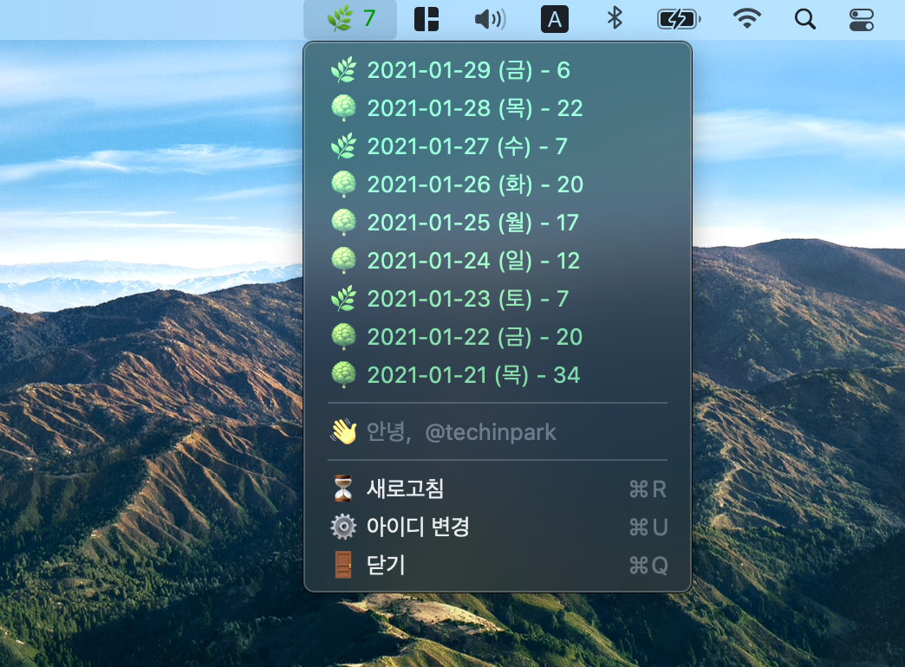
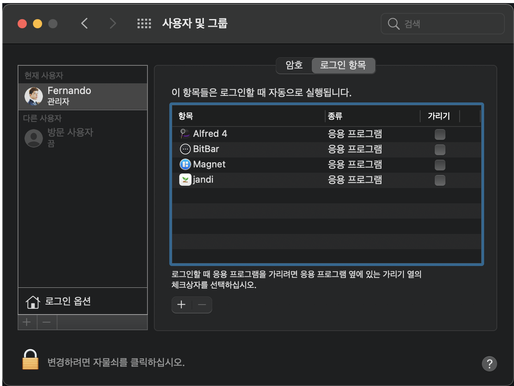

## 🌱 1일 1커밋 도전하기 

새해에는 깃헙을 꾸준히 이용해서 잔디를 기르시려고 하신 목표를 가진 개발자 분들이 많을 것이라고 생각합니다. 
저역시도 새해에는 하루도 쉬지 않고 커밋을 해봐야겠다는 목표를 가지고 있었는데 막상 업무를 하다보면 개인적인 프로젝트에 
커밋을 매일 하기란 쉬운일이 아닙니다.  

그럼에도 목표를 이루기 위해서는 늘 잘 보이는곳에 붙여놓는 방법이 저에게는 가장 적합한 것 같았습니다. 
그래서 메뉴바에 내가 커밋을 얼마나 했는지 봤으면 좋겠다는 마음을 가지고 있었고, 이전에 소개시켜드렸던 글인 
[1일 1커밋의 목표를 가지고 있다면 - Bitbar Github 플러그인 설정하기](https://fernando.kr/develop/2020-01-11-github-contributions/) 라는 글을 통해 메뉴바에 세팅하는 방법을 소개한 적이 있습니다. 하지만 제가 소개 드렸던 방법으로 설정이 올바르게 되지 않는 분들도 계셨고, 이제 막 개발에 입문 하신 분들이 스크립트를 추가하고 삭제하는 과정에서 어려움을 느끼실 수도 있다고 판단되어 같은 기능을 하는 간단한 맥 어플리케이션을 스토어에 업로드 했습니다 

## 🌳 Jandi 설치하고 잔디 기르기 

먼저 `Jandi` 를 설치하기 위해서는 복잡한 과정이 필요가 없습니다. 
앱스토어에서 `Jandi` 를 검색하셔서 설치하기서나 [이곳](https://apple.co/36xa0df)을 눌러 설치해주시면 됩니다. 
설치를 하신후 앱을 실행시키셔서 Github 아이디를 입력하시면 모든 설정은 끝이 납니다. 

## ✨ Jandi를 효과적으로 사용하는 방법 

재부팅을 하게되면 `Jandi` 또한 재시작 시켜야하는 불편함이 있기 때문에 설정에 들어가서 시작시 자동실행 되도록 설정을 해주신다면 더욱더 효과적으로 사용하실 수 있습니다 

사과 모양 - 환경설정 - 사용자 및 그룹 - 로그인 항목 으로 들어가셔서 `jandi` 를 시작항목에 넣어줍니다
이렇게 설정을 마치게되면 재부팅을 하여도 자동 실행되어 편리하게 사용할 수 있게 됩니다. 

## 마무리

어차피 해야할 일이라면 즐겁게, 키워간다는 느낌으로 깃헙의 잔디들을 길러보는건 어떨까요? 
제가 소개해드린 맥앱을 통해 1일 1커밋을 결심하신 모든 개발자 분들에게 훌륭한 자극제가 된다면 좋겠습니다 
모든 습관은 작은것에서 부터 시작하고 꾸준히 할때 결실을 맺을 수 있는것 같습니다. 
아직 늦지 않았습니다 지금 한번 시작해보시는것은 어떨까요? 

## 🤷🏻‍♂️ Jandi 추가하고 싶은 기능이 있다면? 

[Jandi](https://github.com/techinpark/Jandi) 는 오픈소스 입니다. 언제나 추가하고싶거나 개선해야할 사항이 있다면 방문해주셔서 이슈로 의견을 남겨주시면 반영할 수 있도록 하겠습니다. 여담으로 맥앱스토어 뿐만아니라 `Brew` 를 통해 설치하실 수 있도록 하려고 했으나 최소 등록요건인 `Star 75개` 의 벽에 막혀 등록을 반려처리 당했습니다 😢
최소 요건이 충족 되는데로 `brew` 명령을 통한 설치를 지원할 예정입니다.  

## 🔗 Reference 

- https://github.com/techinpark/Jandi

