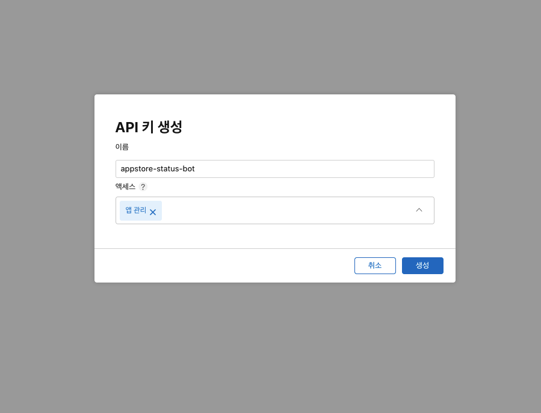
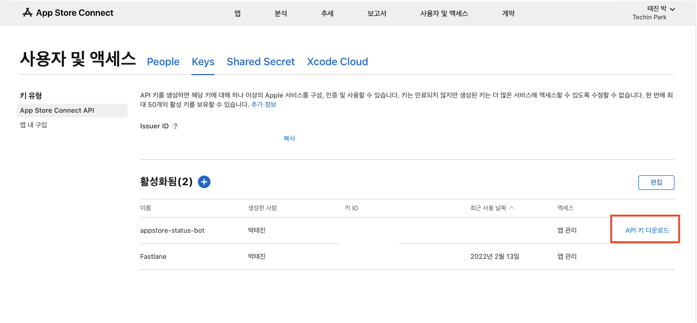

이전에 올렸던 포스팅인 [iOS 앱 심사상태를 팀원들과 쉽게 공유해보자!](https://fernando.kr/ios/2020-11-08-ios-appstore-status-bot/) 라는 글을 통해서 해당 봇을 개발하게된 계기를 올린 적이 있습니다. 
많은분들께서 해당 오픈소스를 활용해주시기 위해 많은 관심을 보여주셨고 현재도 사용중인 것으로 알고 있어요! 감사합니다! 

하지만, 한가지 제가 간과 했던 부분이 있습니다. 그것은 바로 너무 개발자 위주의 설명이었던 것이에요
QA직무를 수행중이신 깃헙을 사용해보지 않으신 분들은 현재의 가이드로는 설정이 너무 어려운것이 문제였습니다. 

저또한 많은 오픈소스 프로젝트들에 관심을 가지고 보는 편이지만, 좋은건 알겠는데 그래서 어떻게 사용하는거야? 
라는 생각이 들때가 많습니다 프로젝트를 직접 만든분들의 시각에서는 이정도면 충분해 라는 생각으로 적어주셨겠지만 제로베이스의 지식인 상태에서는 적용이 쉽지 않더라구요

자 그럼 서론은 이쯤하고 본론으로 들어가서 세팅하는 법을 알아보도록 하겠습니다 

## 1. fork 하기

[레포지토리](https://github.com/techinpark/appstore-status-bot) 에 들어가 `fork` 를 누릅니다. 

본인의 계정에 하시려면 본인 계정으로 포크를 하시면되고, 회사에서 사용하시려면 속한 `Organization` 에 `fork`를 해주셔도 됩니다. 
이후에는 본격적으로 설정을 위한 파일들을 만들기 위한 작업을 해보겠습니다 

## 2. Apple Connect API를 사용하기 위한 준비 

`appstore-status-bot` 은 현재 `appstore connect api` 를 사용하고 있습니다. 해당 API를 통해서 데이터를 가져오기 때문에 애플에서 제공해주는 키가 필요합니다. 
해당 키 정보를 통해서 나의 신원을 확인하고 나의 정보를 가져온다 정도로 이해해주시면 될 것 같습니다. 

키를 생성하기 위해서는 [App Store Connect](https://appstoreconnect.apple.com/access/users) 에 접속합니다.

사용자 및 액세스 탭에 있는 [Keys] 를 선택합니다. 

+ 버튼을 선택하여 새로운 키를 생성합니다 

액세스 권한으로는 위와 같이 설정을 해줍니다 

API키를 다운로드 합니다. API키는 한번다운로드 받으면 다시 받을 수 없도록 되어있기 때문에 잘 보관하셔야 합니다 

페이지에 있는  `ISSUER_ID`, `KEY_ID`, `PRIVATE KEY`는 잠시후 설정을 할때 사용됩니다. 

## 3. 슬랙 웹훅 생성하기

슬랙 웹훅 URL을 생성해야하는데 슬랙 왼쪽 메뉴바에 있는 `More` 를 누르게 되면 Apps 라는 항목이 있습니다. 이곳을 클릭하여 들어간 이후 `Incomming Webhook` 을 검색합니다.
들어가시면 Add to Slack 이라는 버튼이 있는데 그것을 클릭하시면 생성할 수 있는 페이지로 이동이 되고 해당 페이지에서 상세 정보를 설정하실 수 있습니다. 

받고싶은 채널, 웹훅의 이름, 아이콘 등 원하시는데로 설정을 하신 이후 제일 중요한  Webhook URL을 복사하여 보관하셔야 합니다 

그이후 `Save Settings` 버튼을 누릅니다 

## 4. 깃헙 관련 설정하기 

### 깃헙 토큰 세팅하기

업데이트 내역을 주기적으로 가져와서 상태가 바뀌었을때만 알림을 주는 방식이기 떄문에 파일에 내용을 기록할 수 있어야하는데 이부분을 깃헙에서 제공하는 `gist`를 활용하도록 구성이 되어있습니다. 
깃헙액션에서 해당 파일에 내용을 저장하고 불러오기 위해서는 권한이 필요한데 이것을 하기 위한 토큰을 생성해주어야 합니다. 

[Github Personal access Tokens](https://github.com/settings/tokens) 페이지로 들어와서 `Generate New Token` 버튼을 선택합니다.

이후 보이는 페이지에서는 토큰에 부여하게될 만료기한과 권한들을 체크하게 되는데 `repo` , `gist` 권한을 주시면 됩니다. 
아무래도 만료되지 않는 키가 한번 세팅해두면 신경쓸 필요가 없어 가장 편하겠지만, 키가 만료되면 다시 키를 생성해주셔야 하기 때문에 상황에 따라 설정해주시면 되겠습니다!

여기서 부여받은 키도 1회만 노출이 되고 이후는 다시 볼 수 없으니, 잘 저장해둡니다 

### 깃헙 GIST 생성하기 

권한까지 생성을 하셨다면 다음은 업데이트 내역들을 기록할 DB가 되어줄 파일을 생성하여야 하는데요 [Github Gist](https://gist.github.com/)로 접속합니다. 
들어가셔서 적당히 파일이름을 적어주시고 `description` 또한 작성해줍니다. 

이후에는 `Create secret gist` 버튼을 통해 비공개 파일로 저장을 해줍니다.
저장을 하시게되면 URL이 `https://gist.github.com/깃헙ID/XXXXXXXXXXXXXX` 형태로 나오게 되는데 `XXXXXXXXXXXXXX` 부분을 복사해서 `GIST_ID` 로 사용하시면 됩니다. 

## appstore-status-bot 설정하기 

상단에서 했던 정보들을 이제 깃헙레포지토리에 세팅을 해주어야 합니다 먼저 `fork` 했던 레포지토리로 이동을 하셔서 `Settings` 탭에 들어갑니다. 
옵션에 있는 `Secrets` - `Actions` 탭으로 들어가서 이제 상단에서 얻은 정보들을 차근차근히 넣어주시면 됩니다. 

| 키이름 | 내용 | 
|-|-|
|BUNDLE_ID| 앱의 ID라고 보시면됩니다 `com.example.test` 형태로 구성되어있습니다 2개이상 입력하실때는 콤마를 통해서 구분됩니다| 
|GH_TOKEN| 깃헙 토큰을 넣어주시면 됩니다| 
|GIST_ID| Github GIST의 ID를 넣어줍니다| 
|ISSUER_ID|Appstore Connect 에서 복사하여 사용합니다| 
|KEY_ID| Appstore Connect 에서 복사하여 사용합니다|
|PRIVATE_KEY| Appstore Connect 에서 받아두었던 `.p8` 파일의 텍스트 내용을 복사하여 그대로 넣어줍니다| 
|SLACK_WEBHOOK| SLACK 웹훅 주소를 넣어줍니다|

## 마치며 

위에서 설명드린 것 처럼 설정을 하시면 앱의 상태가 변경 될 떄마다 슬랙으로 메세지를 받아 보실 수 있습니다.  
위의 과정을 하셨음에도 불구하고 잘 이해가 되지 않거나 문제가 발생한다면 알려주세요! 감사합니다 