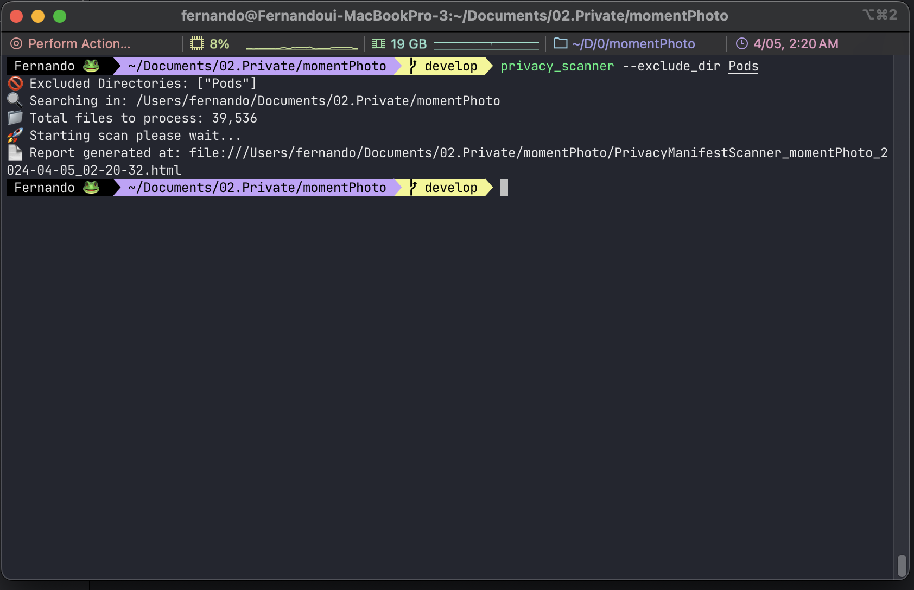
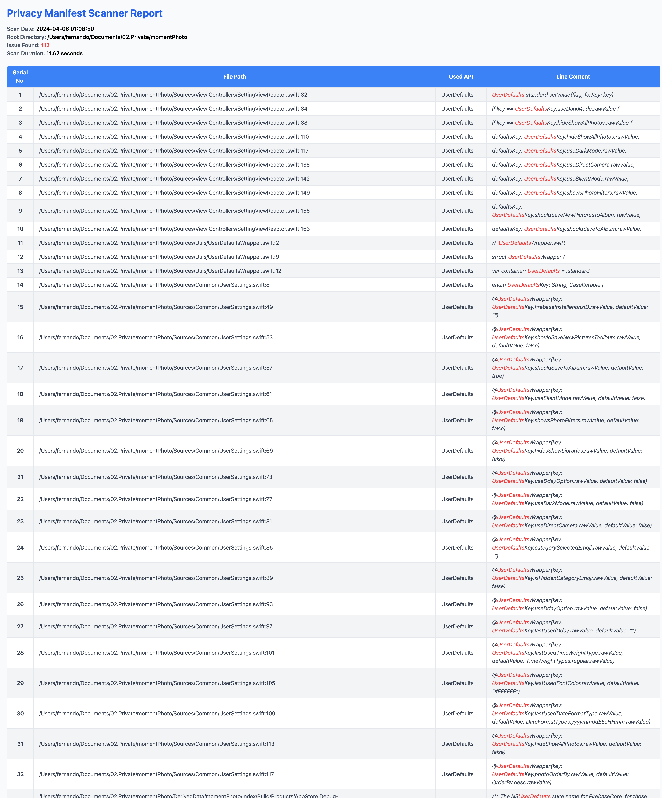

Apple은 5월 1일 부터, 새로운 개인정보 보호정책을 적용하여 `Required Reason API`를 사용한 이유를 설명하지 않은 앱들은 업데이트를 허용하지 않을 예정이라고 발표하였습니다. 

 그렇다면 `Required Reason API`는 어떤 것들이 있고 어떻게 대응을 해야할까요? 
[공식문서](https://developer.apple.com/documentation/bundleresources/privacy_manifest_files/describing_use_of_required_reason_api)에 설명되어있어 링크로 대신하겠습니다. 

공식문서를 보고 대응하려면 위 문서에 기록되어있는 API들을 사용중인지 모두 점검을 해야하는데 해당 과정이 불필요한 리소스를 많이 필요로 하여 나의 프로젝트에서 `Required Reason API`를 사용중인지 확인해주고 보고서로 확인해보실 수 있도록 간단한 스크립트를 만들었고 공유해볼까 합니다.


## 🎁 privacy-scanner 소개 

- https://github.com/techinpark/ios_privacy_manifest_scanner

나의 프로젝트에서 사용중인 `Required Reason API`를 모든 파일을 스캔하여 확인해주고, 해당 결과를 HTML 파일로 리포트 해줍니다. 아래에서 간단한 사용법에 대하여 설명 드리도록 하겠습니다. 

### ✨ 설치하기 

해당 스캐너는 [mint](https://github.com/yonaskolb/Mint) 를 통해서 배포하고 있기에 `mint`를 설치해주셔야 합니다.  
터미널에 아래 명령을 순차적으로 입력합니다. 

- `mint` 설치하기
```sh
$ brew install mint
```

- `privacy-scanner` 설치하기 
```sh 
$ mint install techinpark/ios_privacy_manifest_scanner
```

위 과정을 통해서 성공적으로 `privacy-scanner`을 설치 할 수 있습니다. 


## 🔎 privacy-scanner 사용해보기

`privacy-scanner` 은 간단한 사용법을 통해 사용할 수 있도록 제작 되었습니다. 
터미널에서 아래와 같이 입력하여 사용하실 수 있습니다. 

```sh 
$ privacy_scanner [flags]
```

위 명령을 통해서 실행할 수 있고, 들어가는 `flag`를 모두 생략해도 됩니다. 
하지만 기본적으로 대부분의 프로젝트는 `Cocoapods`를 사용하는 경우도 있어 `Pods` 디렉토리도 순회를 하면 시간이 오래걸릴 수 있으므로 검사가 필요없는 디렉토리는 제외할 수 있는 옵션을 제공하고 있습니다. 


### Flag 알아보기 

- `--path <path>` : 기본적으로는 `privacy_scanner`을 실행한 디렉토리를 기본값으로 가져가서 생략가능하지만, 다른 위치에 있는 프로젝트를 검사하고 싶은 경우 사용합니다. 
- `--exclude_dir <directory>`: 제외하고 싶은 폴더경로를 넣을 수 있는 옵션입니다. 기본값은 `Optional` 입니다. 해당 값을 생략하면 해당 프로젝트내에 모든 디렉토리를 검사합니다.


### Example 



```sh
$ privacy_scanner --path ~/Documents/projectFolder --exclude_dir Pods
```


## privacy-scanner가 제공하는 Report



위 명령을 수행하게되면, 스크립트가 작동하여 해당 프로젝트내에 있는 `Required Reason API`를 정리하여 `HTML` 형태의 리포트로 제공하여 줍니다. 
위 `Report`의 내용을 기반으로  `PrivacyInfo.xcprivacy`를 작성하여 심사에 대비하면 됩니다. 

대부분의 경우 `3rd party` 라이브러리 같은 경우는 최신버전에서 대응이 되었으니 업데이트를 하시면 되고, 나의 앱에서 사용중인 `Requird Reason API`를 파악하여 추가 대응하는 형태로 진행하면 됩니다. 

## 마치며

위에서 설명드린 `privacy_scanner`을 통해서 보다 편하게 새로운 개인정보호정책에 대응하실 수 있었으면 좋겠습니다.  
위의 과정을 하셨음에도 불구하고 잘 이해가 되지 않거나 문제가 발생한다면 알려주세요! 감사합니다 