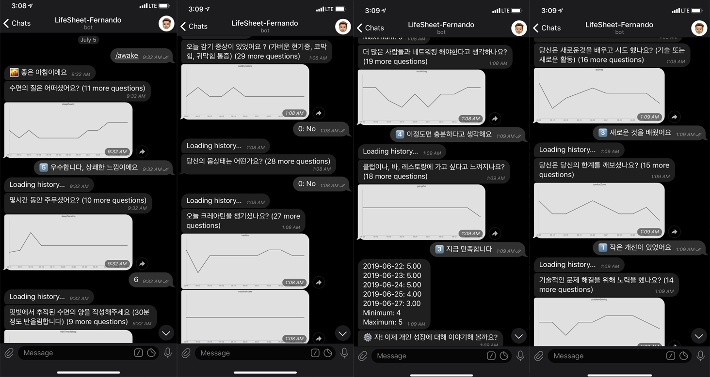

지난 3년간 개인적인 사업을 하다가, 회사에 입사한지 어언 `7개월`이 되어간다.  
벌써 2019년의 절반이 지나갔기 때문에 상반기에 대하여 회고 하는 시간을 가지고자 블로그 글을 남긴다. 

## What is your job now? 

개인적으로 일하던 때와는 다르게 회사에서는 회사만의 고유 문화가 있고, 새로운 사람들이 있으며 그들만의 업무 방식이 있다.  
회사 에서는 `iOS` 개발 파트의 업무를 맡게 되었고, 운영되고 있는 서비스를 유지보수 하면서 새로운 기능을 추가해 나가야 하는 업무를 맡았다.  
해당 파트 프로젝트에 대해 남아있는 자료는 거의 없다시피 하였고, 있어도 쓸모가 없었다.   
하지만 운좋게 들어온지 3개월만에 같은파트에 좋은동료가 생겨 함께 서비스를 열심히 개선해 나가고 있다.  

스타트업의 특성상 서비스는 빠르게 성장하고 변화 하기 때문에 고객의 니즈에 맞게 개발되어 오다보니 기록을 남길 시간이 없었을 것이라고 생각하고 있다.  
기록을 남기는것은 귀찮은 일이지만 잘 정리해놓으면 훌륭한 자산이 되기때문에  
개인적으로는, 개발 능력도 중요하지만 히스토리를 기록 하는 것도 매우 중요하다고 생각한다. 

개인적으로 글쓰기와 정리하는 것을 좋아하기 떄문에 내가 아닌 누군가가 오더라도 빠른 시일 내에 해당 프로젝트를 이해하고 투입될 수 있는 수준으로 만드는것이 큰 목표가 되었다.   
그렇다고 회사를 나가겠다는것은 아니고, 모든 정보는 모두가 함께 알고있어야 한다고 생각하기 때문이다. 

묵묵히 내가 맡은일을 하는것, 회사가 성장 하고있는 이시점에 좋은 동료들과 함께 할 수 있어 매우 감사하고 나또한 함께 성장하고 있음에 감사하다. 

## What do you Things?

### 회사와 관련된 생각 

회사에 들어온 이후로 매주의 절반 이상을 회사에서 보내기 때문에 회사와 관련된 일들에 대해서 생각하는 시간이 자연스럽게도 많아졌다.
그중에 몇가지를 꼽아보자면 다음과 같다.

#### 왜 갑작스럽게 입사를 하셨나요? 

지난 12월, 입사하게 된 이유는 다름이 아닌 여자친구와의 결혼 때문이었다. 결혼을 하기위해서는 안정적인 수입이 필요했고, 회사에 취업이 되어야만 `전세자금대출` 과 같은 복지를 누릴 수 있기 때문이었다. 프리랜서는 수입이 일정하지 않기 때문에 `대출`을 받기도 어려울 뿐더러 수입도 일정치 않다. 

혼자 생활을 했다면 당연히 하지 않았을 고민이지만, 함께 하고싶은 사람과 미래를 꿈꾸기 위해서는 회사에 들어가서 안정적인 사람이 되는게 우선이었다. 
지금 생각해보면 당시에 나를 회사로 들어가게 해준 여자친구에게 정말로 고마움을 느낀다. 

덕분에 지금의 회사에서 너무나도 좋은 사람들을 만났고, 좋은 서비스를 만났고, 오늘보다 내일더 발전하려고 노력하는 사람이 된것 같다. 

내가 열심히 하는 이유는 개인적인 성장을 위하는 것도 있지만, 내 인생에서 가장 중요하게 여기는 가치인 가족을 지키기위함 인것도 있다. 

곧 10월에 가족이 될 예비신부에게 감사함을 느끼며  
늘 열심히 언제나 최선을 다하며 살아가야겠다고 생각한다. 

#### 회사 업무중 최근 생각하고 있는것들은 무엇인가요? 

- 서비스를 하는 회사에서 어떤식으로 서비스를 운영하는지
- 유저들의 피드백을 어떻게 반영하는것이 좋은지
- 개발측면에서 어떻게 유저들에게 더 좋은 경험을 제공할 것인지 
- 기존 레거시 코드들을 어떻게 효과적으로 제거하고 개선해 나갈 것인지 
- 자동화 할수 있는 부분에 대한 고민 (업무 생산성 향상)

다음과 같은 생각을 하면서 상반기를 보낸것 같다. 
제한된 리소스를 가지고 최고의 퍼포먼스를 이끌어 내는것이 개발자가 할일이라고 생각하고 입사 이후 다양한 봇들을 구상하여 개발하였다. 

하지만 개인적인 생각과 회사가 가지고 있는 목표는 다를수 있기떄문에 이러한 열정은 조금 접어두고 서비스에 포커스를 맞춰야 할것 같다. 

###  개인의 삶과 관련된 생각 

일주일의 대부분을 회사에서 보내지만 결국에 나는 지구에 살고있는 수많은 사람들 중 한사람 일뿐이다. 회사의 일도 중요하지만 개인적인 삶과 일정도 굉장히 중요하다.
개인적으로 나의 라이프스타일을 어떻게 데이터화 시킬 수 있을까에 대한 고민을 하면서 살아가고 삶의 패턴을 만들기 위해서 다양한 생각을 하고있다. 

#### 나의 인생을 좀더 효과적으로 관리 할 수는 없을까? 

매일매일을 흘려보내듯이 살기보단, 오늘 하루를 시작하기전과 자기전에 오늘을 되돌아보며 간단하게 일기를 쓰고 싶은 마음이 들었다. 

일종의 `하루회고` 라고 볼 수 있는데, 그냥 내가 하고싶어서 하는것이기 떄문에 뭐 이런거까지 해야하나? 라고 반문한다면 할말이 딱히없다. 
하루회고를 진행하기전에 생각했던 점은 다음과 같다. 

- 일기를 쓰기에는 너무 무거운 느낌이라 가볍게 쓸 수 있어야함 (지속성)
- 기록을 손쉽게 작성할 수 있어야함 (편의성)
- 내가 남긴 기록을 시각화 할 수 있어야함 (편의성)

그렇게 찾아보던 도중, `Google` 개발자인 @Felix 님이 나와 같은 고민을 했다는것을 알게되었고 그가 만든 텔레그램 봇`LifeSheet`을 이용하여 나만의 봇을 만들게 되었다.
간단하게 소개를 하자면 다음과 같다. 

**텔레그램봇 (LifeSheet-Fernando)**
>

**저장되는 데이터(Google Sheet)**
>  

하루의 상태를 간단하게 기록을 할 수 있는 형태이고, 자신이 원하는 질문/답을 설정 하면 
텔레그램을 통해 간단히 전달되며 내용은 구글스프레드 시트에 저장된다. 

사용해본 결과 내가 사용하기에 최적의 방법이라는 것을 알았고 몇가지 추가하고 싶은 기능들이 생겼다.
위의 봇에 대해서는 궁금하신 분들이 많다면 단독으로 포스팅 할 예정이다. 

## What is your plan ? 

#### 하반기 계획 예정중인 일들은 무엇 인가요? 

2019년이 벌써 상반기가 지나갔고, 이제 시작된 하반기에서는 다음과 같은 일들이 예정 되어있다. 

- 결혼 과 신혼여행 (새로운 인생의 시작)
- 회사업무 기여하기 
- 입사 1주년 기념 회고 블로그에 남기기 
- 오픈소스 프로젝트에 기여하기
- 운동 열심히해서 체중 줄이기 (근육량 올리기)

인생에서 가장 중요하다고 볼 수 있는 결혼을 앞두고, 하반기 부터는 본격적으로 
새로운 마음으로 나의일을 더 열심히 할 수 있는 원동력을 얻게 될 것 같다.

또한, 12월이면 벌써 회사에 입사하게 된지도 1주년이 되기 때문에 지난 1년동안 회사에 들어와서 내가 발전하게 된 점, 부족한 점들을 돌아보고 돌아오는 새해에 어떠한 마음가짐과 멘탈로 회사에서 도움이 될만한 존재가 될 수 있을지 회고를 하는 시간을 가질 예정이다. 

그리고 3번째 목표는 오픈소스 프로젝트에 기여하기로 잡았는데, 사실 그동안 오픈소스 프로젝트들을 가져다 쓰기만 했지 실제로 내가 해당 프로젝트에 기여한 적은 없었고 
깃헙에도 별로 관심을 가지지 않았다. 하지만 올해부터 열심히 깃헙을 쓰기 시작하면서 다양한 오픈소스 프로젝트에 관심을 가지게 되었고 오픈소스 기여에도 관심을 가지게 되었다. 

관심을 가지게 된 이후로 [carbon](https://github.com/dawnlabs/carbon) 과 [SkeletonView](https://github.com/Juanpe/SkeletonView) 프로젝트의 한국어 번역에 기여하였지만, 2019년 하반기에는 `개발자`로써 코드 기여를 하고싶다는 생각이 있고 또 실천해볼 생각이다. 

> 모두가 보는 프로젝트에 코드를 기여하기 위해서는 메인테이너가 보기에도 쓸만하고 괜찮은 코드 여야 하기 때문에 나의 실력향상에도 도움이되고 결과적으로 나의 코드가 `merge` 되지 않더라도 메인테이너가 항상 코멘트를 달아주기 때문에 인기있는 오픈소스 메인테이너에게 `공짜` 코드리뷰를 받게되는 셈이니까 긍정적으로 도전해보고자 한다! 

마지막으로 올해 하반기부터는 회사 근처에 있는 헬스장을 등록했기 때문에, 죽이되던 밥이 되던 퇴근하고나서는 꼭 운동을 하는 습관을 들일 것이다. 
오랫동안 개발자로 일하기 위해서는 좋은체력이 뒷받침 되어줘야한다.

2년 전까지만해도 운동을 꾸준히 했기때문에 당시 운동할때의 몸이 그립기도 하고,
제일 좋았던건 정신력이 당시 그상태로 돌아오게 된다면 지금보다도 더 많은 일들을 수월하게 할 수 있을것 같기 때문이다. 

#### 와! 할게 너무많은데요? 

한번 태어난 인생에서 해야할 일들이 많은 것은 당연하다고 생각한다. 
물론 편하게 살고싶다면 편하게 살 수 있겠지만 본인은 직접 어려운일이던 쉬운일이던 몸으로 부딛혀가면서 세상에 도전하는 것을 좋아하기 때문에 나에게 있어서 피할수 없는 숙명 이라고 생각한다. 

하반기에는 어떤 일들이 벌어질지 모르겠지만, 가슴 설레는 일들이 많이 생겼으면 좋겠다. 

앞으로도 꾸준히 내가 맡은 일과 작업들에 대해서는 천천히 기반을 다져서 길고 넓게 나아가기 위해서 노력을 부단히 해야할것 같다. 

## 마무리 

올 2019년 상반기가 나에게 있어서는 인생의 전환점이라고 할 수 있다.  
좋은 서비스를 가진 회사에 취업되어 좋은 동료들과 함께 일할 수 있는 기회를 얻었다.  
올 한해가 마무리되는 2019년 하반기 회고때에는 조금더 좋은 내용을 많이 채울 수 있도록 열심히 노력해야 겠다는 생각이 든다.  
환경이 사람을 만든다는 말이 있듯이, 좋은 환경과 사람들이 옆에 있기 때문에 나만 열심히 하면된다. 

회사를 다니게 되면서 가장 중요한 가치는 물론 `돈` 일 수 있다.  
하지만, 내가 생각하는 가장 중요한 가치는 총 2가지가 있다. 

- 나와 함께 같은 열정을 가지고 일을 할 수있는 동료들의 존재 여부
- 나에게 동기부여가 되는 사람의 존재 여부 

어떤 회사를 가더라도, 저 부분은 매우 중요한것 같다.  
>나에게 동기부여가 되는 사람들이 있는 회사를 다녀야 개인적인 발전과 역량이 발전 할 수있기 때문이다. 올해는 생각이 조금 바뀌었는데, 일단 나부터 다른 사람들에게 동기부여가 될 수 있는 사람이 되는것이 좋겠다고 생각했다. 

모두가 같은 열정을 가지고 있지는 않지만, 그래도 현재는 열정이 있는 사람들과 함께 일 할수 있어서 행복하다. 

현재는 내 파트에서 더 좋은 서비스를 만들기 위해 고군분투 할것이다.  
다가올 2019년 하반기에도 화이팅 하면서 한걸음 한걸음 힘차게 나아가고싶다. 