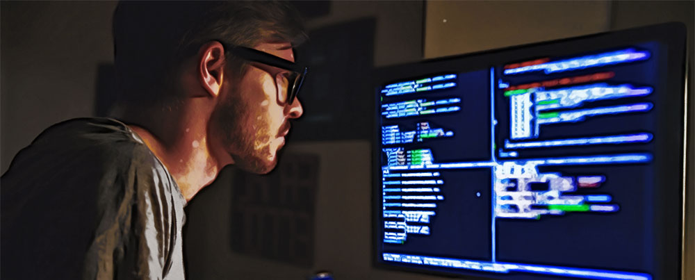

벌써 2019년이 한 달도 안 남았네요. 시간 참 빠르지 않나요? 이 글을 읽는 여러분들의 시간도 빠르게 지나갔으리라 믿습니다.  
저에게 있어 2019년은 다양한 경험과 소중한 순간들이 공존하는 뜻깊은 한 해였습니다.  
지금부터 올 한해 (2019년)에 있었던 일들을 되돌아보고 부족했던 점들은 조금 더 보완해서 더 나아갈 수 있는 방향으로  
나아가고잘했던 점들은 다시 한번 되돌아보려고 합니다.

## 왜 늘 수트를 입나요? 👔

혼자 일하게 되었을 때부터 늘 누군가를 갑자기 만나야 하는 상황이 있었고, 예기치 못한 상황에 대처해야 했기 때문에  
단정한 수트를 입게 되었는데 습관이 돼서 편하게 느껴집니다. 최근에는 복장이 자유로운 회사에 다니고 있는데  
개인적인 느낌이지만 복장이 자유로워지면 마음가짐도 자유로워지는 이유 때문에 마음가짐에 제약을 주기 위한 일종의 `Lint` 로사용한다고 보면 될 것 같습니다. 복장을 갖추면 마음가짐과 행동 또한 한 번 더 생각하고 행동할 수 있기 때문에 나름 괜찮은 방법인 것 같습니다.

## 짧았던 3년간의 사업을 마치고 회사의 일원으로 합류하다.

이전에 회사원으로써의 경험이 없던 것은 아닙니다.  
다만 회사생활을 하다 보니 "매일 같은 일상과 같은 업무가 반복되는 것이 과연 나의 인생에 있어 유익할 수 있을까?"라는 고민을  
하면서 살았던 것 같습니다. 내가 하고 싶은 일들을 하면서 돈을 벌 수 있으면 얼마나 좋을까요?  
감사하게도 저는 그러한 경험을 3년간 하였습니다. 물론 어려움도 많았지만, 그 시간 이후로 저는 인생이란 실패와 성공의 점들이 모여 이루는 한 가지의 선 같은 결과라고 생각하게 되었습니다.

항상 행복한 일들만 있던 것은 아니었습니다.  
달콤했던 월급을 뒤로한 채 밖으로 나와보니 이것은 아무도 나를 보살펴주지 않는 정글과 같이 험난한 곳에서  
많은 사람들에게 저를 알리고, 제가 하는 일에 대해서 설명해야만 했습니다.

일은 그냥 주어지지 않았습니다. 목마른 자가 우물을 판다고 했었나요? 목말랐던 저는 가진 것이 없었지만 사무공간을 얻기 위해 테헤란로에 있는 코워킹 스페이스에 무작정 들어가 사무실을 쓰고 싶다고 이야기하였고 결과적으로 돈이 없어 제가 가지고 있는 기술을 통해 홈페이지를 만들어주고 관리해줄 수 있다고 제안하였습니다.

지금 생각해보면 어떻게 이러한 제안을 할 수 있었는지, 그때의 용기가 아찔하네요  
하지만 저의 제안을 좋게 생각해주신 덕분에 저는 테헤란로의 사무실을 저렴한 가격에 이용할 수 있게 되었었습니다.  
그런 식으로 사람들이 많은 공간에서 각자의 꿈을 향해 매일매일 노력하는 창업가들과 함께 일할 수 있는 기회가 있어  
돈을 잘 벌지는 못하지만 내일에 대한 뜨거운 희망의 열정으로 하루하루 행복하게 살 수 있었습니다.

지난 3년을 돌아보면 큰 성공은 없지만 그 안에서 유의미한 성과들을 얻기도 하였고,  
인생에 커다란 교훈들을 얻을 수 있었습니다.  
욕심 없이 잘 지내던 제가 왜 3년간의 사업을 정리하고 회사의 일원이 되었는지 궁금하실 거예요  
이 이야기는 다음에 하기로 하고, 2018년 12월 IT서비스를 하는 회사에 들어가서 매우 바쁜 1년을 보낸 것 같습니다.

## 홀로 iOS 개발자로서 살아남기

어떠한 이유에서건 제가 현재 몸담고 있는 회사에 입사를 하였을 때는 iOS 개발자가 저뿐이었습니다.  
문서화나 히스토리 정리가 잘되어있었다면 업무 파악에 도움이 되었겠지만, 통상적인 모든 회사는 문서화나 히스토리 정리에  
리소스 투입하는 것을 달가워하지 않습니다. 초창기 혼자 개발할 때는 외로운 시간이었습니다.  
전반적인 서비스에 대한 지식도 없었을뿐더러 개발자가 6번이나 바뀐 서비스이다 보니 코드 컨벤션도 모두 다르고 레거시 코드가 상당히 많아 다른 사람들이 꺼린다는 이야기를 심심치 않게 들었습니다. 하지만 그런 것은 상대적인 것일까요? 지난 3년간 제가 고생했던 것에 비하면 이런 것쯤은 그냥 오래 앉아 시간만 있으면 해결할 수 있는 일이어서 저에게는 마이너 하게 느껴졌습니다.

오랫동안 생각해보니 이상태대로라면 누군가 나중에 들어오더라도 나와 똑같은 경험을 해야 하고  
내가 했던 경험들을 겪어야만 하기 때문에 문서화를 하기로 마음먹고 하나씩 하나씩 진행하고 있습니다.  
지금은 초창기에 제가 처음 왔을 때보다는 작업환경 세팅도 일관화로 할 수 있도록 하였고  
업무 효율을 높이기 위해 위키에 업무 가이드를 작성해 두었습니다.

그 이후로 지금은 저를 포함한 3명의 개발자 분들과 함께 서비스를 개발하고 있습니다.  
실력적으로 뛰어나신 분들과 함께 서비스를 개발하면서 배우는 점도 많고 그분들의 열정으로 인해 저 또한 긍정적인 자극을 많이 받아서 좋지만 현재는 진행 중인 프로젝트가 많아 얼른 마치고 리팩터링 작업을 들어가고 싶다는 작은 바람이 있습니다.

## 결혼, 인생의 커다란 전환점

2019년이 저에게 있어 뜻깊은 한 해가 될 수 있었던 것은 바로 제가 결혼을 하게 된 해 이기 때문입니다.  
결혼이라는 경험은 저를 더욱더 견고하고 단단하게 만들어 준 것 같습니다. 인생을 함께 할 수 있는 동반자를 만나 함께 산다는 것은  
엄청난 행운이자 축복입니다. 결혼생활을 시작하게 되면서 가정을 지키기 위한 책임감과 인생의 목표를 다시 생각해 볼 수 있는 좋은 계기가 된 것 같습니다. 언제나 조건 없는 지지를 해주는 아내와 함께 산다는 것은 매우 행복한 일입니다.

## 지난 1년 요약 📈

### 개인적인 인생에서 축하할 만한 일들 🎉

-   회사의 일원으로 합류하였습니다.
-   동국대학교 국제정보대학원 사이버포렌식 석사학위를 취득하였습니다.
-   행복한 결혼 생활을 시작하였습니다.

### 회사에서 했던 기록할만한 일들 💼

-   외부 라이브러리를 모두 cocoapods로 대체하였습니다.
-   개발에 조금 더 집중할 수 있도록 개발 빌드 환경설정을 자동화하였습니다. (fastlane)
-   샐러드 봇(?!)을 만들었습니다. 
-   각종 링크를 정리해놓은 문서 봇(?!)을 만들었습니다.
-   Github을 좀 더 효율적으로 활용할 수 있는 방법을 찾아 git-hook을 적용하였습니다. 
-   히스토리 관리를 위해 Wiki를 작성하였습니다. 

### 부족했던 점들 🤖

-   시간을 효율적으로 활용하지 못했습니다.
-   학습에 대한 시간이 부족했습니다.
-   새로운 사람들을 만날 기회가 적었습니다.
-   자동화 테스트에 대한 학습이 부족했습니다. (내년 목표) 

## 마치며

회사에 들어간 이래로 좋은 사람들을 너무 많이 만났습니다. 좋은 사람들이라는 기준은 물론 개개인마다 차이가 있겠지만 제 기준에서는 같은 곳을 함께 바라보고 성장을 원하는 동료들을 의미합니다.  
항상 높은 곳을 바라봐야 높은 산을 오를 수 있듯이 이곳에서 만난 사람들은 현재에 안주하지 않고 미래를 위해 오늘을 기꺼이 희생하는 동료들이 있었습니다.  
  
물론 회사에서 야근을 왜 하는지 이해를 못하는 사람들도 있을 수 있지만 저에게 있어 회사의 일을 하는 것은  
우리가 좋은 음식을 먹고 그 음식의 양분을 통해 성장을 하듯 회사에서 해야 할 일들을 하며 개인적인 성장까지 이룰 수 있기 때문입니다. 그렇기 때문에 일을 항상 즐기면서 할 수 있게 되는 것 같습니다.  
늘 좋을 수는 없지만 기본적으로 개개인 모두 열정이 있기 때문에 회사로 출근하는 것이 즐겁습니다.  

하루하루 가 모여 1년이 되고 그것들이 모여 인생이 되는데 , 그 하루 중 절반이 넘는 시간을 있는 회사에서 하고 싶지 않은 일을 하면서 다닌다는 것은 정말 끔찍해요. 다행스럽게도 저는 제가 즐거워하는 일을 하고 있어 행복합니다.  개인적인 소망으로는 회사뿐만 아니라 이 글을 읽는 모든 분들에게 본인이 하고 있는 일에 대해 자부심을 느끼고  본인이 성장하고 싶은 열망을 가질 수 있도록 동기부여를 주고 싶습니다.