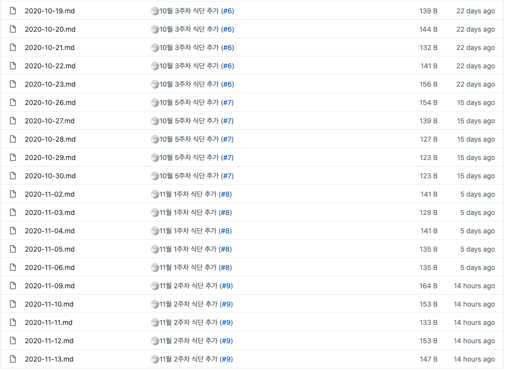
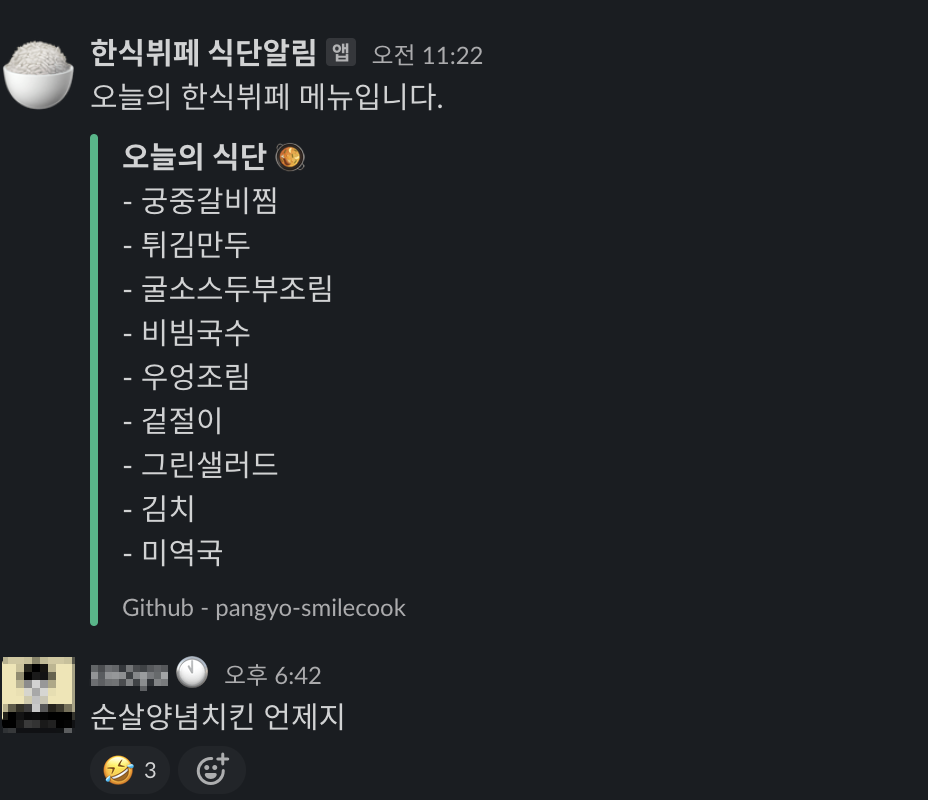

## 가격 및 메뉴구성이 혜자인 구내식당이 있다?

판교의 점심식사 비용이 왠만하면 거의다 만원대 수준입니다. 점심식사 만원이면 꽤 부담스러운 금액이기는 하죠.  
그러다가 어느날 맛있는 한식 뷔페가 있다는 이야기를 같은 회사 디자인팀 멤버로부터 전해 듣게 되었습니다.  게다가 금액도 `6,500원` 이라 상당히 가성비가 있다고 느껴졌어요. 그래서 한번 따라갔던것이 `pango-smilecook` 프로젝트를 시작하게된 계기가 되었습니다. 

## 언제 맛있는 메뉴가 나오나요?  🙄

사실 이 주제가 가장 중요한 주제입니다. 한식뷔페 특성상 메뉴가 매일매일 달라집니다. 이 메뉴는 아쉽게도 온라인으로 확인 불가능하고 식당앞에 있는 식단표를 가지고가서 주단위로 확인을 해야합니다 너무 귀찮죠. 매주 금요일날 맛있는 메뉴가 많이 나온다는 이야기는 많이 들었지만 그래도 정확하게 무슨 메뉴가 언제나오는지 알고 싶었어요.
판교라면 힙하게 요런것 쯤은 온라인으로 볼 수 있어야 한다고 생각 했습니다. *(메뉴는 알아서 매일 매일받아보고 싶은 욕..심..)*

그래서 시작된 간단한 오픈소스 프로젝트가 바로 `pango-smilecook` 입니다. (뒷광고 아닙니다.)  
프로젝트의 목적은 간단합니다. 

- 🧠 &nbsp; 집단지성을 이용하여 더 많은 사람들과 맛있는 메뉴가 나오는 날을 공유하자.
- 🤟 &nbsp; 맛있는 메뉴가 나오는날에만 뷔페를 가겠다는 의지

이 두가지면 `충분`했습니다. 

이 두가지 문제를 해결하기 위해서는 2가지 해결해야할 이슈가 있습니다. 

- 🍱 &nbsp;  매주 새로운 메뉴표가 필요합니다.  
- 📣 &nbsp; 새로운 메뉴가 올라왔다는 사실을 어디서 전달 받아야 할까?

첫번째로, 매주 새로운 메뉴표는 월요일날 오전 식당앞에 일주일치 메뉴표가 새롭게 세팅이 됩니다.  

즉, 매주 월요일 오전에는 가서 메뉴표를 받아와야 한다는 이야기 입니다.  
혼자 이걸 한다면 상당히 귀찮을 수 있지만 오픈소스 프로젝트 이기 때문에 누군가가 메뉴를 정리해서 `PR`로 날려준다면 같은 봇을 쓰는 사람들과 메뉴 정보를 공유할 수 있게 됩니다. 

두번째는 새로운 메뉴에 대한 공지를 어디서 받아야 할지에 대한 고민이었습니다.  
저희 회사에서는 내부적으로 팀 커뮤니케이션 용도로 `Slack` 을 이용하고 있었기 때문에 상대적으로 가볍게 이 문제는 패스 할 수 있었습니다. 
> 현재는 슬랙으로만 메세지가 전달 되지만 언제든지 새로운 `PR`은 환영입니다.

## 자, 그럼 만들어 볼까? 👨🏻‍💻

아이디어는 간단합니다. 매주 새로운 식단표를 업데이트하고 그것을 슬랙으로 공유해주면 됩니다.  
매번 같은시간에 공유를 하기위해서는 서버가 필요한데 `Github` 에서 제공해주는 `Github Actions`를 이용하면 해결이 됩니다.   
`Github Actions`를 활용하는 방법이 궁금하시거나 다른 봇이 궁금하신 분들은 아래 링크를 참고해주세요 

- [Github Actions를 이용한 개발블로그 글을 슬랙으로 알림받기](https://fernando.kr/develop/2020-04-26-develop-slack-bot/)
- [Github 프로필에 나의 Daliy 코딩 시간을 적용해보자!](https://fernando.kr/develop/2020-05-02-github-gist-posting/)

매주 새로운 식단표는 일 단위로 끊어서 `YYYY-MM-DD.md` 형태로 만들었습니다.   
그럼 봇이 오늘에 해당하는 날짜의 파일을 읽어와서 파일의 내용을 간단하게 슬랙으로 보내주는 형태입니다.   
슬랙 봇을 사용하고 싶으시다면 아래에 있는 링크를 통해서 접속하시면 됩니다 

- [pangyo-smilecook Github Repository](https://github.com/techinpark/pangyo-smilecook)

## 실제로 사용해보니 생긴 에피소드들 

- 갑작스럽게 터진 코로나 이슈로 인해 봇 중지 😷  

아쉽게도 코로나 때문에 사회적 거리두기가  `2.5단계`로 격상 되는 바람에 봇을 만든지 얼마 되지 않아 재택근무로 전환이 되는 바람에 봇을 한달반 정도 돌리지 못하였습니다. 

- 한식뷔페 알림을 기다리시는 분들이 생기다 🎉

한식뷔페 봇에 메뉴를 궁금해하시는 분들이 생기기 시작했습니다. 이러한 소소한 재미가 새로운 토이 프로젝트를 하는데 자극이 되어서 계속 유지할 수 있는 원동력이 되는것 같습니다. 슬랙의 특성상 쓰레드로 댓글을 계속 추가할 수 있다보니 맛있는 메뉴가 나오는날 쓰레드가 많이 달릴 수도 있는것이 재미 포인트 인 것 같습니다.

> Tip > 매주 금요일날에는 치킨이 나옵니다. 

## 마치며  ✍🏻

이번 토이프로젝트는 재미로 진행했지만, 생활속에서 생각할 수 있는 간단한 아이디어를 통한 접근 방법에 대해서 기록도 하고 비개발자 이신 분들에게도 이러한 접근이 가능하구나 라는것을 공유 드리고 싶었던 마음에 글을 작성하게 되었습니다. 
`pango-smilecook` 프로젝트 에 관심을 가지고 작은 부분이라도 기여 해 주실 분들을 찾고 있습니다. 한식을 사랑하시는 판교러가 계시다면 주저하지 마시고 함께해주세요 🙌🏻
