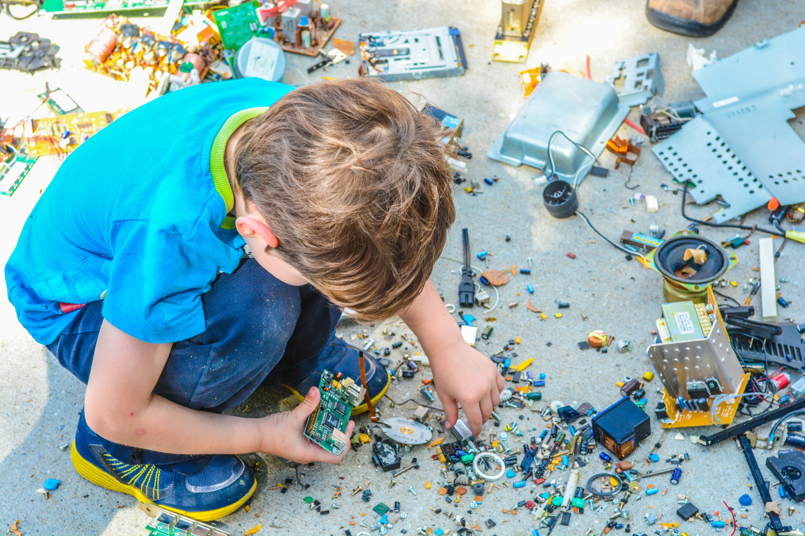
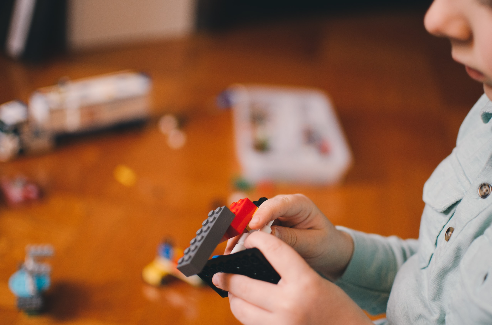
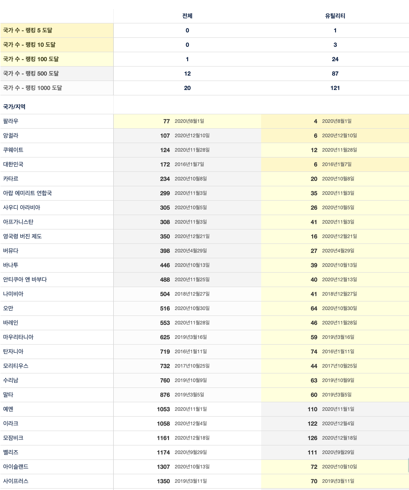
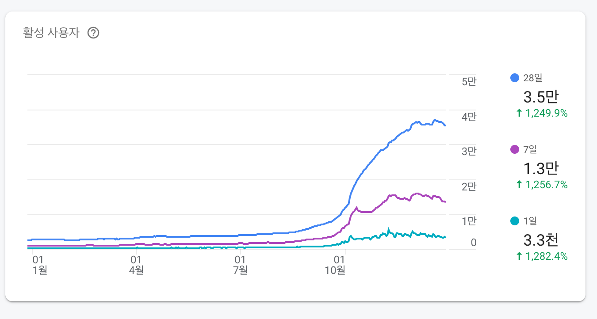
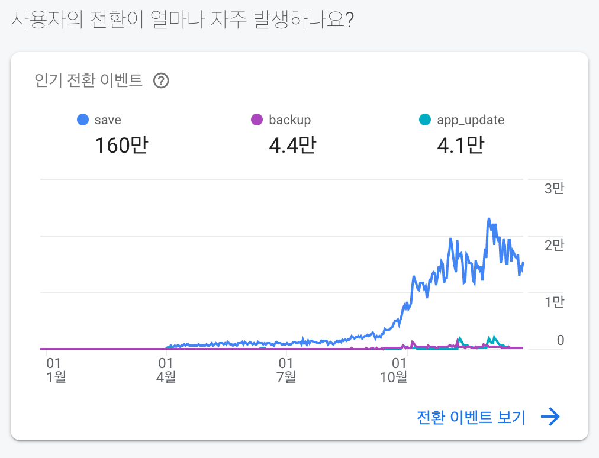
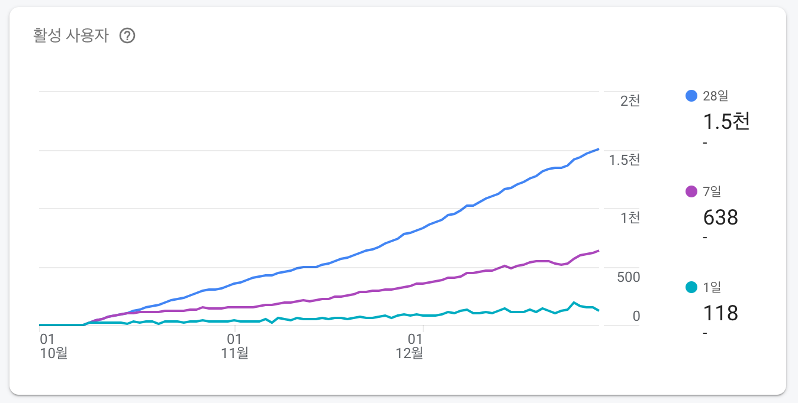
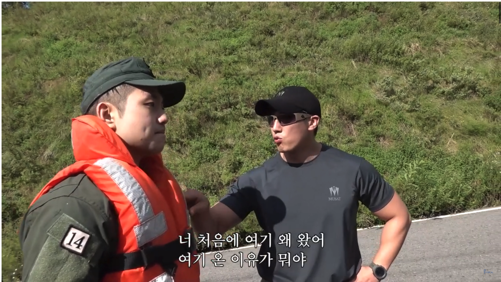

2019년 회고를 쓴것이 엊그제 같은데 벌써 2020년 회고를 쓰고있자니 시간이 참으로 빠르다는 생각이 듭니다.  
올해는 예상하지 못했던 코로나 팬데믹 사태를 겪으면서 많은 분들이 힘드셨을 것으로 예상이 되는데요, 저와 제 주변 역시도 힘든 한해를 보낸 것 같습니다. 
평소에 당연시 여기던 것들이 당연하지 않았다는 것들을 깨닳고 감사한 마음을 가질 수 있게 되었고, 재택근무와 같은 제도들을 통해 기술의 발전을 단기간에 느낄 수 있는 한해 였습니다. 
2020년을 시작할때에 누구보다도 한해를 잘 보내야 겠다는 마음으로 시작을 한 것 같은데 되돌아보면 항상 후회는 남는 것 같습니다.  남는 후회속에서도 그간 개인적으로 많은 것들을 성취하고 이룰 수 있었고, 
부족한점 또한 기록으로 남겨두어 내년에는 같은 실수를 반복하지 않겠다는 다짐을 하고자 합니다. 

# 🌱 오픈소스의 맛을 보다 

오픈소스는 늘 막연하게 나도 하고싶다 정도의 느낌이 드는 행위였습니다.  실제로 누구에게 공개할만한 소프트웨어를 만든다는것 자체가 부끄럽게 느껴지기도 했던거 같습니다.  
아무래도 잘해야한다는 강박관념 때문이겠죠. 2020년에는 이러한 부분들을 개인적으로 타파해보고자 부족하더라도 내가 만든 소프트웨어를 타인들에게 공개하거나, 이미 공개가 되어있는 소프트웨어에 기여를 해보자는 생각으로 다양한 프로젝트를 시작했고 경험 해볼 수 있었습니다. 

## ✨ 내가 공개한 프로젝트 

###  슬랙봇 
- [today-devblog-bot](https://github.com/techinpark/today-devblog-bot)
- [appstore-status-bot](https://github.com/techinpark/appstore-status-bot)
- [appstore-review-bot](https://github.com/techinpark/appstore-review-bot)
- [pangyo-smilecook](https://github.com/techinpark/pangyo-smilecook)

### Xcode Template 
- [texture-xcode-template](https://github.com/techinpark/texture-xcode-template)
- [SwiftUIFluxTemplate](https://github.com/techinpark/SwiftUIFluxTemplate)
- [reactorkit-based-template](https://github.com/techinpark/reactorkit-based-template)

### iOS 
- [SettingBundleDemo](https://github.com/techinpark/SettingBundleDemo)
- [reactorkit-keyboard-example](https://github.com/techinpark/reactorkit-keyboard-example/stargazers)

### 기타 유틸
- [earning-admob-bitbar](https://github.com/techinpark/earning-admob-bitbar)

## 📦 기여한 프로젝트 

- [Fastlane](https://github.com/fastlane/fastlane) [(#17319)](https://github.com/fastlane/fastlane/pull/17319)
- [RxSwift](https://github.com/ReactiveX/RxSwift) [(#2234)](https://github.com/ReactiveX/RxSwift/pull/2234)
- [newsletter](https://github.com/letswiftconf/newsletter)
- [5boon-iOS](https://github.com/5boon/5boon-iOS)
- [ReactorKit](https://github.com/ReactorKit/ReactorKit) [(#144)](https://github.com/ReactorKit/ReactorKit/pull/144)
- [Danger](https://github.com/danger/swift/) [(#342)](https://github.com/danger/swift/pull/342)
- [Texture-KR-Wiki](https://github.com/techinpark/Texture-KR-Wiki)

다양한 프로젝트에 기여를 해보면서 오픈소스 커뮤니티에 대해서 배울 수 있었고, 
작은 기여일지라도 참여를 한다는 점에서 보람도 느낄 수 있고 다시한번 동기 부여를 얻을 수 있다는 것이 가장 큰 장점인것 같습니다. 반복되는 업무때문에 가슴과 머리가 차가워진 상태라면 가벼운 마음으로 레포지토리를 살펴보며  간단한 오타부터 수정해보는것도 좋을 것 같습니다. 

# 🛠 레거시 프로젝트 개발환경 분리하기 

## 프로젝트파일 병합충돌 에서 해방시켜준 Xcodegen 도입기 

약 8년 이상된 서비스 프로젝트를 개선하기 위해서 `XcodeGen`을 도입하였습니다. 
기존에 있던 프로젝트 환경설정이나 프로젝트를 구성하는 라이브러리 파일들 `ARC` 옵션을 사용하지 않는 레거시 오브젝티브 씨 코드 등을 그대로 가져가면서 도입을 하려고하니 처음에는 막막했습니다. 초반에는 쉽게 환경을 그대로 옮길 방법이 있는지 찾아보다가 따로 해답을 찾지 못해서 프로젝트 환경을 `xcconfig` 형태로 `export` 해주는 오픈소스 라이브러리를 이용해서 모든 설정을 `XcodeGen` 에서 지원해주는 형태로 한땀 한땀 작성을 하였습니다.  

쉽게 하는 방법을 찾기보다는 정공법이 오히려 빠를때도 있다는것을 느꼈습니다. 

## 🧰 개발환경 테스트 이제 쉽게 가능해졌어요 

`XcodeGen`을 도입하면서 누릴 수 있는 장점으로 한가지 더 꼽자면  모든 프로젝트 설정을 `project.yml` 형태로 관리하게 되기 떄문에 빠르게 파악하기 좋다는 점과 개발 스키마 또한 파일로 관리할 수 있게 되기때문에 리얼 환경과 개발환경을 구분하기 위한 작업을 쉽게 분리해 낼 수 있었습니다. 

위 작업을 통해서 `Firebase Remote Config` 와 같은 값을 `bundle identifier` 로 구분지어서 테스트 용도로 편하게 사용할 수 있게 되었습니다. 

# 🚶🏻‍♂️ 개인 프로젝트로 얻은 성과 및 데이터 

약 `4년전` 에 만들었던 어플리케이션을 바쁘다는 이유로 방치해오다가, 회사 동료덕분에 [ReactorKit](https://github.com/ReactorKit/ReactorKit) 기반의 스위프트 프로젝트로 컨버팅 할 기회가 있었습니다. 돈받고 하는 회사일은 밤낮 가리지 않고 하게되는데 개인 프로젝트 여서 그런지 시간을 쏟아서 집중한다는게 굉장히 어려웠는데 공부도 할겸 겸사겸사 전체적으로 다시 만들어서 업데이트를 진행 할 수 있었습니다.

## 📈 업데이트 이후 얻은 성과들 

업데이트를 진행하고 난 이후 현재까지 약 8개월의 시간이 흘렀고, 다양한 재미있는 경험을 할 수 있었습니다. 그중 몇가지의 소중한 경험들을 공유하고자 합니다. 

### 🥰 아랍문화권 유저들이 사랑하는 앱이 되다 

 

약 4년전에 만든앱을 현재까지 사용해주고 계시는 유저분들이 있기에 감사하는 마음으로 `iPhone X` 해상도 대응, `다크모드 지원` 등과 같은 iOS가 업데이트되면서 있었던 소소한 내용들을 업데이트 하였고 솔직히 앱이 다시 잘될거라는 기대는 없었습니다. 

운이 좋게도 긴 기간동안 불편함을 감수하고도 본래의 기능을 유용하게 사용하시는 분들이 많았던 탓인지 업데이트를 기점으로 업데이트 및 신규 아랍문화권 유저들의 유입이 빠르게 상승하였으며 현재 대부분의 아랍문화권 동남아권 스토어에서 유틸리티 카테고리 랭킹에 올라가 있어 많은 사랑을 받게 되었습니다. 

### 💰 갑작스러운 데이터 저장 증가의 대안은 Admob

 

앱 내에 있는 백업 기능을 구현하기 위해서 백엔드가 필요했고, 클라이언트 개발자가 간단하게 사용할 수있는 `Firebase`를 활용하였습니다. 하지만 생각외로 유저들이 많이 늘어나고 앱이 완전 무료인 상태이기 떄문에 데이터를 무제한으로 추가할 수 있다는것이 언젠가는 부담으로 다가올 수 있겠구나 싶었습니다.  실제로 유저들의 사용패턴을 개인당 많아도 50개 정도의 데이터를 저장할 것이라고 생각했었는데, 역시 필드에서 직접 검증을 해보니 많게는 5천개이상의 데이터를 저장해서 백업하는 유저도 있었습니다 

> 🙄 아직도 저 데이터를 어떻게 아이폰으로 저장을 했는지 궁금합니다.. 

그래서 생각해낸 방법은 네이티브 광고를 넣는것 이었습니다.  최근에는 유저들도 많은 학습을 하였기 떄문에 본인의 니즈를 충족시켜주는 앱이 있다면 기꺼이 광고를 보거나 광고가 없다면 광고 넣어도 쓸테니 넣어달라고 요청하는 경우도 많이 있기 때문에 유저들의 사용성을 방해하지 않는 범위 내에서 광고를 넣었고 결과적으로 앱 운영이 가능할 정도의 수익이 발생하기 때문에 앞으로도 지속적으로 불필요한 기능은 제외하고 꼭 필요한 기능을 위주로 계속 유지해 나갈 생각입니다. 

> ✅ 앱스토어 개발자 등록비용도 연간 12만원이 소요됩니다. 

### 🧠 갑작스러운 앱의 폭발적인 성장, 다른앱 아이디어도 시장에 먹힐까? 

기존에 가지고 있던 앱을 리팩토링하면서 겪은 경험을 토대로 연휴가 길었던 추석기간에 약 일주일동안 
평소에 생각을 하고 있었지만 하지 못했던 아이디어 하나를 빠르게 만들어서 스토어에 올려보고 싶다는 생각을 가지게 되었고 앱 리뷰에 요청이 많았던 기능을 아예 별도의 앱으로 피벗하는 형태로 만들었습니다.
그래서 기존앱에 있던 기능을 그대로 재활용 할 수 있어 시간이 오래 걸리지 않았고, 결과적으로 스토어에 업로드 할 수 있었습니다. 

### 📈 현재까지의 성적표

출시한지 2개월 이 되어가는 지금, 아직 한참 멀었지만 반응은 괜찮은 편입니다.
앱을 사용하는 유저들의 니즈를 4년 전부터 분석했고, 결과적으로 핵심 기능은 빠진 상태로 릴리즈 하였는데 꾸준한 상승곡선을 그리고 있으니 핵심 기능을 넣은 업데이트 이후의 지표가 궁금해집니다. 

# 🚧 개인적 성장을 위한 고민

개발자의 커리어를 시작하게된 이상 공부를 게을리 할수가 없게 된 것 같습니다. 새로운 기술은 매년 발표되고, 기존에 있는 기술들 조차 다 파악하지 못하는 상태에서 무수히 새롭게 쏟아지는 새로운 기술들을 따라가기가 너무 벅찬것도 사실입니다.  회사 내에서 기술적으로나 개인의 커리어를 챙겨주고 거시적인 관점에서 제안을 해줄 수 있는 사수를 만난다는것은 더욱 더 어렵습니다.

결국 본인의 성장은 본인이 챙겨야하기에 다양한 고민들을 하게 되는것 같습니다. 

## 🤷🏻‍♂️ 나 자신에 대해서 얼마나 알고 있는가? 

평소에 나름대로 자신에 대해서 잘 알고 있다고 생각을 했으나 그 생각은 결코 옳지 못했습니다.  
나 자신의 한계를 만나야 비로소 진짜 자신의 모습을 알 수 있게 된다는 가짜사나이의 방송의 말처럼 
자신을 데이터로 객관화 하고 수치화 하는것이 가장 중요하다고 생각하게 되는 한해 였습니다.  

개발자의 커리어를 주니어와 시니어 로 보편적으로 많이 나누는 경향이 있는데 이 기준에 대해서도 다시한번 생각해 보았을때 내가 주니어라면 주니어의 어디쯤 서있는지?  시니어라면 시니어의 어디쯤 서있는지? 객관화 할 수 있어야 한다고 생각했습니다. 

막연하게 개발 연차가 짧다고해서 주니어 일 수 없을 것이고, 개발을 오래했다고 해서 시니어 일 수 없을 것 입니다. 그 어떤 누가 봤을때도 인정받을 수 있는 시니어 레벨로 나아가기 위해서는 어떤 것들이 나에게 필요한지 현재 부족한점은 무엇인지 파악하는것이 필요했습니다. 안락함에 빠져 현재에 안주하고 싶지 않았습니다. 두려움 과 어려움이 있더라도 한번 뿐인 젊음을 보람있게 내가 필요한곳에서 성취감을 느끼며 치열하게 살아보고 싶었습니다. 

마침 같은 고민을 다루는 발표 자료를 보게되어 많이 참고 할 수 있었습니다. 

[중니어의 고뇌: 1인분개발자, 다음을 찾아서 ](https://www.slideshare.net/jayjin0427/1-239437066?fbclid=IwAR2xnmU_VkrRLOYlVjBITR8gCON_eL6r80WDVjnBX9Yq5f6kFnzXeII-x9k) 

위 발표자료에 비슷한 고민을한 흔적이 있어 공유차원에서 링크를 올립니다.  
조급한 마음을 조금은 내려놓고 다음레벨로 나아가기 위해서 어떠한 것들이 나에게 필요한지 정리를 하고 객관화 하여 결국 꾸준히 하는것 만이 정답이라는것을 깨달을 수 있었습니다.

# 🌷 새로운 회사에서의 새로운 시작 
지난 2년간 있었던 회사를 뒤로한채, 내년 1월달부터 새로운 회사로 이직을 하게 되었습니다.  
새로운 환경에서 제가 가진 경험을 토대로 기여를 할 수 있을지에 대한 기대감과 두려움이 공존합니다.  
하지만, 그 두려움에 잠식되어버린다면 저는 현재에 머물러 성장할 수 없음을 잘 알고 있기때문에 치열하게 임해야될 것 같습니다. 돌이켜보면 매순간 새로운 것들을 시작하게 될때 느꼈던 두려움과 공포가 내 자신이 성장하기전 느꼈던 성장통과 같은 느낌으로 다가오는것 같습니다.  

내년 회고에서는 이직한 회사에서 좋은 기여들을 많이 했다라는 회고를 남기고 싶은 바램이 있습니다. 

# 🚀 2021년의 새로운 목표 

올해 가장 아쉬웠던 점은 조직의 생산성 향상을 위해 다양한 아이디어를 가지고 있었는데 이것을 동료들에게 많이 자주 이야기하지 못한 것입니다. 다같이 고민을 했다면 조금더 좋은 방향을 잡거나 
일이 수월하게 진행이 될 수 있었을텐데 라는 아쉬움이 남는것 같습니다. 

- 조직의 생산성에 도움을 줄 수 있는 방법에 대해 동료들과 이야기를 많이 나누기 
- 새로운 기술들을 적용해보고 배울 수 있는 사이드 프로젝트 진행하기 
- 5년 이후 내가 바라는 모습으로 성장 하기 위한 준비 구체적으로 꾸준히 하기 
- 언제 어디서나 팀플레이어가 되기 

결과적으로 더 좋은팀을 만들고 좋은 문화를 만들어가는데에 초점을 두고 싶습니다.  
모두가 서로를 통해서 동기부여받고 더 나은 방향으로 나아갈 수 있는 팀을 만들기 위해서 스스로 먼저 노력해야 할 것 같습니다. 그러기 위해서는 아주 작은일 일지라도 솔선수범 해야 할 것 같습니다. 

# 🙇🏻‍♂️ 마치며 

2021년도 또한 바쁘게 지나갔고, 결국엔 모든것이 잘 마무리 되었습니다.  
올한해 동안 함께 해준 동료들과 지인들 그리고 항상 옆에서 저를 지지해주는 사랑스러운 와이프 덕분에 잘 견딜 수 있었습니다.  마라톤 처럼 긴 레이스를 펼쳐야하기에 페이스 조절 잘해서 내년에도 한단계 더 발전 할 수 있는 사람이 되기 위해서 많이 노력해야겠습니다. 새해복 많이 받으시고 건강 항상 유의하시기 바랍니다. 

