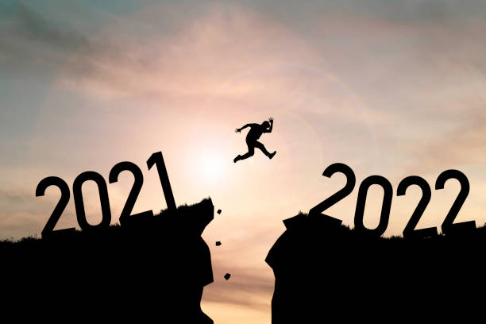

되돌아보니 2021년은 새로운 도전과 경험으로 가득찬 한해 였던 것 같습니다.  
그동안 올해처럼 밀도있게 보낸  해가 있나 생각될 정도로 많은일 들을 한 것 같습니다.  
지난 1년을 되돌아보기 위해 기록으로 남기고자 합니다. 

## 🤝 최고의 복지는 동료이다

스타트업은 결국 사람의 문제로 귀결된다는 것을 몸소 느낄 수 있는 한해였습니다.
1월에 이직해서 새로운 조직에서 새로운 사람들과 함께 경험해보지 못한 도메인 영역에서의 문제를 해결하는 과정에서  이전에는 느낄 수 없었던  수평적인 커뮤니케이션 방법을 현재 속한 조직에서 많이 배울 수 있었습니다.  

모두가 프로덕트의 성공을 위해서 한마음으로 목표를 가지고 나아가는 과정속에서  동료를 더 잘 이해할 수 있었고,
더 나은 프로덕트를 만들어 갈 수 있었다고 생각합니다.

회사에서 개인에게 줄 수 있는 것들이 물질적인 것들도 있지만, 결국 최고의 복지는 동료라는 것을 다시 한번 느낄 수 있었습니다. 각 동료가 가진 장점을 보면서 개인적으로 부족한 부분들을 더 명확히 알 수 있었고,  좋은 자극이 되었던 것 같습니다. 한가지 또 새롭게 배울 수 있었던 것은 `why`를 중요하게 생각하는 조직 문화로 인해서 현재보다 더 개선된 프로덕트를 만들 수 있는 기반이 된 것 같습니다.

회사의 상황이 어렵다는 것을 공유받은 순간에도, 그럼 현재로서 무엇을 더 할 수 있고 어떤 걸 더 기여할 수 있을지 고민하는 동료의 모습을 보면서  개인적으로 너무 감동하였고, 안정적인 것만을 추구했던 제가 부끄럽기도 했습니다.

뜨거운 열정을 가진 동료들과 함께 할 수 있어서 한 해 동안 많이 자극받았고, 이 동료들에게 나 또한 좋은 자극이 될 수 있을까? 라는 긍정적인 고민을 할 수 있는 기회에 감사한 한해였습니다.

## 🏃‍♂️ 팀의 리더가 되다

회사가 성장함에 따라 iOS팀도 인원이 빠르게 충원이 되었고, 팀의 리더 역할을 제안받게 되었습니다.
규모가 큰 조직에서의 리딩 경험은 처음이기 때문에 처음에는 제가 잘 할 수 있을까에 대한 고민이 상당히 많았고, 팀에 계신 분들 또한 경력이 있으신 분들이기 때문에 리더에게 기대하는 역할이 무엇일지 또 내가 그 부분을 충족시켜줄 수 있을지에 대한 고민이 많았던 것 같습니다.

한 해 동안 기존에 서비스하던 제품을 잘 마무리 하고 새로운 도약을 하는 과정을 거치게 되면서 기존에 가지고 있었던 레거시들을 큰 문제 없이 정리 할 수 있었고 주도적으로 서비스 개발에 참여해주시는 멤버분들 덕분에 서비스를 개발하는 데 있어서 생산성을 개선할 수 있는 부분들에 대해서 기여를 할 수 있는 시간이 있었습니다. 한 해 동안 iOS 파트의 프로젝트 기본 설정을  협업이 원활하게 진행될 수 있는 방향으로 개선을 많이 하였고, 빌드 배포 부분도 전체 자동화 할 수 있었습니다.  하지만 이러한 부분을 모두가 알고, 문제가 있을 때 누구나 빠르게 기여할 수 있는 환경이 될 수 있도록 환경설정 관련 부분은 따로  케이스 스터디를 통해서 모든 구성원과 동일한 지식을 공유할 수 있도록 하는 게 올해의 목표가 될 것 같습니다.

팀으로써 일할 때 다른 동료들에게 안정감을 주는 것도 중요하지만, 올바른 방향성을 가지고 함께 성장하는 방향도 중요하다고 생각하기때문에  함께 해볼 수 있는 것들을 올해에는 더해볼 수 있었으면 좋겠습니다.  팀 문화를 만드는데 모두가 기여할 수 있는 환경을 만들어야겠다고 느꼈습니다. 좋은 멤버분들과 한팀을 이룰 수 있어서 큰 축복이기도 하고, 개인적으로 부족함을 더 느끼면서 성장할 수 있는 기회가 되는 것 같습니다.  이자리를 빌어서 저희 모바일파트 멤버분들에게 올 한 해 동안 감사했고 내년에도 잘 부탁드린다고 말씀드리고 싶습니다.

내년은 더 좋은 팀을 만들기 위해서 더 노력하는 한 해가 되었으면 합니다.

## 🔥 꾸준히 하는 것이 중요한 이유 

올해 6월 개인적으로 5년 전에 만들었던 앱이 미국 스토어 1위를 하는 진귀한 경험을 하게 되었습니다.
그 과정이 오래가지 않을 것이라는 것을 잘 알고 있었지만, 그 당시에는 잠을 자지 않아도 엔도르핀이 마구 솟구칠 정도의  감정을 느꼈습니다.  실제로 생각한 아이디어가 시장에서 폭발적인 반응을 얻고 그것이 눈에 보이게 되는 과정을 겪게 되니까  기존에 느꼈던 기쁨과는 차원이 다른 감정을 느낄 수 있었습니다.

개인 프로젝트이긴 했지만, 나의 필요로 만들어졌던 앱이고 내가 필요한 앱이라면 누군가는 필요할 것이라는 생각으로 5년간 유지보수를 해왔는데 역시나 가장 좋은 `Sales point`는 내가 고객이 되는 것이라는 것을 다시 한번 느낄 수 있었습니다.

일단 시작하면 끝을 볼 때까지 유지하고 지속하는 것이 중요하다는 것을 느꼈습니다.
해외의 다양한 매체에서 인터뷰를 할 수 있는 경험도 했고, 다수의 업체에서 앱을 인수하고 싶다는 제의를 받기도 하였습니다. 돈이 중요하긴 하지만, 그래도 내가 생각한 가설을 구현하고 그것이 시장에서 먹히는 좋은 경험을 하였기 때문에 이앱을 팔기보다는,  꾸준히 유지보수 하면서 처음에 의도했던 가치를 지키고 싶었습니다.
유저들 또한 갑자기 앱의 방향성이 바뀌고 광고가 많아지거나 유료화 되는 것을 원치 않았을 것이라고 믿습니다.

6개월이 지난 현재에는 예전보다는 못하지만 그래도 꾸준히 앱을 이용해주시는 분들이 있어 어떻게 더 나은 방향으로 개선을 할 수 있을지 고민하고 있습니다. 

## 🌳 새로운 생명의 싹을 틔우다

올 한해 있었던 일 중 가장 기쁘고 설레는 일은 드디어 아내가 아이를 임신하였다는 사실입니다.
항상 한해가 끝날 때 내년에는 꼭 셋이서 함께 하자는 약속을 하곤 했는데, 그 약속이 2022년에는 성립이 된다는 사실이 가슴 벅차고 설레는 것 같습니다. 아이가 생기는 순간부터 평생 놓을 수 있는 걱정이 시작되었는데,  정상적으로 건강하게만 자라 주었으면 좋겠다고 생각합니다. 아내는 딸아이를 기대하고 있었지만, 아들이 생겼습니다.
저희 가정에 찾아올 아이에게  좋은 환경을 제공해주고 싶고, 어렸을 때 제가 해봤으면 좋았겠다 싶은 것들을 해주고 싶은 마음이 가득한 것 같습니다. 어렸을 적 아버지가 저를 키워주셨을 때도 이러한 감정이셨을까? 생각을 하게 되고 처음이셨을 텐데도 지금까지 잘 키워주셔서 감사한 마음이 생깁니다.

저도 훗날 아들에게 인정받고 존경받을 수 있는 아버지가 되기 위해 최선을 다하고 싶습니다.
5월에 만나게 될 아이에게 부끄럽지 않은 아버지가 되기 위해서 노력하겠습니다. 

## 🫁 역시 가장 큰 자산은 건강

올 한해는 건강에 대해서 돌아 볼 수 있는 한 해가 된 것 같습니다.
직업의 특성상 오래 앉아서 일하기도 하고 밤늦게까지 컴퓨터를 보는 게 거의 일상이 되어서 그런지 면역력이 많이 저하되기도 했고 담낭에 작은 폴립이 있었는데 그것을 4년간 추적검사 하다가 연말에는 수술의 기준이 되는 1cm를 넘어서 결국엔 수술하였습니다.
수술하고 다행스럽게도 회복은 빠르게 할 수 있었습니다. 그렇지만 기존에 잘 먹었던 음식들도 가려서 먹어야 하고 조심해야 하니 건강이 최고라는 것을 느낍니다

## ✏️ 마치며 

이렇게 밀도 있는 한 해를 보낸 적이 있을까 싶을 정도로 알찬 한 해를 보낸 것 같습니다.
새해에는 회사라는 조직 안에서 생산성을 개선 할 수 있는 다양한 일들을 해보고 싶다는 생각이 듭니다.  또 팀에서 협업하며 각자 성장할 수 있는 환경을 더 좋게 만들어보고 싶습니다.  
성장을 원하는 이들과 한 공간에서 한곳을 바라보며 같이 달릴 수 있는 소중한 시간들을, 의미있게 만들기 위해 할 수 있는 것들이 무엇인지 돌아보며 빠르게 움직이는것이 목표입니다.