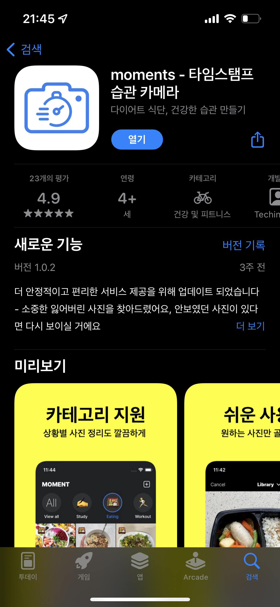
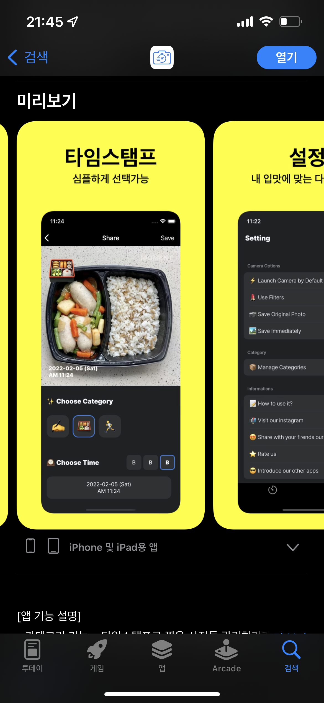

새해를 맞아, 새로운 사이드 프로젝트를 하기로 마음을 먹었습니다. 올해 설날은 휴일이 많고 길었기 때문에 목표를 설연휴동안 개발해서 스토어에 올리는것을 목표로 잡고 시작하였습니다. 개발을 하고 그것을 배포한 이후 사용자들의 피드백을 듣는 과정에서 어떠한 고민을 하고 어떠한 문제를 해결했는지에 대해서 가볍게 공유하기 위해서 글을 적습니다. 

## 🤔 해결하고자 했던 문제? 

건강/운동 관련된 도메인의 업무를 하다보니, 자연스럽게 고객들이 어떠한 문제를 가지고 있는지, 어떤것들을 원하는지 생각해볼 수 있는 시간이 많습니다. 
그 중에서도 가볍게 시작해볼 수 있는 주제로 기록을 잡았습니다. 다이어트를 한다면 80% 이상은 식단이 중요하다고 할 수 있을 정도로 어떠한 음식을 먹는지가 가장 중요하다고 합니다. 
그러나 그것들을 텍스트로 적기엔 너무 귀찮고, 가볍게 사진을 통해서 기록하는것이 좋겠다고 생각하였습니다. 이 과정에서 가벼운 타임스탬프 앱을 제작해보면 좋겠다는 큰 아이디어를 도출합니다. 

이미 있는앱인데 그걸 왜 했어? 라고 물어보신다면 기존에 있는 타임스탬프앱들이 가지고 있는 불편함이 있다고 생각하였습니다. 

- 타임스탬프사진을 굳이 앨범에서 보고 싶지 않아요 
- 타임스탬프 사진을 그룹별로 나눠서 보고싶은데 다 섞여서 보여요
- 사진을 찍은 시간이 변하지 않았으면 좋겠어요 (시간 수정기능이 없었으면 좋겠어요 )
- 광고가 너무 많아요 

사실 광고를 제외한 세가지 문제는 저또한 불편함으로 생각하고 있었기 때문에, 3가지의 불편을 겪고있던 유저라면 자연스럽게 이번에 만든 앱을 자연스럽게 사용하게 될 것 이라고 믿었습니다. 
이미 관리가 잘 되고있는 앱이라고 할지라도, 끝까지 개발하고 그것을 배포해본다면 거기서도 새로운 인사이트를 얻을 수 있습니다. 시중에 수많은 다이어리가 있음에도 불구하고 매년 새로 나오는것 처럼말이죠

## 🔥 설레는 개발의 시작 

이제 아이디어는 정했으니 어떻게 만들지 고민을 해야했습니다. 저에게 주어진 시간은 약 일주일 정도 였기 때문에, 완벽하게 만드는것 보다는 유저들의 니즈를 검증하는것을 초점으로 맞추었고
최대한 간단하게 만들고자 노력하였습니다. 코드부터 작성하면 나중에는 어떠한 것들을 개발하려고 했는지 생각이 깊어질수록 기존에 나아가려고 했던 방향도 변경이 되는 케이스도 생기기 때문에 
초반에 생각한 아이디어를 간단하게 스케치 하였습니다. 

그리고 생각한 아이디어를 기반으로 프로젝트를 만들었습니다.
내가 필요한것들을 생각하고 구현하는 과정은 배포 이후를 항상 생각하면서 개발을 하다보니 시간도 잘가고, 일주일이 금방 순삭 되어버렸습니다. 
개발을 하다보니 초반에 생각하지 못했던 케이스들도 있고, 생각이 깊어질수록 처음에 생각한 기능보다 더 살을 붙이는 경우도 생기는것 같아서 중간중간 진짜 필요한 기능인지 아닌지에 대해서 리스트로 정리하고 백로그로 옮기는 작업을 하였습니다.  
이 과정은 슬랙 & 깃헙 이슈를 통해서 관리하였습니다.

어느정도 개발을 마쳤고, 이제 앱 이름만 정하면되는데 개발보다 어려운게 이름인것 같습니다. 하지만 현재의 순간을 사진에 담는다는것을 잘 표현할 수 있는 moment 로 정하기로 하였습니다. 디자이너 없이 순수 혼자서 하는 프로젝트 였기 때문에, 최대한 오픈되어있는 저작권프리의 이미지들을 활용하여 제작 하였습니다.  다양한 오픈소스나 디자인 소스들 덕분에 1인개발자도 충분히 프로덕트를 출시 할 수 있는 환경이 만들어진것을 정말로 감사히 생각하고 있습니다. 

| | | |
|-|-|-|
||||

## 🚀 배포 그리고 한달이 지나다 

배포를 하고 마이너 업데이트까지 약 2번의 업데이트를 진행하였습니다. 
첫번째 배포는 오로지 개발자의 생각만으로 이렇게 쓸꺼야 라는 판단하에 개발이 되었기 떄문에 유저가 원하는 것들이 아니거나 유저들이 생각하지 않았던 굳이 불필요한 기능들도 들어가 있을 수 있습니다. 
이것들을 보기 위해서 앰플리튜드로 데이터 이벤트를 트래킹 하였습니다. 약 한달간 쌓인 데이터를 보여드리자면 다음과 같습니다. 

생각했던 방향대로 유저들이 원하는것들을 제공하고 있다는것을 앱스토어 리뷰를 통해서 확인할 수 있었고, 개인적으로는 이과정을 다시느끼기위해 개인앱을 계속 만들게 되는 것 같습니다.
앞으로는 유저분들의 피드백을 받아서 더 유저들이 원하는 기능을 제공하는것을 목표로 하려고 합니다. 
개인적으로 개인앱을 운영하면서 느낀점을 몇가지 적어보자면, 

**첫번째, 앱의 방향은 결국 유저들이 가진 문제를 잘 해결해주는 방향으로 가야한다는 것입니다.**  

개발의 관점으로 서비스를 보게된다면 기술적으로 어떠한 기술을 사용했고, 이정도는 나도 만들 수 있다고 생각을 하게되는 경우가 많은데 경험을 해보니 서비스는 개발의 질이 중요하다기 보다는 결국 
그 서비스가 어떠한 문제들을 해결해주고 있는지가 더 중요하다는 것입니다. 사용자들은 불편하더라고 본인이 가진 문제를 해결해주는 서비스라면 기꺼이 사용한다는것을 이제서야 깨달은 것 같습니다. 

내가 만들고자 하는 서비스를 어떻게 팔 수 있을까의 접근이 아닌 내가 쓰고 싶은 서비스를 만든다는 관점으로 생각해본다면 좀더 좋은 서비스를 만들 수 있을 것 입니다. 

**두번째, 앱의 사용성은 결국 유저들이 만들어가는 것이라는 사실입니다.**  
제공하고자 했던 의도대로 사용하는 고객들도 있지만 전혀 생각하지 못한 방식으로 서비스를 사용하시는 분들도 많기 때문에 결국 어떠한 유저들이 어떻게 사용하는지에 따라 서비스의 방향은 충분히 달라질 수 있습니다. 
이것을 경험하기 전까지는 개발자인 나의 의도대로 흘러갈 것이라고 생각을 했지만, 경험을 하고나니 결국 사용자들이 자신의 사용성을 결정하고 그것은 데이터로 나타나기때문에 그 데이터를 어떻게 활용해서 
더 나은 사용경험을 제공해줄 수 있을지에 대해서 고민하는 시간이 중요하다고 느낍니다. 

**세번째, 배포를 먼저하고 나중에 고민하자 입니다.**  
사용자들의 사용성은 위에 적은대로 사용자들이 정하는 것 이기때문에 배포전에 기능에 대해서 어떻게 사용할 것인지에 대한 깊은 고민은 필요가 없습니다. 
오히려 배포를 자주하면서 피드백을 토대로 업데이트를 빠른주기로 해나가는것이 더 옳은 방향이 될 수 있습니다. 고민만 하고 배포되지 않은 코드의 가치는 0에 수렴하기 떄문입니다. 

## 👋 마치며 

위 사이드프로젝트의 앱을 통해 유저들은 평균 2분정도를 체류하고 있으며, 총 8천여장 정도의 사진이 저장되었습니다. 
서버가 없는 클라이언트만 구현이 되어있기 떄문에 유저들이 어떠한 사진을 저장하고 있는지는 모르지만, 해당 사진을 찍는 행위를 통해 습관을 만들어줄 수 있다고 생각했기 때문에 
다음 스탭은 가볍게라도 서버를 붙여서 같은 성격의 카테고리의 사진들을 공유할 수 있게 해주고 서로 볼 수 있게 해주는 기능을 추가하고자 합니다. 

소중한 사용자분들의 리뷰를 반영하여 계속 개선해나가겠습니다. 사이드 프로젝트의 시작부터 배포까지의 경험을 공유하고 여러분들 또한 동기부여를 받고 무언가를 시작할 수 있었으면 좋겠습니다. 또 일정 시간이 지난 이후에 해당 프로젝트에 관련된 경험들을 다시 글로 나눌 수 있는날이 오기를 기다리겠습니다.