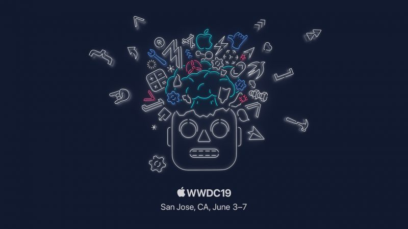

## tvOS
- 멀티유저 지원
- 음악가사 동기화 지원 
- 엑스박스 컨트롤러 / Play Station 컨트롤러 지원 

## Apple Watch

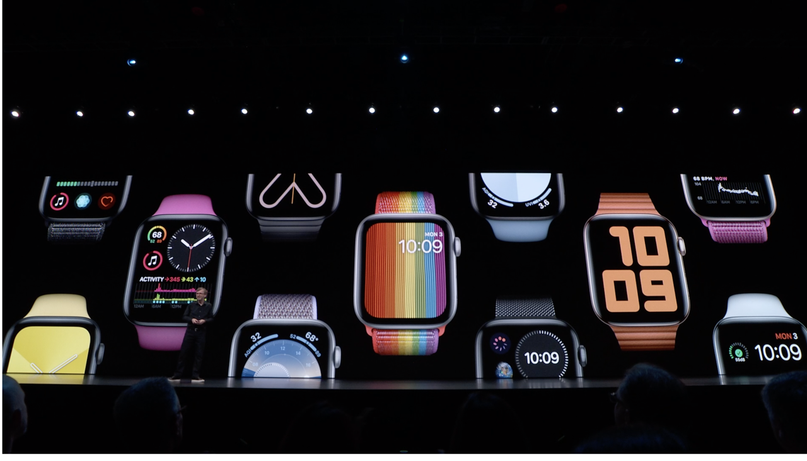

## 다양한 애플워치 페이스 지원 
시계 워치 페이스가 기존에는 한정적 이었으나, 이번 발표를 통해서 새로운 워치스페이스들이 대거 공개가 되었습니다.

자신이 원하는 형태의 워치스페이스를 설정할 수 있고, 개인화 할 수 있게 되었습니다. 

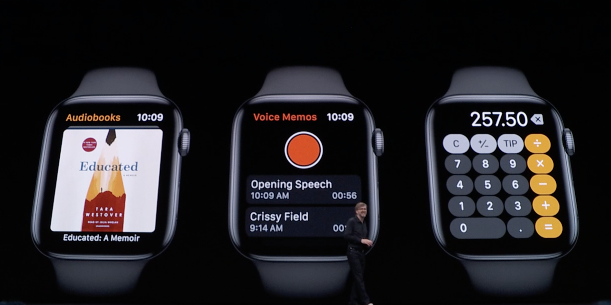

##  오디오북 , 녹음, 계산기 지원 
기존 워치에서는 컨텐츠가 많이 부족하다는 느낌이 있었으나, 해당 발표에서는 새로운 어플리케이션들이 많이 발표가 되었습니다. 

워치가 가지고 있던 단점을 극복하려는 노력을 많이 했다는 느낌을 받았습니다. 

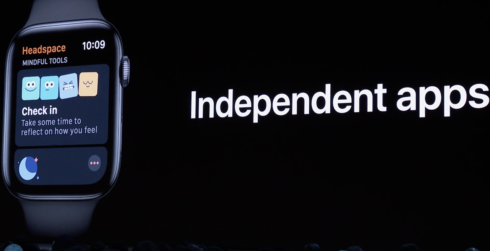 

## 애플워치 단독 앱지원 
기존 애플워치 앱들은 아이폰과 연동되어 동작하는 방식으로 작동하였으나, 이번 부터는 새로운 Apple Watch App Store를 통해 워치에서 단독으로 동작하는 형태로 앱을 사용할 수 있게 되었습니다. 

개발자들은 애플워치 단독으로 앱을 개발 할 수 있게 되었고 `Audio Streaming API` 가 공개 되었습니다.

 
## iOS 13
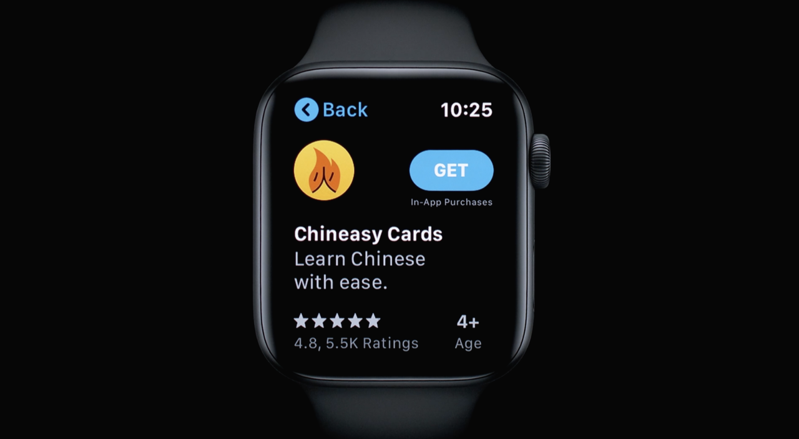 

`iOS12` 버전은 안드로이드 버전에 비해 사용률이 `85%` 나 된다고 팀쿡 형님이 나와서 자랑하시다가 이번 새롭게 업데이트될 iOS 13에 대해 소개를 하는 시간이 있었습니다.

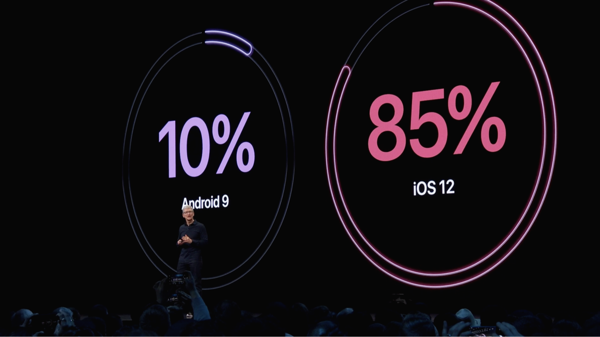 

iOS13은 성능 측면에서 기존 iOS12 보다 Face ID로 잠금 해제하는 속도가 30% 빨라졌고, 앱 실행속도가 2배나 빨라졌다고 합니다.

이외에도 다양한 성능 및 UI 업데이트가 있었습니다. 큰 맥락에서 보자면 다음과 같습니다.

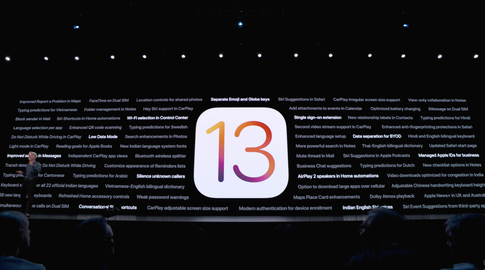 
다양한 앱들이 업데이트 되었지만, 

iOS13에서  중요한 업데이트는 아래와 같습니다.

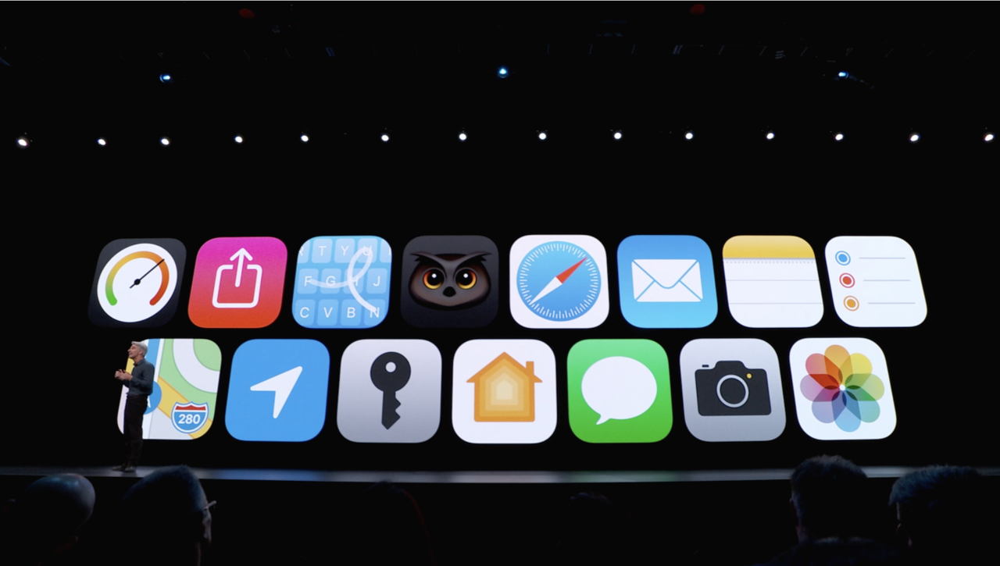 

## 다크모드 지원 
기존 루머에서 알려졌던 다크 모드 지원이 이루어졌습니다. 

다크모드에서는 iOS 기본 어플리케이션이 다크모드로 지원되며, 사진앱, 갤러리앱, 메모 앱의 기능이 대폭 개선되었습니다. 

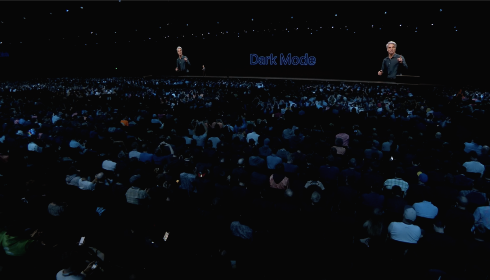 

다양한 앱들이 많이 개선되었지만 그래도 단연 돋보이는것은 바로 사진 앱입니다. 

갤러리를 통해서 사진들이 순서대로 정렬 되는것이 아니라, 사진의 연관성을 통해 알아서 분석을 하여 사용자에게 가장 알맞은 구성으로  보여주는 형태가 되어 "AI" 기술이 적용된것인가 하는 생각을 하게 해주었습니다. 

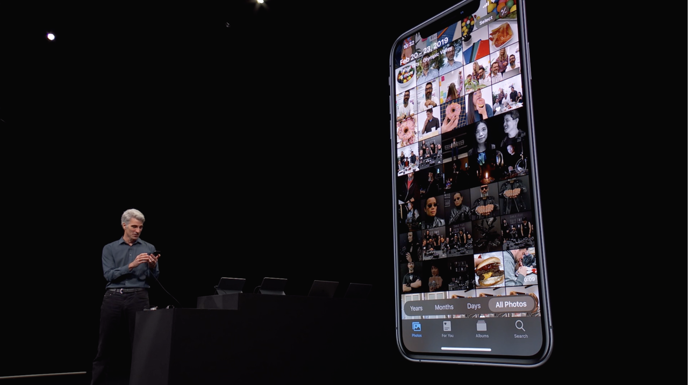 

다양한 갤러리의 사진들을 분석하여 연도별, 테마별로 가장 인생에서 중요한 순간들을 정리하여 분류하여 줍니다. 

아이폰에서도 이제 점점 AI 분석이 도입되어 사용자별 개인화에 초점을 둔다고 생각을 할 수 있게 해주는 대목이었습니다 

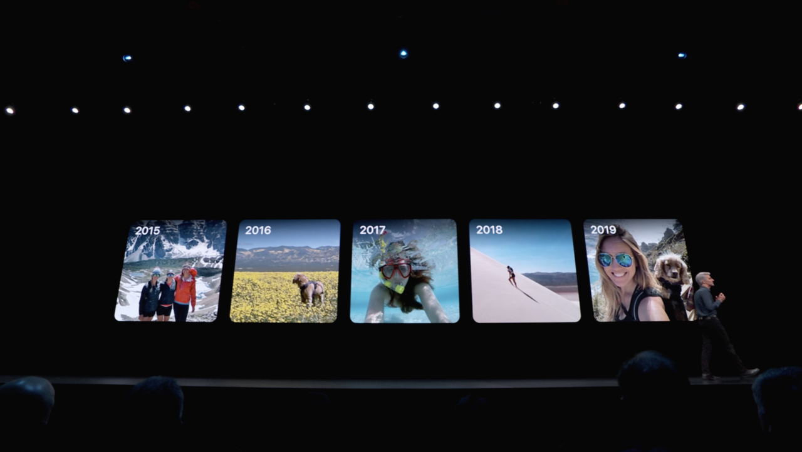 

## 소셜로그인 (애플로그인 지원) 
많은 앱들이 지원하고 있는 구글 로그인, 페이스북 로그인은 개인정보를 넘겨야 한다는 점에서 부담감이 있는데 이번 발표를 통해서 새로운 로그인 방식이 발표 되었습니다. 

바로 애플아이디를 통한 로그인 API가 공개 되었는데 간단히 iOS기기 이용자들은 자신의 애플 아이디를 이용해 로그인을 할 수 있습니다.

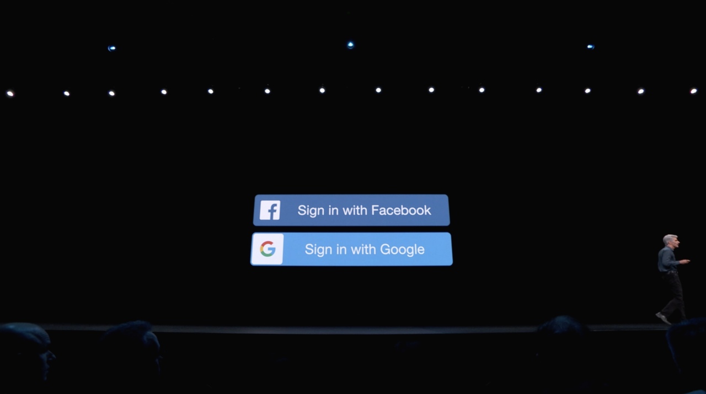 

바로 이름하여 "애플 로그인" 입니다. 

해당 버튼을 통하여 로그인을 시도하면, 별다른 입력 절차 없이 Face ID를 이용하여 로그인이 되며, 자신의 정보를 이름만 공개할 것인지 이름과 이메일을 함께 공개 할것인지 선택을 할 수 있습니다. 

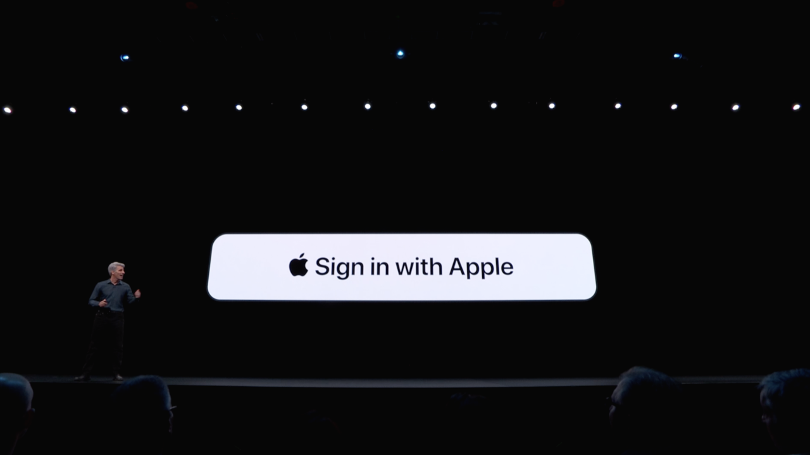  

또한 자신의 이메일을 그대로 공개하는 방식이 아니라, 애플에서 만들어주는 암호화된 메일 주소를 가지게되며 자신의 개인정보 노출에 대한 걱정이 없어졌습니다. 

 
iOS13 에서 업데이트 된 앱들의 아이콘들을 띄워놓고 설명을 하는 시간이 있었습니다. 

개인적으로 가장 맘에드는것은 FaceID 성능 향상, 애플 로그인, 사진 앱 UI 개선을 꼽을 수 있을것 같습니다.

## iPadOS 

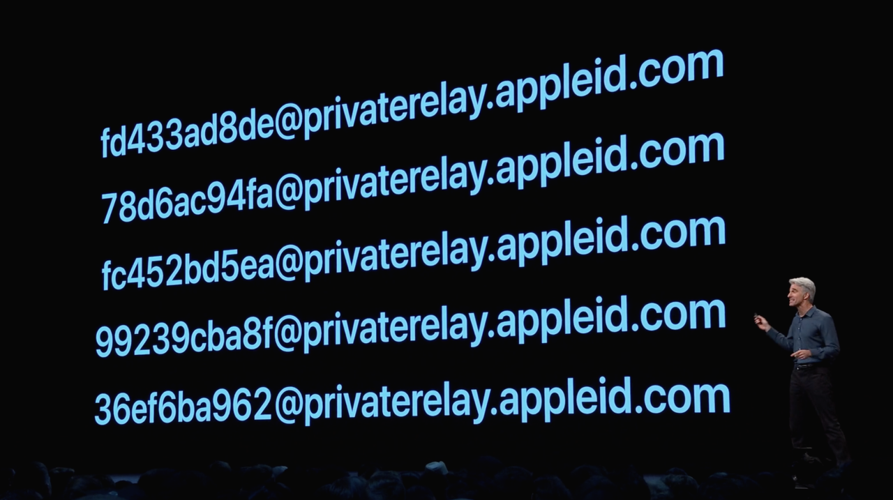

갈수록 다양한 컨텐츠 생산이 많아지면서 iPad 사용율 또한 높아지고 있습니다. 

이번 WWDC19 에서는 새로운 OS 인 iPadOS가 소개되었습니다.  iPadOS는 iPad 환경에 최적화된 새로운 형태의 OS입니다.

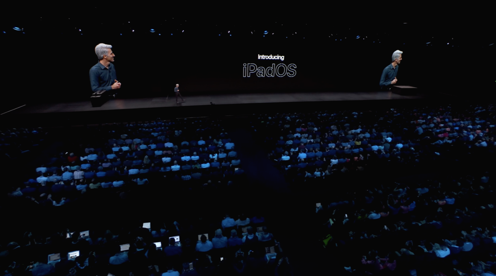 

이번 업데이트 발표를 통해서 마우스가 함께 포함되어 발표될 것 이라는 루머가 있었으나 발표에는 포함되지 않았지만 확인결과 마우스를 지원하는것으로 알려졌습니다. 

마우스가 어떤식으로 동작하는지 아래의 링크를 통해서 확인 하실 수 있습니다. 

https://twitter.com/stroughtonsmith/status/1135653636145590273

 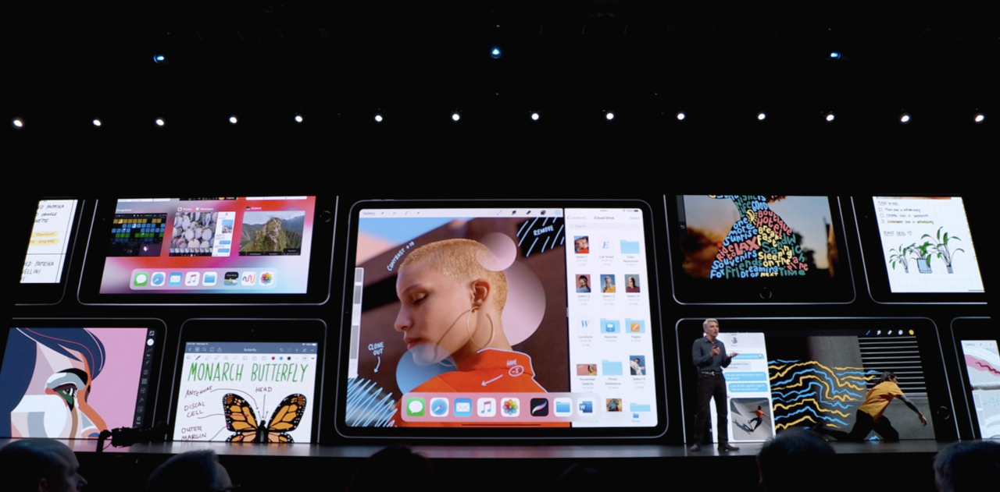 

이번 업데이트를 통해 사용자들은 동시에 여러가지 일을 할 수 있도록 업데이트가 되었고,  `복사` , `붙여넣기` , `되돌리기` 등과 같은 커맨드를 세 손가락으로 컨트롤 할 수 있도록 해주는 모션등이 추가 되었습니다. 

또한 가장 큰 업데이트라고 할 수 있는것은 `USB`를 통해 파일을 직접 불러오고 내보내기 할 수 있다는것이 가장 큰 업데이트 내용입니다.

 

## 기타 업데이트  (Airpods)

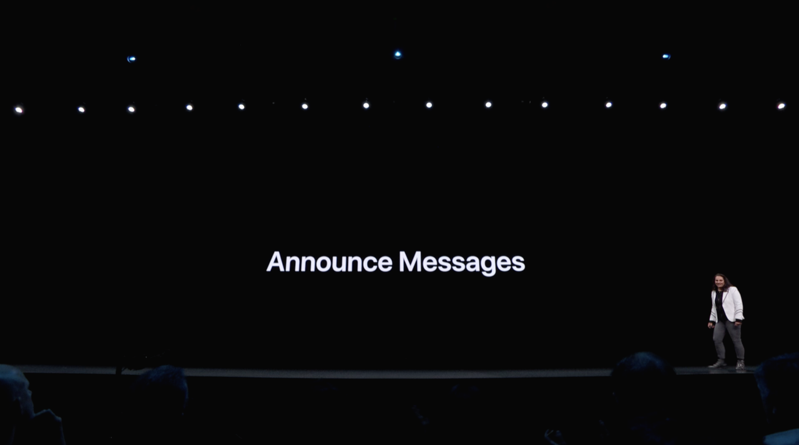 

## 새로운 메세지가 왔을 경우 알림
이제 `Airpods` 에서 메세지가 오거나 새로운 알림 사항이 있으면 알려주도록 업데이트 되었습니다. 

시리가 메세지를 읽어주도록 업데이트 되었습니다

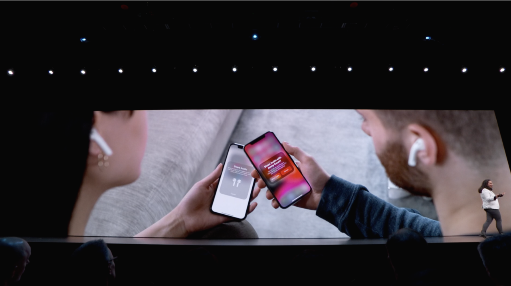 

## Airpods 컨텐츠 공유 
현재 내가 듣고 있는 음악이나 컨텐츠를 다른 `Airpods` 사용자와 공유할 수 있게 되었습니다. 

 

