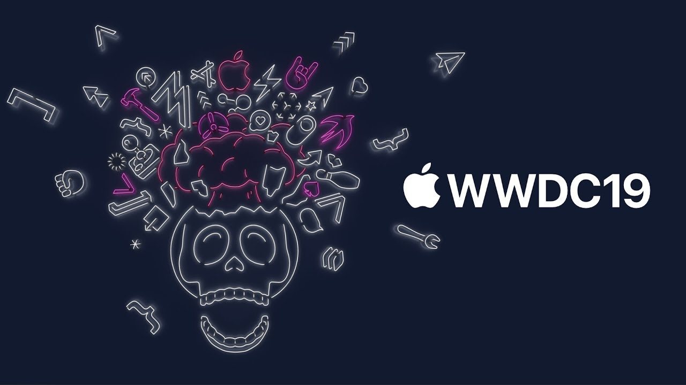
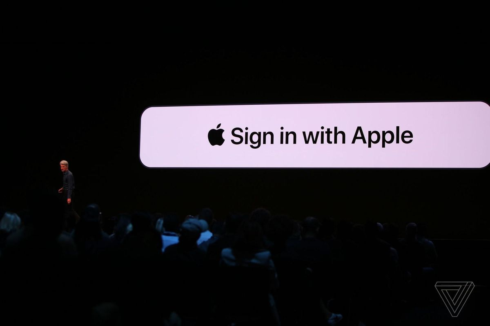
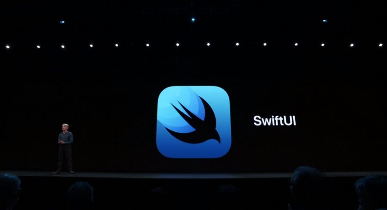

## What's new? 🎁

애플의 연례 행사인 세계 개발자 컨퍼런스(WWDC) 2019 일정이  2019년 6월 3일부터 7일까지 매키너리 컨벤션 센터`(McEnery Convention Center)`에서 성황리에 마무리되었습니다. 이번 발표에서 소개된 새로운 많은 기능들과 제품들은 벌써부터 올 가을을 기다려지게 만드는 중이네요. WWDC19에서 소개된 신 제품과 `iOS13`의 기본 기능들은 개발자 뿐만아니라 일반  iOS 유저들에게도 많은 호응을 받고 있습니다.

일반적으로 소개된 다크모드, 사진첩 알고리즘 개선, 애플 아이디 로그인 지원은 사용자들에게는 편한 기능이 되겠지만, 개발자들은 새로운 OS에서 개발 중인 앱이 잘 돌아가는지 크래시는 나지 않는지 테스트도 해야 하고 지원되는 새로운 기능을 미리 익혀야 하기 때문에 즐거움 반 고통반의 시간을 보낼 것이라고 믿습니다.

그래서 기사를 통해 접할수 있는 내용 이외에도 개발자 관점에서 바라본 iOS13은 
어떠한 변화가 있는지 요점만 쏙쏙 정리해서 알려드리겠습니다.

## Signin with AppleId 

<br><br>

모바일 앱에서는 간편 로그인이 중요한 기능 중 한 가지로 자리를 잡았는데요, 
예를 들자면 소셜로그인 서비스들 중 페이스북, 구글, 카카오, 네이버 로그인 등을 꼽을 수 있습니다. 
사용자는 기존에 이용하고 있는 서비스인 아이디 정보를 가지고 새로 접근하고자 하는 서비스에 간편하게 가입을 할 수 있는 좋은 기능인데 
최근 개인정보보호 이슈가 연일 발생하면서 사용자들이 소셜 로그인에 대한 불신이 생기고 있는 것도 사실입니다 

이번 `WWDC19`에서는 해당 문제점을 해결하기위해 야심 차게 `Sign in With Apple`이라는 서비스를 새로 오픈하였습니다. 
사용자는 본인이 소유한 애플 아이디를 가지고 기존에 사용하던 소셜로그인과 같은 방식으로 이용을 할 수 있습니다. 
아마 사용은 iOS 기기가 아니어도 가능은 하겠지만 `iOS`를 지원하는 기기에서는 `FaceID`, `TouchID`를 통한 로그인이 가능해지기 때문에 
정말 편해질거라고 생각합니다. 하지만 단점도 있습니다. 

## 소셜 로그인 기능이 있다면 반드시 Apple 로그인을 지원해야 함 😭

만약 소셜 아이디 로그인 기능이 들어 있는 앱이라면 반드시 `Apple Login`을 지원해야 합니다. 이번 새로 업데이트된 정책을 보면 해당 기능을 지원하지 않으면 리젝 사유에 해당한다고 적혀있어요.  이번 `iOS13` 업데이트 이후 빠르게 애플 로그인의 점유율을 높이기 위해 정책을 수정한 것 같아 보이네요. 해당 기능이 있는 앱을 개발하시는 분들이 있다면 체크 한번 해보셔야 할 것 같습니다 

> https://developer.apple.com/sign-in-with-apple/get-started/ <br>
`Sign in with apple` 에 대해 더 많은 정보가 궁금하시다면 이곳을 통해서 확인하시면 될 것 같습니다. 

## 새롭게 소개된 SwiftUI 💄



이번 `WWDC19`에서 가장 많은 관심을 받고 있는 것은 바로 `SwiftUI`라고 해도 과언이 아닌 것 같습니다. 

그 이유는 기존에 사용하던 Storyboard를 버리고 새로운 방식으로 UI를 만들 수 있는 `SwiftUI`를 새롭게 소개했기 때문입니다. 
새롭게 소개된  `SwiftUI` 는 어떤 식으로 작동을 하고 기존의  `UIStoryboard`와는 어떤 식으로 다른지 간단하게 정리해보겠습니다. 


SwiftUI는 기존에 발표 되었던 `Flutter` , `React`와 비슷한 방식으로 UI를 그릴 수 있도록 만들어진 것 같은 느낌을 받았습니다.


```swift 
struct ContentView: View { 
    var body: some View { 
        Text("Hello World") 
    } 
}
```

위의 코드처럼  형태로 뷰를 그리는 코드를 추가 할 수 있으며, View안에 있는  body를 통해서 화면을 구성합니다. 
기존 방식과는 다르게 UI를 구성하는 방법이 달라져서 새롭게 익혀야 한다는 부담은 있지만, 아직 지원 버전이 최소  `iOS13`까지는 올라가야
많이 활성화 될 것 같습니다 `(최소 2년 이후에는 대세가 되겠죠 🚀)`

`SwitUI`를 사용하게 되면 `AppDelegate` 이외에도 `SceneDelegate` 파일이 하나 더 추가됩니다. 
화면을 관리해주는 생명주기가 하나 생겼습니다 자세한 것은  `SwitUI` 튜토리얼 포스팅에서 별도로 소개해드리도록 하겠습니다.

눈에 띄는 점은 실시간으로 UI를 그릴 수 있고 화면에 Drag & Drop으로 그린 화면이 코드로도 반영이 된다는 점입니다. 
UI를 그리기가 쉬워진 만큼 앞으로는 프론트앤드만 전문적으로 하는  iOS 개발자가 등장할 것 같은 느낌이 드는 부분입니다
이외에도 새롭게 추가되면서 많은 개발자들이 궁금해하는 SwitUI의 대표적인 질문 3가지를 정리해보았습니다 


## SwiftUI에 대해 가장 궁금해하는 대표적인 질문 3가지 🤔

- 📱 `SwiftUI`는 `iOS13`, `macOS10.15` 이상 버전에서만 동작합니다. 
- 📐 `SwiftUI`는 `AutoLayout`이 없습니다, 대신 `H/V Stack`과 같이 그룹 지어 사용합니다 `(100% Autolayout Free)`
- 👨🏻‍💻 `UIStoryboard`로 작성된 코드 모두 `SwiftUI`로 포팅이 가능합니다. 
- 👍🏻 `UIHostingController`을 이용해서 `UIKit`과 함께 사용할 수 있습니다. 

## SwiftUI를 좀 더 자세히 알고 싶다면?  📝

새롭게 발표된 `SwiftUI`에 대한 관심이 뜨거운만큼 많은 능력자 분들께서 튜토리얼을 만들어서 공유를 해주고 계십니다 
가장 먼저 살펴봐야 할 것은 `SwiftUI`의  애플 공식 세션 비디오입니다 


## 애플 공식 비디오 세션 링크 

- [Introducing SwiftUI: Building Your First App](https://developer.apple.com/videos/play/wwdc2019/204/)
- [Integrating SwiftUI](https://developer.apple.com/videos/play/wwdc2019/231/)
- [Data Flow Through SwiftUI](https://developer.apple.com/videos/play/wwdc2019/226/)
- [Building Custom Views With SwiftUI](https://developer.apple.com/videos/play/wwdc2019/237/)
- [wwdc2019-video-sessions](https://github.com/techinpark/wwdc2019-video-sessions)
 

## 유용한 샘플 프로젝트 🧳

- [SwiftUI Guideline (unofficial)](https://github.com/Jinxiansen/SwiftUI)
- [SwiftUITodo (Sample Project)](https://github.com/devxoul/SwiftUITodo)
 

## Combine.framework 🧠
이번에 새롭게 추가된  `combine.framework` 는 기존에 `iOS` 개발자들에게는 익숙했던 `RxSwift`와 닮은 부분이 너무 많습니다. 
스트림을 다루는 방식이기도 하고 기존 `RxSwift`에서 지원하는 오퍼레이터들을 비슷하게 사용할 수 있어 비교를 해보고자 했는데 
이미 능력자가 해놓은 훌륭한 블로그 글 링크가 있어 해당 링크로 대체합니다. 

https://medium.com/gett-engineering/rxswift-to-apples-combine-cheat-sheet-e9ce32b14c5b

## 그 외에도 iOS13에서 추가된 내용

 - SwiftUI
 - PencilKit
 - RealityKit
 - BackgroundTasks
 - Combine (RxSwift)
 - QuickLookThumbnailing
 - Create ML
 - Core Audio Types
 - Core Haptics
 - SoundAnalysis
 - VisionKit
 - Maps Webs Snapshots
 - LinkPresentation
 - Apple CryptoKit
 - IOUSBHost
 - Logging
 - MetricKit
 - NetworkingDriverKit
 - DriverKit
 - EndpointSecurity
 - ExecutionPolicy
 - SystemExtensions
 - USBDriverKit
 - USBSerialDriverKit
 - HIDDriverKit
 - WiFi
 

## 마치며 ✍🏻
이번 `WWDC19`에서 발표된 `iOS13`은 개발자들에게 선물이자 새로운 숙제를 안겨준 업데이트가 되었습니다. 
앞으로 `IOS`가 어떻게 업데이트가 되고 새로운 `SwiftUI`를 활용한 새로운 프레임워크들이 나올지 기대가 됩니다 
혹시나 설명이 틀렸거나 내용이 부족하다 싶으시면 아래의 댓글 기능을 이용해 남겨주세요 감사합니다. 
