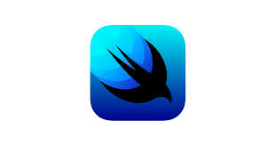
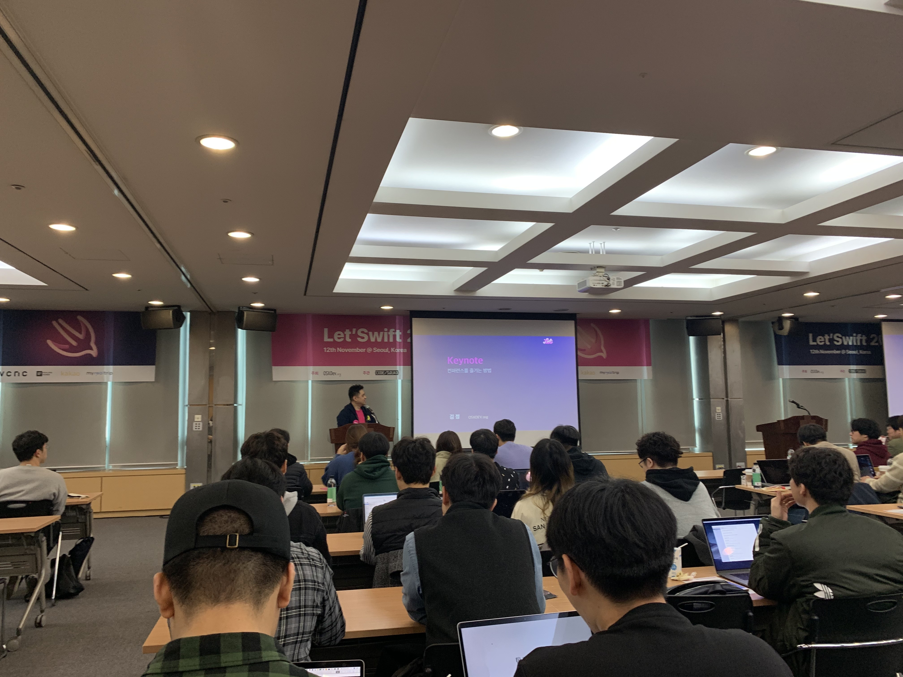
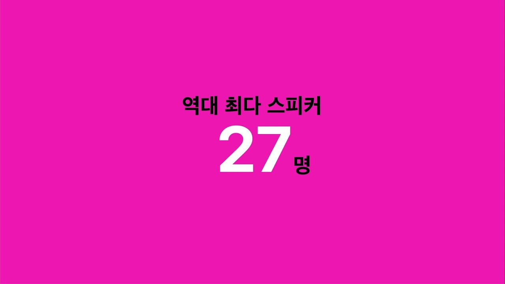
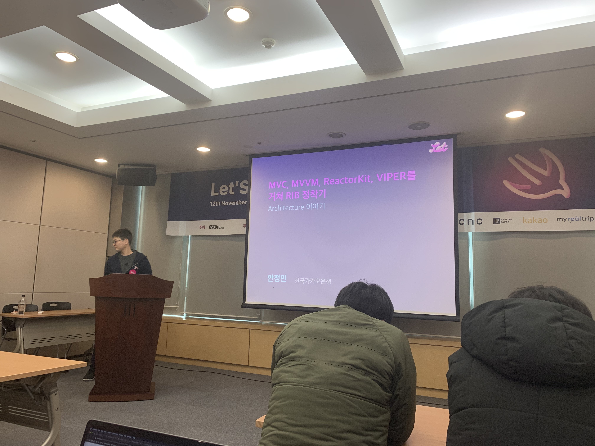

1년에 한번 있는 iOS개발자들의 행사인 **Let's Swift 2019**에 다녀왔습니다!  
이번 행사는 티케팅부터 너무 치열했던 만큼 이른 시간임에도 불구하고 미리 도착하신 분들이 많아 인산인해를 이루었습니다.  
참가자들을 위한 사은품은 스위프트 로고가 새겨진 후드집업과 Let's Swift 뱃지, 다양한 간식거리  
아침에 하는 행사 인 만큼 간단한 간식을 준비해주셨어요 운영진 분들의 세심한 배려가 돋보였습니다

Let's Swift 2019 의 시작을 알리는 첫번째 세션은 [김정](https://github.com/godrm)님 께서 진행해주셨습니다.

행사의 히스토리에 관한 관한 비디오로 행사가 시작 되었고 ([https://youtu.be/y5ZV5zJMeKI)](https://youtu.be/y5ZV5zJMeKI)  
전반적인 Let's Swift 2019 를 즐길 수 있는 방법과 준비 과정에 대해 이야기를 해주셨습니다.

아쉽게도 이번 행사를 끝으로 김정님께서는 행사를 직접 준비하는 쪽이 아닌 서포트를 하시는 방향으로 하신다고 언급 하셨고 내년 Let's Swift 준비위원회를 모집하고 있으니 언제든 연락 달라고 하셨습니다

모두가 준비 할 수 있는 형태로 Let's Swift 의 모든 서비스 (웹페이지 / 앱 서비스) 는 깃헙에 오픈 되어 있으니 언제든지 참여가 가능합니다.

[https://github.com/cleanios/LetSwift](https://github.com/cleanios/LetSwift)

가장 인상 깊었던 부분은 커뮤니티가 소비되고 있다는 말을 해주셨을때 깊은 공감이 되었습니다.  
최근의 커뮤니티는 대화형태의 커뮤니티가 많기 때문 기존에 누군가가 했던 질문 일지라도 반복해서 물어볼 수 밖에 없는 구조이기 때문에 쌓아나갈 수 없는 형태 라는 것이 너무 아쉬울 따름 입니다.

이후 김정님의 세션을 시작으로 다양한 스피커 분들의 발표가 있었습니다.  
다양한 경력의 개발자들이 서로 모여 있기 때문에 세션은 **3가지 분류**로 나누어 진행 되었습니다

워크샵 세션은 실제 실습을 하면서 진행되었고 티타임 세션은 토론형식으로 진행 되었던것 같습니다  
발표 세션은 특정 주제를 가지고 경험과 팁을 나누는 형태로 진행 되었습니다

모두가 iOS개발자 이지만 서로의 관심사가 다르고 업무가 다르다보니 실무를 하면서 있었던 소중한 경험을 나눌수 있는 시간 이었습니다.모든 세션들의 자료는 이후 Let's Swift 2019 홈페이지를 통해 공개될 예정 이기 때문에 제가 들었던 세션들에 대해서만 간단하게 리뷰를 남겨볼까 합니다.

---

## **MVC, MVVM, ReactorKit, Viper을 거쳐 RIBS 정착기 (민소네님)**

  
  
다양한 아키텍쳐를 경험하고 왜 RIBS를 선택하게 되었는지에 대한 소중한 경험을 공유 해주셨습니다.

충분히 실무에서 겪을 만한 이야기들로 설명을 해주시고 실제 고민이 있는 부분을 해결한 경험을 발표 해주셔서 개인적으로는 많은 인사이트를 얻을 수 있는 발표 였던 것 같습니다

아마 많은 분들이 해당 세션을 듣고 이후 [https://github.com/uber/RIBs](https://github.com/uber/RIBs) 에 스타를 하나씩 꾹 누르지 않았을까 살포시 예상해봅니다  
발표 내용은 감사하게도 민소네님께서 웹상에 공유를 해주셔서 링크자료로 대체합니다.

[MVC, MVVM, ReactorKit, Viper을 거쳐 RIBS 정착기 ](https://speakerdeck.com/minsone/mvc-mvvm-reactorkit-viperreul-geocyeo-rib-jeongcaggi)

## **Swift in SwiftUI (giftbott 님)**

SwiftUI에 반영된 Swift 5.1의 **주요 구현사항**에 대해서 설명 해주셨습니다.

어려울 수 있는 부분을 쉽게 풀어서 설명해주시고 어떤식으로 개선이 되었는지를 Step by Step으로 설명 해주셔서 좋았습니다. 발표를 잘하셔서 기억에 남는 세션입니다. 

## **Xcode Preview IB없이 개발하기 (김남현 님)**

그동안 스토리보드와 XIB사용성과 문제점에 대한 이야기는 많이 들어와서 비슷한 내용의 세션이지 않을까 생각 했는데,  
SwiftUI의 간략한 설명과 더불어서 현재 실무에 적용해 볼 수 있을만한 **UIKit**을 **Xcode Preview**로 보는 방법에 대한 데모를 진행해주셨습니다. _(정확히는 UIKit을 SwiftUI 화 해서 보여준다고 하는것이 맞을 것 같아요)_

안그래도 여러명이 한 프로젝트를 개발하게 되면 엑스코드에서 생성해주는  .storyboard 나 .xib 파일의 xml값은 자기 멋대로 바뀌기 때문에 골치 덩어리 였습니다

그래서 코드베이스로 변경하는 작업을 진행중인데 코드베이스로 변경하게 되면, 이 코드가 어떤 UI인지 빌드를 하고 해당 화면으로 이동을 해야 하기때문에 고민이었는데 해당 고민을 위 세션에 나온 내용을 통해 해결 할 수 있을 것 같습니다.  
발표에 나온 IBKit 이라는 프로젝트는 아직 비공개 상태라고 하니 얼른 공개되었으면 좋겠네요 😀

비슷한 내용의 관련 링크 
- [UIKit Hot Reload Using Xcode 11’s Live Preview](https://medium.com/@ethanjdiamond/using-xcode-11s-live-preview-with-uikit-92692cd481f) 

- [Using Xcode 11’s Live Preview with UIKit](https://medium.com/@ethanjdiamond/using-xcode-11s-live-preview-with-uikit-92692cd481f)

## **RxTesting 같이 시작하기 (이병찬 님)**

아이폰 개발자들에게 있어 꿀같은 존재인 Rx의 테스트를 도울 수 있는 오픈소스를 어떻게 다룰 수 있는지에 대한 세션 이었습니다.

다양한 예시 상황과 적절한 설명을 통해 기본 개념을 이해 할 수 있었습니다!  
어려운 주제의 발표 임에도 불구하고 간략하게 정리를 잘해서 발표를 해주신 덕분에 좋은 시간이었습니다  
  
관련 링크 : [https://github.com/ReactiveX/RxSwift/tree/master/RxBlocking](https://github.com/ReactiveX/RxSwift/tree/master/RxBlocking)

[ReactiveX/RxSwift](https://github.com/ReactiveX/RxSwift)

## **iOS앱에서 머신러닝이 해결 할 수 있는 문제들 (곽도영 님)**

다른 컨퍼런스나 발표들을 보면 주로 머신러닝의 학습과 데이터 설계에 대한 발표 내용이 많은데 이번 발표는 머신러닝 데이터를 사용하고자 하는 개발자를 위한 세션이었습니다. 다양한 실제 예시를 보여주시면서 설명을 해주셔서 흥미도 생기고 룰베이스로는 해결하지 못하는 많은 것들을 머신러닝 으로는 할 수 있다는 말이 기억에 남습니다.

해당 세션에서 소개해주신 다양한 샘플들을 보며 머신러닝을 활용해서 할만한 프로젝트들이 많겠구나 하는  
짐작을 할 수 있는 세션 이었습니다.  
  
관련 링크 
- [https://github.com/motlabs/awesome-ml-demos-with-ios  ](https://github.com/motlabs/awesome-ml-demos-with-ios)  

Demo  
- [tucan9389/ObjectDetection-CoreML](https://github.com/tucan9389/ObjectDetection-CoreML)
- [motlabs/awesome-ml-demos-with-ios](https://github.com/motlabs/awesome-ml-demos-with-ios)

## 스타일쉐어 iOS팀 개발 문화 (StyleShare ios team)

[ReactorKit](https://github.com/ReactorKit/ReactorKit)의 아버지 수열님이 계시는 StyleShare팀의 개발문화를 들어볼 수 있는 시간이었습니다.  
서로 어떠한 방식으로 커밋을하고 어떠한 기준으로 **PR**을 날리는지 알 수 있었습니다.  
또한 새롭게 시도하고있는 git 브랜치 전략에 대해서도 알 수 있었습니다.  
팀이 점점 커지면서 자연스럽게 협업에 대한 방법에 대해 모두가 의논하여 의사결정하는 방식이 맘에 들었습니다.  
다양한 오픈소스 및 자동화를 통해 메인인 개발에 집중한다는 개념이 저에게 많은 인사이트를 주었습니다.

  
아쉽게도 저는 행사를 들으면서 많이 메모를 하지 못해 공유할 수 있는 부분이 한정적이었는데   
마침 렛츠스위프트 후기를 잘 정리해주신 포스트가 있어 링크를 남깁니다.   

[Let’Swift 2019 후기](https://medium.com/@agiletalk/letswift-2019-%ED%9B%84%EA%B8%B0-658639d08815)

## 마치며 📝

다양한 경력의 실력자 분들과 같은 공간에서 현업에서 겪었던 어려움과 경험을 공유하면서 공감대도 형성이되고 새로운 인사이트를 많이  
얻을 수 있는 좋은 기회의 장이지 않았나 생각해봅니다. 늘 같은 환경에서 같은 업무만 하다보면 루즈해지기 쉬운데 여러가지 주제를 가지고   
다양한 세션의 발표를 들으니 새로운 아이디어도 떠오르고 개인적으로는 매우 만족스러운 행사였습니다.   
이번 행사에 참여하시지 못하셨더라도 홈페이지를 통해서 행사의 자료들이 공유될 예정이라고 하니  
유익하고 값진 자료들과 함께 다시 열정을 불태워 보는것은 어떨까요~?    
  
iOS를 사랑하는 개발자분들 모두 화이팅합시다!