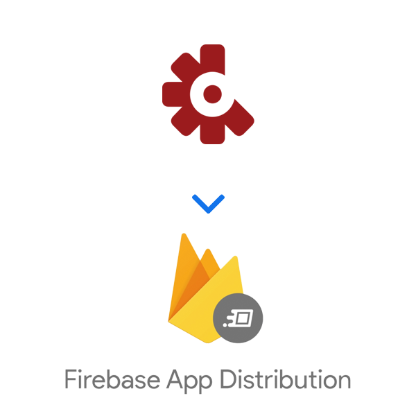
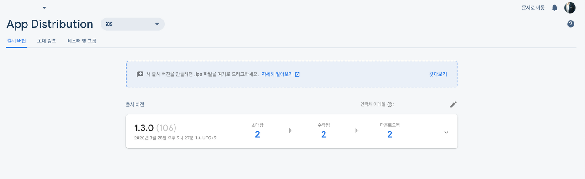
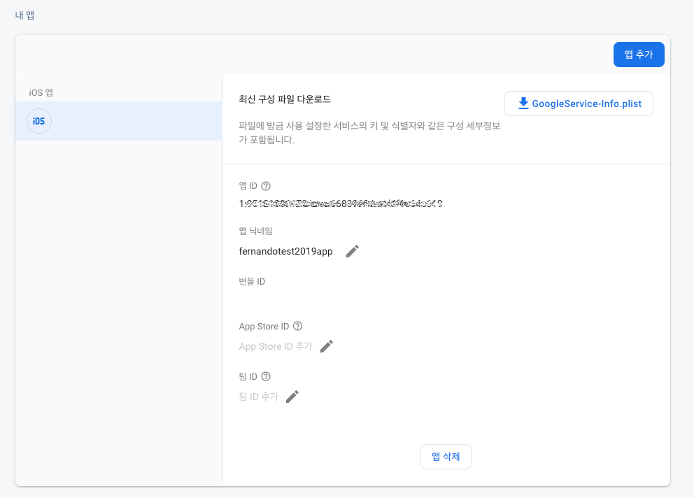

# 😢 Fabric Beta 지원 종료

사내 배포를 위해 그동안 열심히 써왔던 `Beta` 서비스가 `deprecated` 되었습니다.

```
Fabric is deprecated and shutting down May 4, 2020. 
Learn how your Fabric access and apps will be impacted after this date. 
Work with your Fabric organization's admin to migrate your apps to 
Firebase to take advantage of the latest tools we’ve built there.

```

현재 `Beta` 서비스를 보면 위와 같은 메시지가 쓰여있습니다.  
5월 4일 이후로는 `Fabric`에서 지원하는 모든 서비스들이 지원중단 되므로 가능하면  
Firebase로 이전을 권장한다는 내용의 글입니다.

# 😎 Firebase Distribution 사용하기


Firebase 에 접근하신 이후 `[품질]` > `App Distiribution` 이 저희가 사용해야할 서비스 입니다.


`App Distribution` 으로 들어오시면 다음과 같은 페이지가 보이실텐데, 여기서 시작하기 버튼을 눌러줍니다.

> ⚠️ 이전에 시작하기를 누르신 경우에는 위 메뉴가 보이지 않아요. 참고해주세요

## 01\. Firebase 웹페이지를 통한 배포



`Firebase` 웹페이지를 통한 배포는 정말 간단합니다.  
릴리즈 버전의 IPA 파일을 만들어 웹페이지에 Drag & Drop 방식으로 업로드가 가능합니다.  
업로드 이후에는 버전 릴리즈 노트를 작성할 수 있으며 배포 대상을 지정할 수 있습니다.

## 02\. Firebase CLI를 통한 배포

`Firebase CLI` 를 통한 배포는 PC에 `Firebase Tool` 이 설치되어 있어야합니다.  
아래와 같은 명령어를 통해 설치합니다.

> 설치가 되어있다면 이 단계는 생략 하셔도 됩니다.

```bash
curl -sL firebase.tools | bash
```

설치한 이후 터미널에 `firebase` 명령을 입력하여 명령어가 수행이 되는지 확인합니다.  
명령어가 수행이 된다면 정상적으로 설치 된 것입니다.

이후 로그인을 수행합니다.

```bash
$ firebase login 
```

위 명령어를 수행하게 되면 firebase 로그인 과정을 거칩니다.  
로그인 한 이후 다시 명령어를 입력해보시면 현재 로그인되어있는 계정의 정보가 출력됩니다.

```bash
$ firebase projects:list
```

> 💡 위 명령을 통해 현재 내가 관리중인 프로젝트 목록을 불러올 수도 있습니다.

`Firebase CLI`를 통한 배포를 위해서는 `appID` 를 알아야합니다.



`[프로젝트 설정]` -> `일반` 탭 하단에 보시면 `앱ID` 라는 항목이 있습니다.  

```bash
$ firebase appdistribution:distribute App.ipa  \
    --app 1:1234567890:ios:0a1b2c3d4e5f67890  \
    --release-notes "Bug fixes and improvements" --testers "user1@example.com, user2@example.com"
```

> ⚠️ IPA 파일이 있는 경로로 접근한 이후에 사용하시면 디렉토리 경로를 별도로 입력하지 않으셔도 되나,  
> IPA 파일이 없는 경로에서 명령을 입력하시려면 IPA가 존재하는 곳의 경로를 적어주셔야합니다.

이후에 위와 같은 명령을 통해 배포할 수 있습니다.  
위의 복사하셨던 `앱ID`는 `--app` 항목 뒤에 값을 바꾸셔서 이용하시면 됩니다.  
들어가야하는 필수 값은 `appId` , `배포할 대상의 IPA` 입니다.

## 03\. Fastlane를 이용한 배포 🚀

기존에 Fastlane를 통해서 `Beta` 배포를 하셨었다면 약간의 스크립트 수정만 하시면 됩니다.

-   Fastlane 플러그인을 설치합니다.
    
    ```bash
    $ fastlane add_plugin firebase_app_distribution
    ```
    

-   `.env` 환경변수 파일에 두가지 값을 추가합니다.

> ⚠️ Firebase cli 가 설치 되어있다는 전제가 필요합니다.  
> 💡 위 FIREBASE\_APP\_TOKEN 값은 cli 설치이후 로그인을 진행하시면 발급받을 수 있습니다.

```ruby
# for Firebase app distribution 
FIREBASE_APP_ID = "앱아이디 입력"  
FIREBASE_APP_TOKEN = "FIREBASE\_APP 토큰"
```

-   `Fastfile` 내에 배포 스크립트를 추가합니다.

```ruby
firebase_app_distribution(
    app: ENV['FIREBASE_APP_ID'],
    ipa_path: lane_context[SharedValues::IPA_OUTPUT_PATH],
    firebase_cli_token: ENV['FIREBASE_APP_TOKEN'],
    groups: "원하는 그룹명",
    release_notes: "릴리즈 노트 내용",
    debug: true
)
```

위와 같은 과정을 통해서 배포를 하시면 `Firebase Distribution`을 사용할 수 있게 됩니다.  
좋은 기능을 `Firebase` 를 통해서 무료로 사용 할 수 있다는 것 만으로도 정말 좋은 기능이니 테스트를 위해서 한번 써보세요! 강력하게 추천드립니다.

# 🔗 Reference

-   [https://firebase.google.com/docs/app-distribution](https://firebase.google.com/docs/app-distribution)
-   [https://firebase.google.com/docs/app-distribution/ios/distribute-fastlane](https://firebase.google.com/docs/app-distribution/ios/distribute-fastlane)