# 키노트의 시작

    

키노트 시작전 인트로 영상에 보이는 지구본 영상에 `mimoji`는 현재 wwdc를 온라인으로 보고있는 수많은 사람들을 표현한것 같습니다.

  

애플 본사인 `Apple Park` 이 줌인 되면서 WWDC의 막이 올랐습니다. 

  

  

팀쿡이 등장하고, 얼마전 미국에서 있었던 조지플루이드 사건에 대해 추모를 하며 시작하였습니다. 

  

이후, 다양한 세션들과 WWDC2020에서 준비한 많은것들이 있다는 소개멘트와 함께 본격적으로 시작되었습니다
코로나 사태로 인한 온라인 세션인 만큼, 더욱더 세심하게 준비한 것이 느껴지는 영상미가 압권입니다. 

  

이후 `Craig` 를 소개하며 본격적인 기술세션이 시작 됩니다. 

# iOS 14의 소개 
  

- 새롭게 추가된 기능을 소개하였습니다. 

## AppLibrary

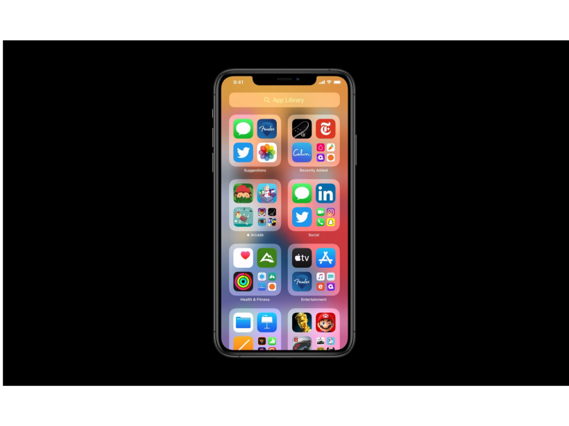  

`AppLibrary` 는 앱을 좀더 세분화 하여 보기 쉽게 정리해주는 듯한 새로운 기능입니다.  
따로 폴더로 구분하지 않아도 홈화면에서 자동 정렬되어 보여주는 기능인것 같습니다. 

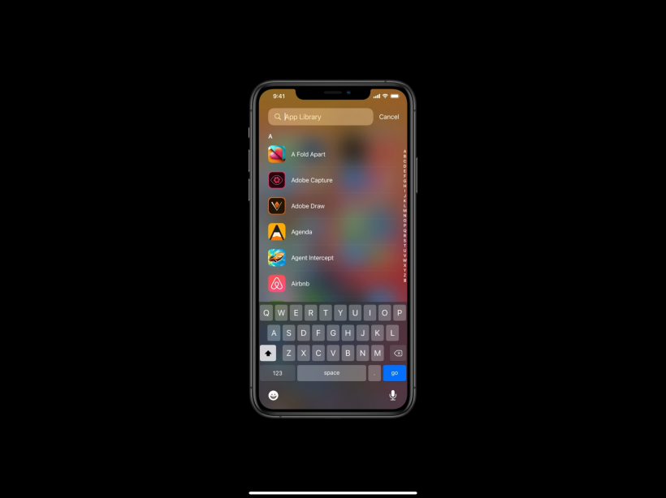 

`AppLibrary` 는 위의 사진 처럼 앱 검색도 가능합니다. 

## Widget 

  

- `Widget` 기능이 추가되었습니다. 

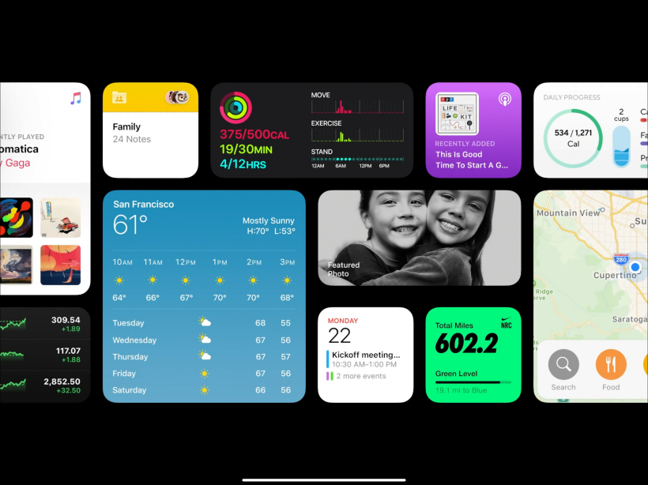   

기존에 있었던 위젯으로는 다양한 정보를 담아내는데 한계가 있었고, 다양한 스크린에서 보다 많은 정보를 접할 수 있도록 
위젯의 기능이 추가되었습니다. 

   

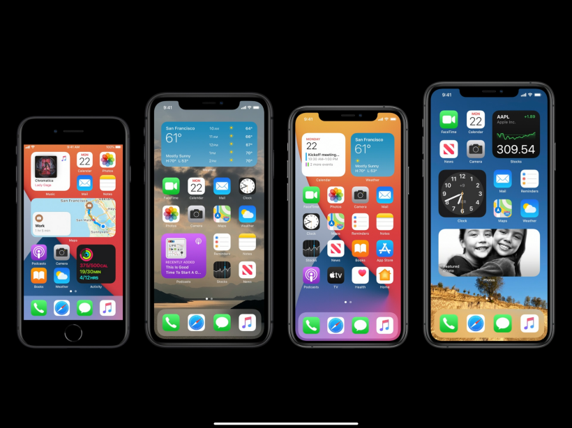   

이제 위젯은 사용자의 홈화면의 앱 아이콘 중간에 넣을 수 있는 형태가 되었으며 자유롭게 배치가 가능합니다. 

앞으로 더 많은 다양한 앱들이 위젯을 지원할것으로 보입니다. 

## Picture In Picture 

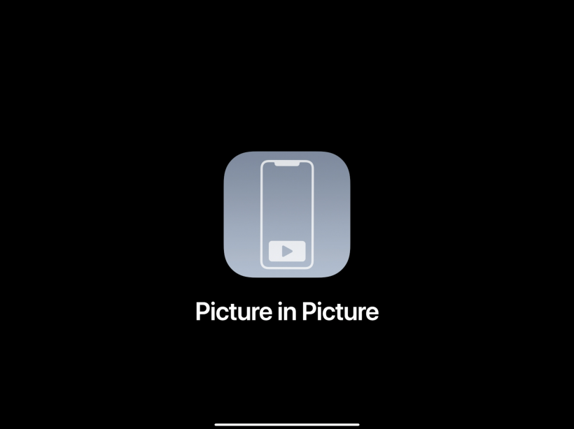   
   
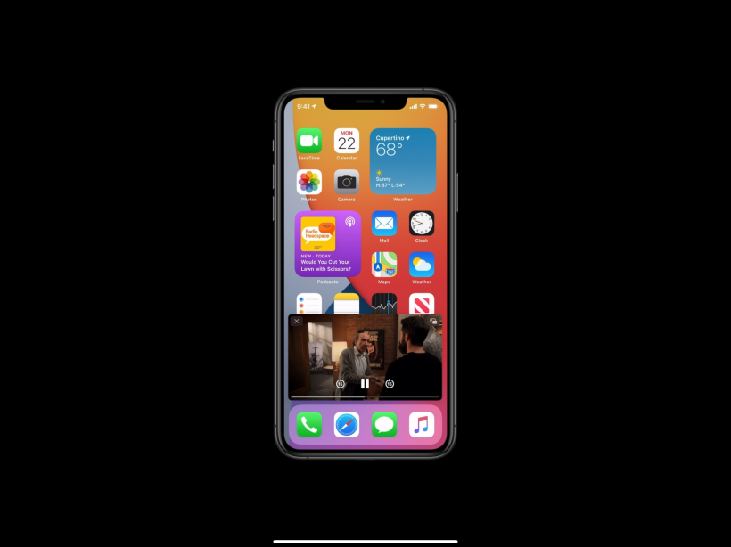   

이제 영상을 보다가 홈화면에서 재생하는것이 가능해 졌습니다. 

## Siri 기능 강화 
   

시리의 기능도 좀더 강화되었으며 새로운 UI에서 동작합니다. 

   
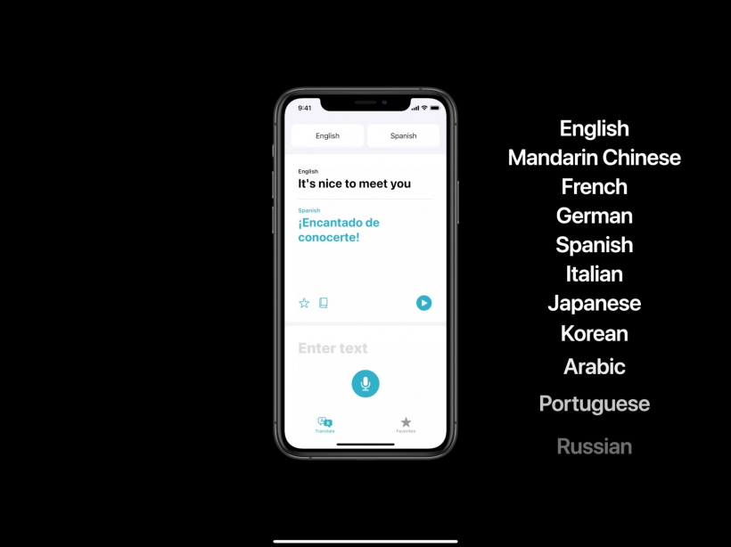   

실시간 번역기능을 제공하며 `한국어` 또한 지원대상에 포함되었습니다. 

## Messege 및 미모지 기능 추가 

   

메세지 또한 가장 많이 사용하는 기능중에 하나라고 소개하였고 추가된 기능이 공개되었습니다. 

그룹메세지 사용량이 두배로 늘어난 만큼 필요했던 기능인 멘션 기능이 추가되었습니다. 

   

나만의 미모지에 마스크를 씌울수 있게 되었습니다. 

## Apple Map 

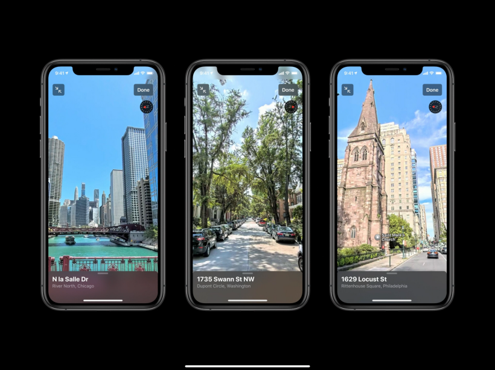   

   

애플맵의 성능이 더욱더 향상 되었으며 미국내에서는 거리뷰 뿐만 아니라 주변 정보까지 정확하게 제공합니다. 

   

이번에 영국, 아일랜드, 캐나다 의 지도까지 완벽하게 지원하게 되었습니다. 

   
   

`EV Routing`의 기능을 제공하며 해당 가능은 전기충전소가 있는곳을 기준으로 경로를 찾아주는 기능입니다. 

## Car Play 

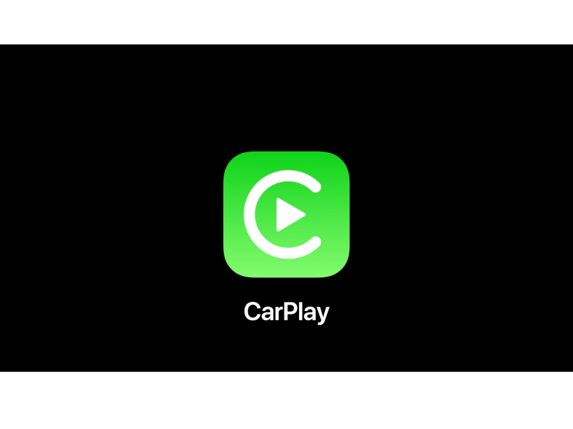   
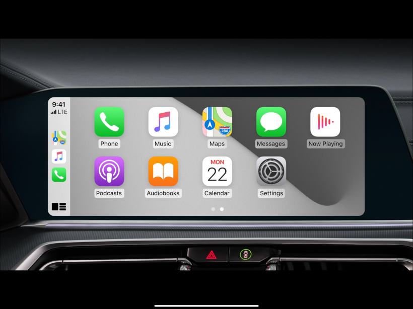   

카플레이의 배경화면을 바꿀수 있는 기능이 추가되었습니다. 

   
   
  

`NFC` 기능을 통하여 자동차의 문을 열 수 있는 스마트키의 기능을 할 수 있습니다. 

 

또한 메세지를 통하여 자동차에 `Access` 할 수 있도록 친구에게 스마트키를 전송할 수 있습니다.

## App Store 

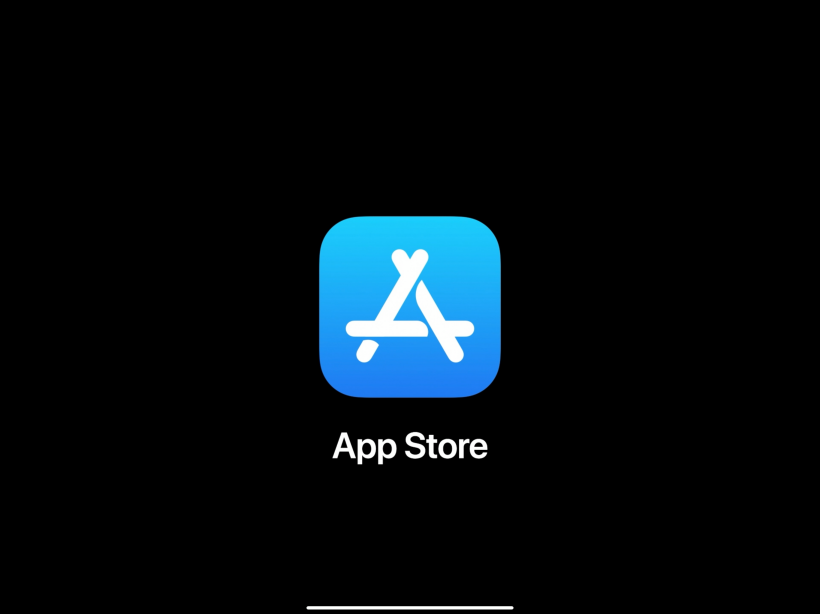 

앱스토어 에서는 다음과 같은 기능이 추가되었습니다. 

 
 

앱을 추가 설치 하지 않고도 간단하게 일회성으로 사용할 수 있는 `App Clips` 라는 기능이 추가되었습니다. 

가볍고 빠르며 `10MB` 이하입니다

## iOS 추가된 사항 요약 
 

- `Widgets` 기능 추가 
- `App Clips` 기능 추가 
- `App Library` 기능 추가 
- `새로워진 Memoji` 기능 추가 
- `Callbar` 기능 추가 
- PIP 기능 추가 
- 실시간 번역 앱 추가 
- 더욱더 새로워진 Siri UI
- 지도 & 애플 카플레이 업데이트 (스마트키)
- 자전거 경로 제공
- `EV Routing` 기능 추가 

# iPadOS 

 

다양한 앱들이 아이패드에 최적화 되어 개발이 되었으며 생산성 향상을 위한 앱위주로 마켓에 다양하게 등록되어있다고 소개하였습니다. 

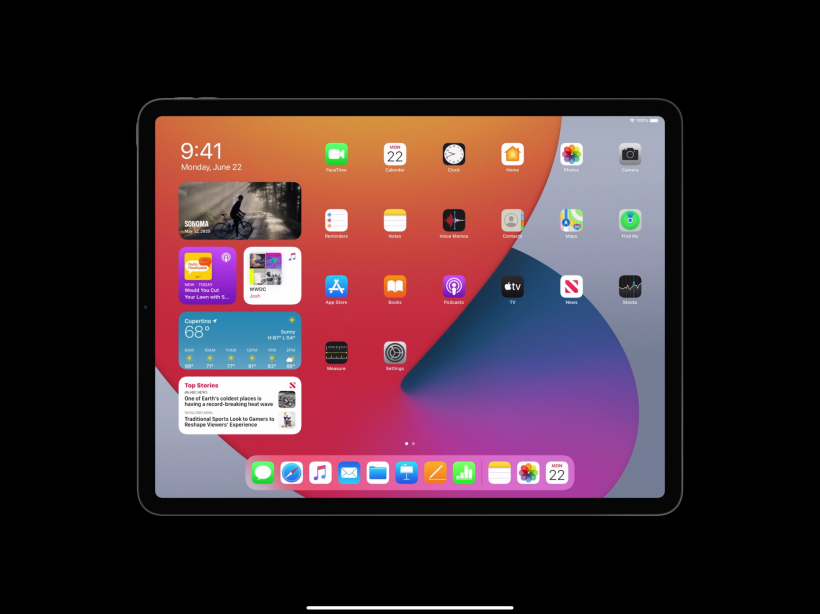 

`iOS14` 에서 추가된 것과 같이 `Widget` 이 동일하게 추가되었습니다. 

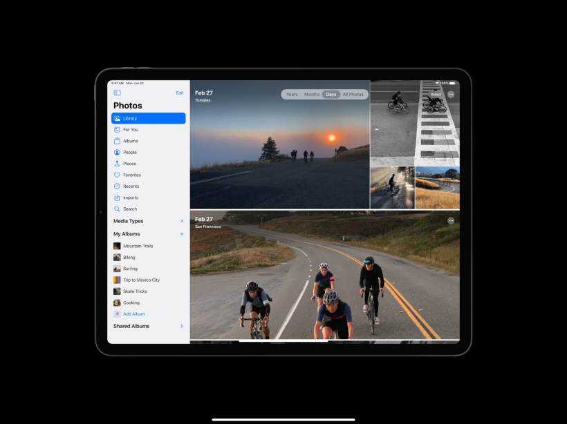 

넓은 화면의 특성을 살려 사진을 더욱 몰입감있게 볼 수 있도록 변경 되었습니다. 

 

`드래그 앤 드롭` 을 활용하여 사진을 손쉽게 정리할 수 있게 되었습니다 

 

기본 음악앱 또한 화면에 최적화 하여 새롭게 변경 되었습니다. 

## Call bar 

 

기존 UI로는 전화가 왔을때 하던 화면위에 강제로 전화가 왔다는 화면이 나와서 불편하였던 점이 개선되었습니다. 

 

아이폰 역시 아이패드와 동일하게 적용 됩니다. 

##  Universial Search

 

검색이 `MacOS`에 있는 `Spotlight` 형태로 변경되었습니다. 전화번호 뿐만아니라 파일 검색, 인터넷 검색 등등 다양한 기능을 지원할 예정입니다. 

## Pencil 

 

`Scribble` 기능이 추가 되었습니다. 위 기능은 모든 `TextField` 에 손글씨를 쓰면 자동으로 문자로 인식하여 동작하는 기능입니다. 

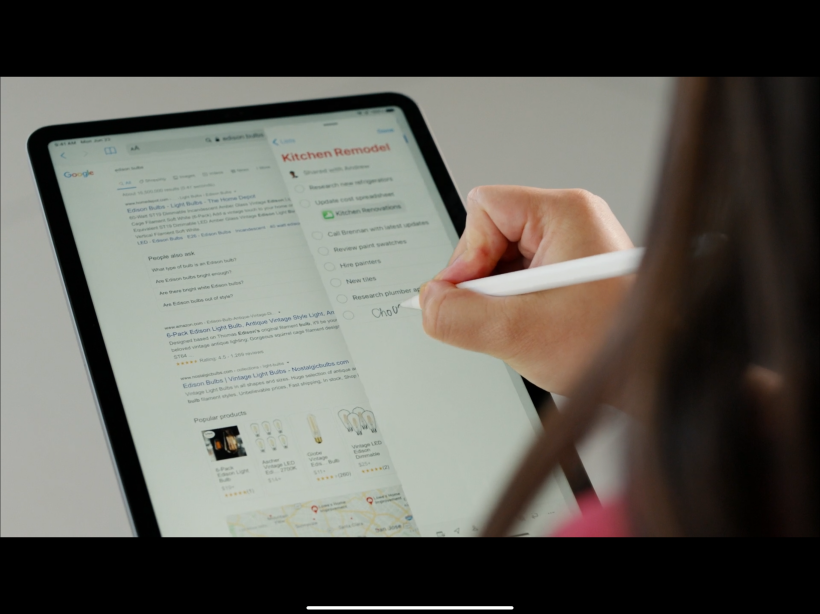 

화면에 보이는 리스트에 손글씨를 써넣으니 자동으로 텍스트로 변환이 되는 장면을 보여줍니다 

## iPadOS 추가된 사항 요약 

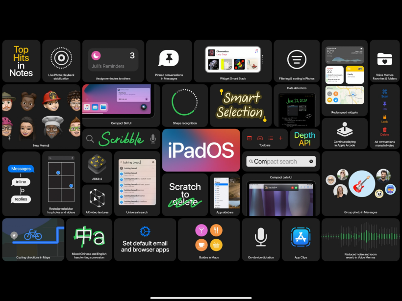 

- `Scribble` 기능 추가 
- `Widget` 기능 추가 
- `Universial Search` 기능 추가 
- `Pencil` 의 다양한 기능 추가  (영어, 중국어 인식)
- `Callbar` 추가 

# Airpod Software 

 

 

에어팟은 이제 다양한 디바이스에서 자연스럽게 페어링 될 수 있도록 업데이트 되었습니다.

 

에어팟 프로모델에서는 방향및 공간을 인지해서 소리를 입체적으로 내주도록 업데이트 되었습니다. 

# WatchOS 

 

새로운 댄스 기능이 추가되었습니다.  다양한 춤을 인식하여 효과적으로 기록해줍니다. 

 

COVID-19 관련 기능인 `손씻기` 기능이 추가되었습니다. 세심한 애플의 귀여운 배려가 돋보입니다. 

## WatchOS 추가된 사항 요약 
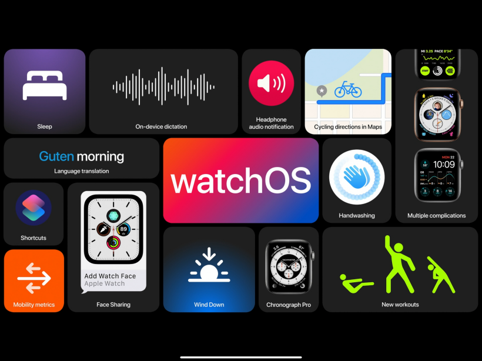 

- 새로운 댄스기능 추가 (다양한 동작 지원)
- 손씻기 기능 추가 
- 다양한 워치페이스 추가 
- 수면 추적 기능 추가 
- 자전거 길찾기 기능 추가 

# Privacy 

 
앱의 개인정보 보호에 대한 기능은 갈 수록 중요해지고 있다는것을 강조하였습니다.

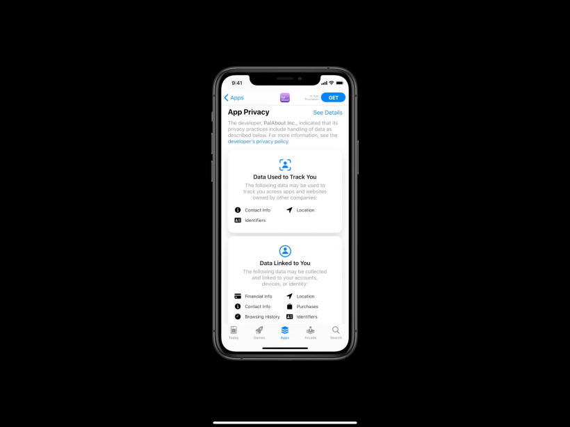
앱이 현재 무슨 권한을 어떻게 사용하는지에 대한 알림을 앱스토어 내에서 볼수 있게 변경 되었습니다. 

# macOS 

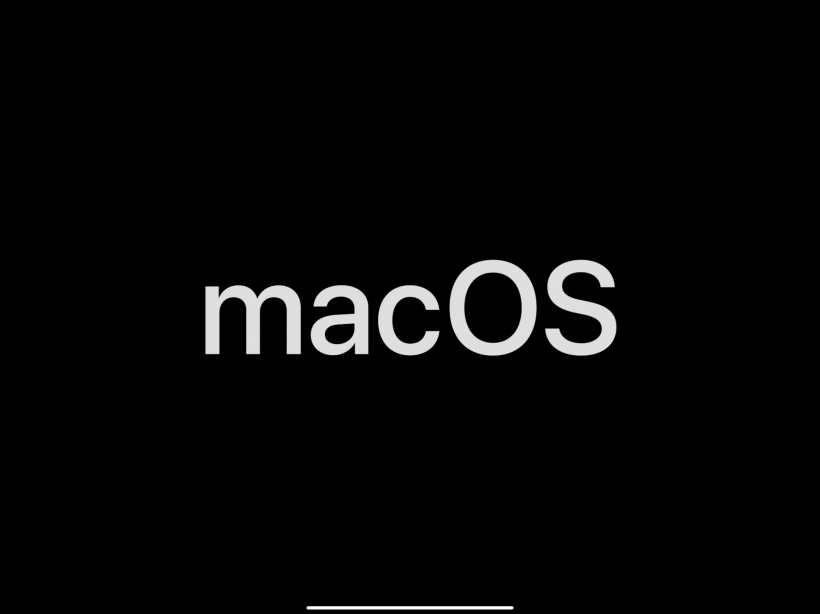

`macOS` 는 다양한 세대의 사람들이 다양한 목적으로 사용하고 있다는 것을 강조 하였습니다. 

이번에 변경되는 코드명은 `Big Sur` 이라고 합니다. 

대대적인 `UI` 업데이트가 있었다는것을 알린후 여러 기본앱의 화면을 보여줍니다.  전체적으로 `iPadOS` 의 느낌과 비슷하게 가는것이 
점차적으로 경계가 허물어질 수도 있겠다는 생각을 하게 됩니다. 

  

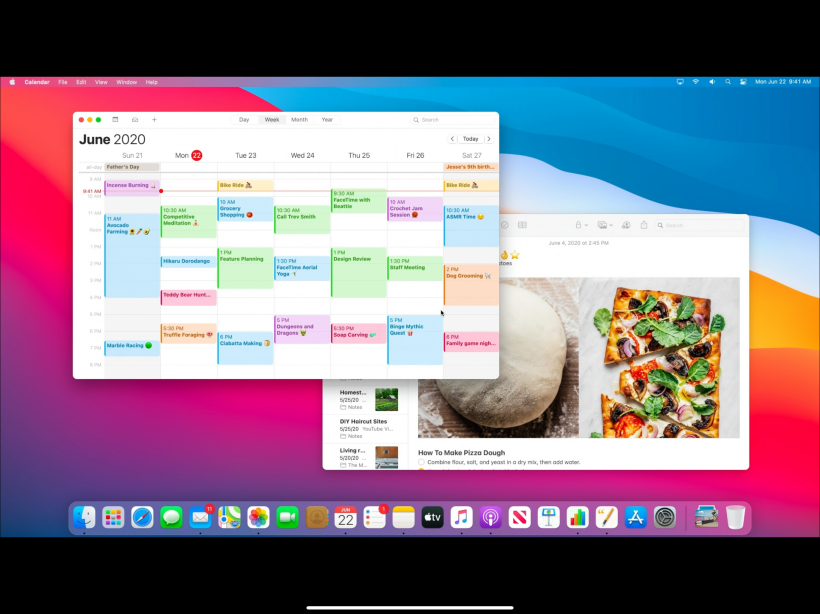

상단바 컨트롤들 또한 심플하면서도 세련되게 변경되었습니다. 

## Safari 
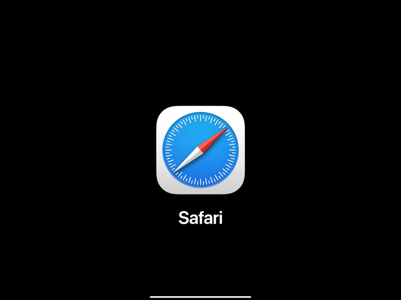

사파리 또한 크롬보다 50% 이상 빠르다고 합니다. 

개인정보보호를 중시하는 관점의 `Extension` 기능이 강화 되었다고 합니다. 

## Xcode 
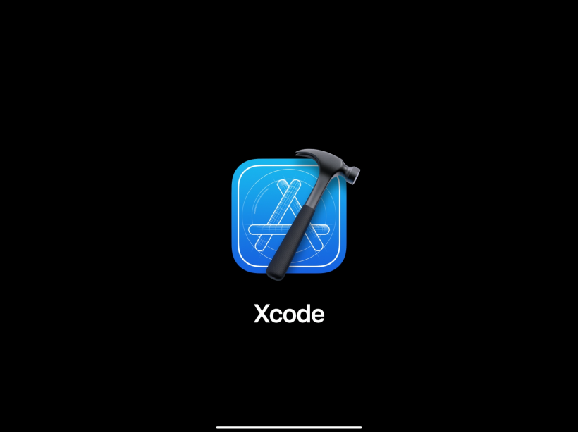

 
`Xcode`의 UI가 변경되었습니다. 

## macOS 요약정리 

- 새로워진 macOS UI 
- Safari의 성능 개선 (크롬보다 50% 빠름)
- 최적화 된 서드파티 어플리케이션 (마이크로소프트 사의 워드 , 파워포인트 , 엑셀, 어도비사의 사진영상편집툴 )

## 마치며 

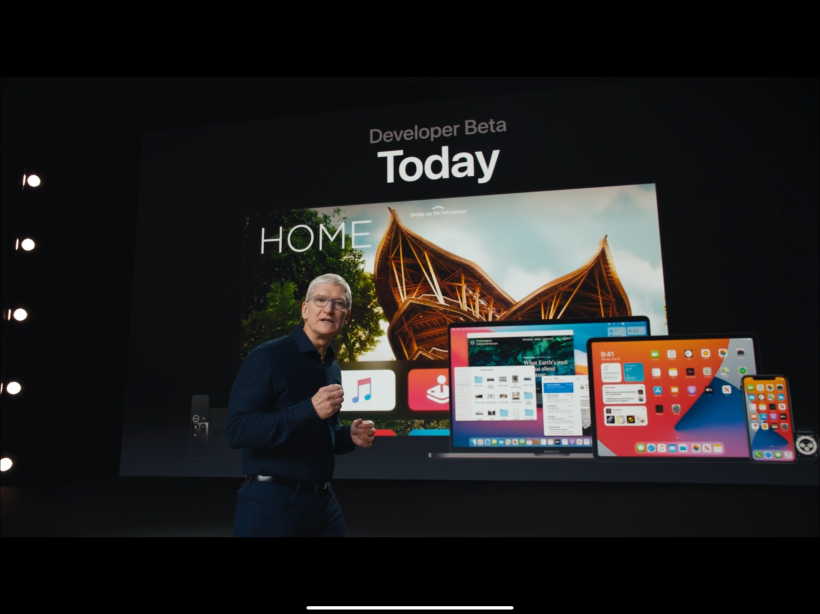

이모든 새로운 기능들의 `Developer Beta`는 오늘부터 가능합니다. 

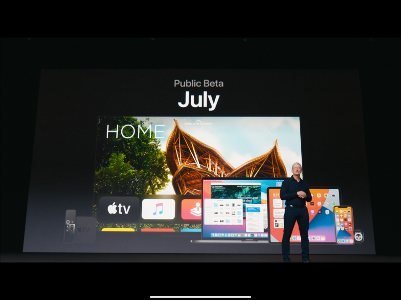

`Public Beta`는 7월 부터 가능하며 정식 출시는 가을쯤 가능할 것 같습니다. 

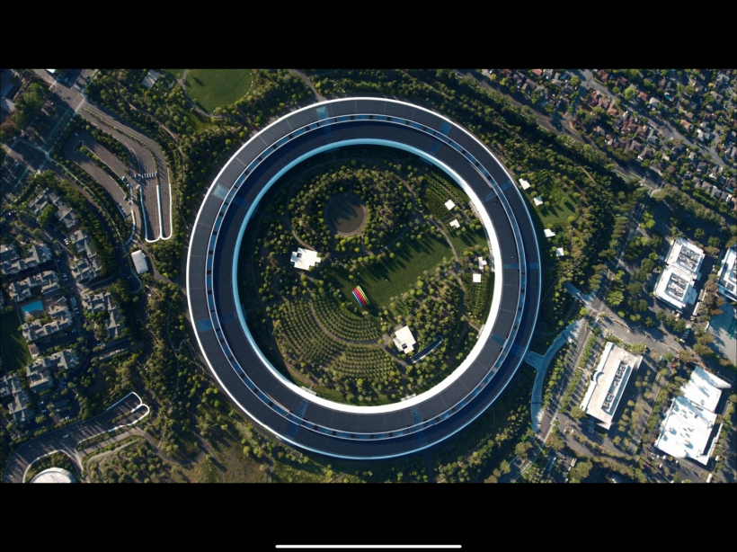

이후 `Apple Park` 의 영상이 나오며 `WWDC2020`의 키노트가 마무리 되었습니다.

