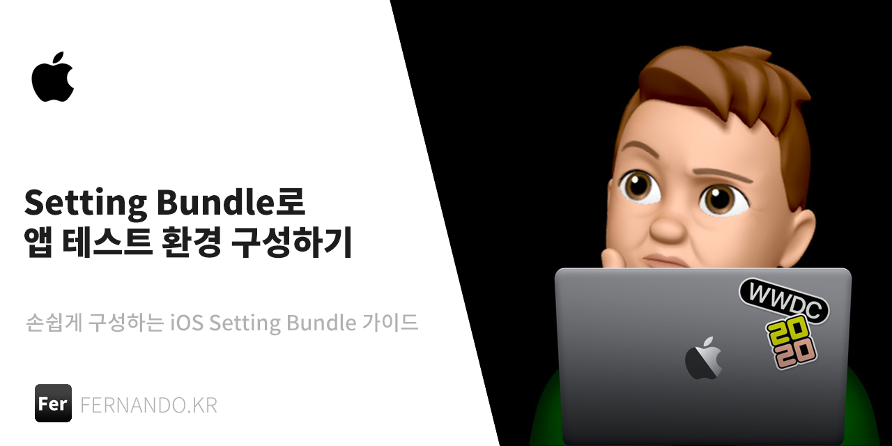
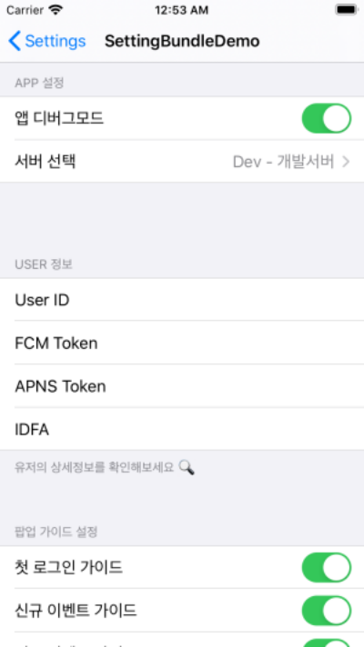
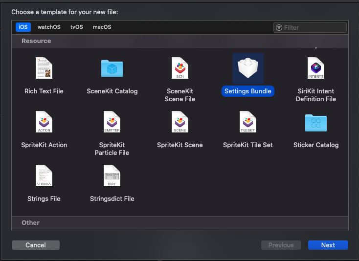
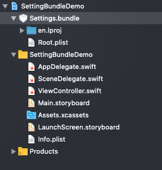
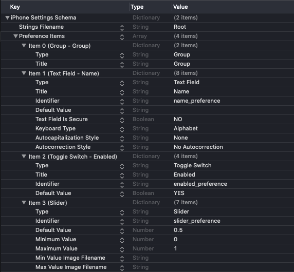
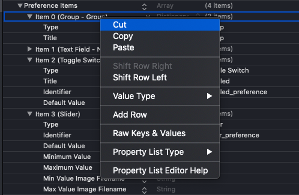
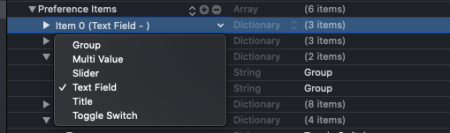
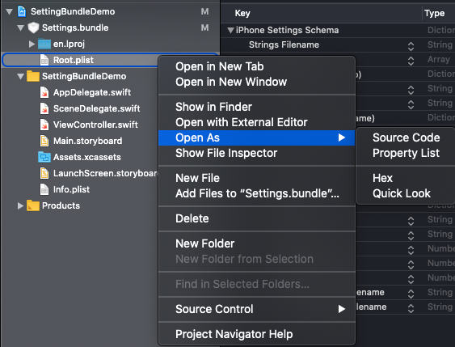

<br><br>
앱 테스트를 위해서는 설정페이지를 만들어야 하는 경우가 있습니다. 이러한 경우 앱 내에 설정 페이지를 넣어도 되지만 iOS에서 기본으로 지원해주는 `Setting Bundle` 기능을 이용하여 손쉽게 구현 할 수도 있습니다. 



다음의 경우는 `Setting Bundle` 을 이용하기에 충분한 조건들 입니다.  

```sh
1. 디버그 버전에서 앱 테스트를 위하여 값들을 변경해보고 싶은 경우 
2. `UserDefaults` 에 저장된 값을 가지고 테스트를 해야하는 경우 
```

위 조건을 만족한다면 나의 앱에 어떻게 `Setting Bundle` 을 추가할 수 있을지 한번 알아보도록 하겠습니다. 

# iOS Setting Bundle 어떻게 세팅해야 할까? 🤔

설정은 정말 간단한 편이다. 새로운 파일을 추가하여  `Setting Bundle` 로 추가를 하면 됩니다.  
해당 기능을 적용하기 위해서 다양한 블로그를 검색해 보았는데 상세한 가이드는 없어 잠깐 혼란스러웠지만, 애플 공식문서에 나와 있는데로 해주니 금방 해결 할 수 있었습니다.
하지만 초반에 영문이라 읽지않고 넘어간 부분도 있고 해서.. 한글로 상세하게 정리를 해볼까 합니다. 


### 01. 프로젝트에 Setting Bundle 추가하기 

- `New File` - `Resource` 항목의  `Setting Bundle` 를 클릭합니다. 



- `Settings.bundle` 파일이 추가되었다면 성공!



### 02. plist 파일을 형식에 맞게 수정하기 

파일을 추가하는 과정은, 여러 블로그에 친절하게 설명되어 있지만 이후 설정은 어떻게 해야하는 것인지에 대해서는 정리가 되어있는 블로그를 찾을 수 없었습니다.  [이곳](https://developer.apple.com/library/archive/documentation/Cocoa/Conceptual/UserDefaults/Preferences/Preferences.html#//apple_ref/doc/uid/10000059i-CH6-SW5) 을 참조 하여 데이터를 채워야 하는데
문서가 영어로 작성되어있어 어렵게 느껴지지만 이 글을 통해 하나씩 차근차근 풀어나가 보겠습니다. 

먼저, 추가를 하게되면 `Settings.bundle` 내에 `Root.plist` 라는 파일이 생성이 됩니다. 

-  `Root.plist` 의 기본구조 



```xml 
<?xml version="1.0" encoding="UTF-8"?>
<!DOCTYPE plist PUBLIC "-//Apple//DTD PLIST 1.0//EN" "http://www.apple.com/DTDs/PropertyList-1.0.dtd">
<plist version="1.0">
<dict>
	<key>StringsTable</key>
	<string>Root</string>
	<key>PreferenceSpecifiers</key>
	<array>
		<dict>
			<key>Type</key>
			<string>PSGroupSpecifier</string>
			<key>Title</key>
			<string>Group</string>
		</dict>
		<dict>
			<key>Type</key>
			<string>PSTextFieldSpecifier</string>
			<key>Title</key>
			<string>Name</string>
			<key>Key</key>
			<string>name_preference</string>
			<key>DefaultValue</key>
			<string></string>
			<key>IsSecure</key>
			<false/>
			<key>KeyboardType</key>
			<string>Alphabet</string>
			<key>AutocapitalizationType</key>
			<string>None</string>
			<key>AutocorrectionType</key>
			<string>No</string>
		</dict>
		<dict>
			<key>Type</key>
			<string>PSToggleSwitchSpecifier</string>
			<key>Title</key>
			<string>Enabled</string>
			<key>Key</key>
			<string>enabled_preference</string>
			<key>DefaultValue</key>
			<true/>
		</dict>
		<dict>
			<key>Type</key>
			<string>PSSliderSpecifier</string>
			<key>Key</key>
			<string>slider_preference</string>
			<key>DefaultValue</key>
			<real>0.5</real>
			<key>MinimumValue</key>
			<integer>0</integer>
			<key>MaximumValue</key>
			<integer>1</integer>
			<key>MinimumValueImage</key>
			<string></string>
			<key>MaximumValueImage</key>
			<string></string>
		</dict>
	</array>
</dict>
</plist>

```

`Settings.bundle` 이 추가되면 기본적으로 안에 들어있는 `Root.plist` 파일은 다음과 같은 구조로 되어있습니다. 코드로 보면 어렵게 느껴지지만 구조를 이해한다면 **전혀** 어렵지 않으니 천천히 살펴보겠습니다.   

### `Preference Items` 는 무엇일까요? 

아이템은 다음과 같이 `6가지` 타입을 가집니다.
- [Group](#group)
- [MultiValue](#multi-value)
- [Slider](#slider) 
- [Text Field](#text-field) 
- [Title](#title) 
- [Toggle Switch](#toggle-switch)


#### Group
> `설정` 페이지에 보여질때 그룹 단위로 표시해줍니다. 공통의 성격을 가지고 있는 `Item` 들을 묶기에 적합합니다. 

|Key|ValueType| Description| option |
|--|--|--|--|
|Type|`String`| `PSGroupSpecifier` 이라는 타입을 가집니다.| 필수 |
|Title|`String`| 그룹의 제목을 나타냅니다. | 다국어가능  |
|FooterText|`String`| 테이블 하단에 부가적인 설명을 표시할때 사용할 수 있습니다. 최대 `5라인` 까지 표시할 수 있습니다.| 다국어가능 |
|SupportedUserInterfaceIdioms|`Array`| 특정 디바이스에서만 노출을 할지에 대한 옵션을 정할 수 있습니다. | 선택 |


#### Multi Value 
> 다양한 값들 중에서 한가지를 선택하게 하고 싶을 경우 사용합니다. `서버선택` 과 같은 옵션을 넣을때 유용합니다.  

|Key|ValueType| Description| option |
|--|--|--|--|
|Type|`String`| `PSMultiValueSpecifier` 이라는 타입을 가집니다.| 필수 |
|Title|`String`| 제목을 나타냅니다. | 다국어가능  |
|Key|`String`| `UserDefaults` 키를 나타냅니다. | - |
|DefaultValue| `Any`| 기본값을 나타냅니다. | 선택 |
|Values|`Array`| 값의 배열입니다. | 선택 |
|Titles|`Array`| 값의 제목 배열입니다. | 선택 |
|ShortTitles|`Array`| 선택된 값에 대한 제목 배열입니다. | 선택 |
|SupportedUserInterfaceIdioms|`Array`| 특정 디바이스에서만 노출을 할지에 대한 옵션을 정할 수 있습니다. | `Phone`, `Pad` <br> (선택 및 생략가능) |
|DisplaySortedByTitle|`Boolean`| 제목에 의해 정렬할지 설정할 수 있습니다. | 선택 |


#### Slider 
> 슬라이드 형태로 값을 선택할 경우 사용합니다. `숫자` 값을 조정하는 옵션을 넣을때 유용할것 같아요.  

|Key|ValueType| Description| option |
|--|--|--|--|
|Type|`String`| `PSSliderSpecifier` 이라는 타입을 가집니다.| 필수 |
|Key|`String`| 제목을 나타냅니다. | 다국어가능  |
|DefaultValue|`Real`| `UserDefaults` 키를 나타냅니다. | 필수 |
|MinimumValue|`Real`| 최소값을 나타냅니다. | 필수 |
|MaximumValue|`Real`| 최대값을 나타냅니다. | 필수 |
|MinimumValueImage| `String`| 최소값을 나타낼 `21x21` 이미지를 설정할 수 있습니다.| 선택 |
|MaximumValueImage| `String`| 최대값을 나타낼 `21x21` 이미지를 설정할 수 있습니다. | 선택 |
|SupportedUserInterfaceIdioms|`Array`| 특정 디바이스에서만 노출을 할지에 대한 옵션을 정할 수 있습니다. | `Phone`, `Pad` <br> (선택 및 생략가능) |


#### Text Field 
> `Write` 하여야하는 데이터를 세팅할때 사용하며, 사용자에게 값을 입력받고자 할때 사용합니다. 

|Key|ValueType| Description| option |
|--|--|--|--|
|Type|`String`| `PSTextFieldSpecifier` 이라는 타입을 가집니다.| 필수 |
|Title|`String`| 제목을 나타냅니다. | 다국어가능  |
|Key|`String`| `UserDefaults` 키를 나타냅니다. | - |
|DefaultValue| `String`| 기본값을 나타냅니다. | 선택 |
|IsSecure|`Boolean`| 패스워드 필드처럼 암호화 해야하는 항목인지 선택할 수있습니다 기본값은 `false` 입니다. | 선택 |
|KeyboardType|`String`| 기본으로 사용될 키보드 타입을 선택합니다 기본값은 `Alphabet` 입니다. | `Alphabet`,<br> `NumbersAndPunctuation`,<br> `NumberPad`,<br> `URL`, <br>`EmailAddress` |
|AutocapitalizationType|`String`| 자동으로 대문자 교정 옵션에 대한 타입입니다. 기본값은 `None`  입니다. | `None`,<br> `Sentences`,<br> `Words`,<br> `AllCharacters` |
|AutocorrectionType|`String`| 자동 내용 교정에 대한 타입입니다. 기본값은 `Default` 입니다.| `Default`, <br> `No`, <br> `Yes` |
|SupportedUserInterfaceIdioms|`Array`| 특정 디바이스에서만 노출을 할지에 대한 옵션을 정할 수 있습니다. | `Phone`, `Pad` <br> (선택 및 생략가능) |


#### Title 
> `ReadOnly` 데이터를 세팅할때 사용하며, 사용자의 데이터를 표현할때 유용합니다. 

|Key|ValueType| Description| option |
|--|--|--|--|
|Type|`String`| `PSTitleValueSpecifier` 이라는 타입을 가집니다.| 필수 |
|Title|`String`| 제목을 나타냅니다. | 다국어가능  |
|Key|`String`| `UserDefaults` 키를 나타냅니다. | - |
|DefaultValue|`String`| 기본값을 나타냅니다. | 선택 |
|Values|`Array`| 값의 배열입니다. | 선택 |
|Titles|`Array`| 값의 제목 배열입니다. | 선택 |
|SupportedUserInterfaceIdioms|`Array`| 특정 디바이스에서만 노출을 할지에 대한 옵션을 정할 수 있습니다. | `Phone`, `Pad` <br> (선택 및 생략가능) |

#### Toggle Switch 
> `Boolean` 으로 설정되어있는 값을 변경할때 사용합니다, on/off 가 필요한 설정 데이터를 세팅할때 유용합니다.

|Key|ValueType| Description| option |
|--|--|--|--|
|Type|`String`| `PSToggleSwitchSpecifier` 이라는 타입을 가집니다.| 필수 |
|Title|`String`| 제목을 나타냅니다. | 다국어가능 (필수)  |
|Key|`String`| `UserDefaults` 키를 나타냅니다. | 필수 |
|DefaultValue|`Any`| 기본값을 나타냅니다. | 필수 |
|TrueValue|`Any`| `Switch` 상태를 `On` 으로 표현하고 싶을때 사용합니다. | - |
|FalseValue|`Any`| `Switch` 상태를 `Off` 으로 표현하고 싶을때 사용합니다.  | - |
|SupportedUserInterfaceIdioms|`Array`| 특정 디바이스에서만 노출을 할지에 대한 옵션을 정할 수 있습니다. | `Phone`, `Pad` <br> (선택 및 생략가능) |


위의 테이블을 참고하여 현재 앱에 추가하고자 하는 `Setting.bundle` 을 구성하시면 됩니다.   
기본적으로 가장 많이 사용하는 `Group`, `TextField`, `Title`, `Toggle Switch` 위주로 보시면 좋습니다  
`필수` 라고 적혀있는값은 필수사항이므로 꼭 값이 들어가야 합니다. 

### 내용을 쉽게 구성하는법 🍯 

위에 있는 테이블을 보고 대략적으로 어떤식의 값들이 있는지는 알았으니 이제 나의 환경에 맞게 구성을 해야겠죠?  
제가 구성을 직접해보니 다음과 같은것들이 불편 했습니다. 

- `Property List` 에디터로 새로운 `Row`를 추가하면 무조건 최상단에 붙습니다.   
- `Source`로 수정하자니 너무 어려워요 😢

그래서 저는 이렇게 작업했습니다. 

1. 최초 생성된 `Root.plist` 파일의 내용중 불필요한 아이템은 지웁니다. 



2. `Property List Editor` 을 통해서 필요한 값을 만듭니다. 



3. `Source View`로 접근해서 자동 생성된코드를 원하는 위치로 변경합니다. 



4. 작업하고자 하는 내용이 일정 패턴이 반복된다면 코드를 `복붙`해서 재활용합니다. 


# Example 📦
 `Setting.bundle` 을 구성하는 기본적인 예제를 `Github` 에 업로드 해두었습니다.  

예제는 `Setting.bundle`를 이용해 테스트를 위한 환경을 설정하는 `Use-case` 로 구성해보았습니다.  
> ⚠️ 참고용으로만 봐주세요!  
 실서비스 배포시에는 `릴리즈` 스키마 일 경우 해당 세팅을 뺴고 배포하는 등의 추가 설정이 필요합니다. 


- [http://github.com/techinpark/SettingBundleDemo](http://github.com/techinpark/SettingBundleDemo)


# References 🔎

위 내용을 정리하면서 참고했던 내용들을 하단에 링크로 남깁니다.  
제가 정리한 내용은  `Setting Bundle` 을 처음 접해보시는 분들에게 초점이 맞춰져 있으며 부족한 부분이 있다면 언제든지 코멘트를 통해 알려주시면 즉시 반영하겠습니다. 


- *[Implementing an iOS Settings Bundle](https://developer.apple.com/library/archive/documentation/Cocoa/Conceptual/UserDefaults/Preferences/Preferences.html#//apple_ref/doc/uid/10000059i-CH6-SW5) - by Apple Documents*

- *[[30분 완성] iOS 앱 개발자 도구로 세상을 이롭게 하기](https://medium.com/banksalad/user-defaults-for-testing-ios-application-a492c52cd87f) - by 뱅크샐러드 기술블로그*
