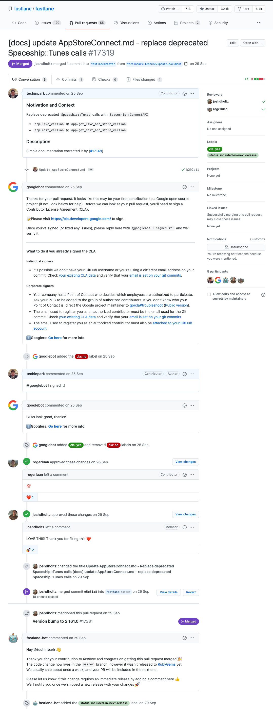
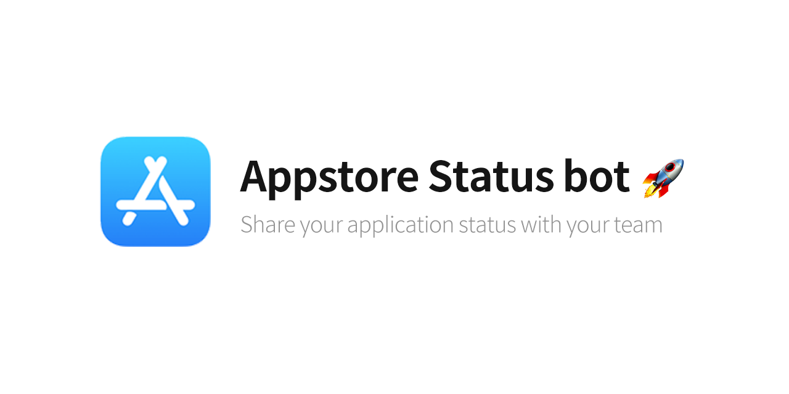

## 나의 앱 심사 상태는 어떻게 확인하죠? 🤷🏻‍♂️

앱스토어 심사 상태를 확인하려면, 간단한 방법이 있습니다.. Apple에서 만들어준  `Connect` 앱을 쓰면됩니다.  
앱으로 푸시도 오기 때문에 상당히 편리합니다. 하지만, 개인앱이 아닌 이상 앱의 심사 상태를 함께 일하는 팀원 혹은 멤버들과 공유해야 할 일이 종종 있습니다.  매번 심사를 올리고 심사 상태를 확인해서 공유를 해주어도 되지만, 개발자라면 당연히 자동화에 대한 욕심이 있을거라고 생각합니다.  
오픈소스 환경에서는 당연히 누군가가 만들어준 툴이 있을것이라고 생각하고 검색을 해보았습니다.  

## 오픈소스 검색해보기 🌱 

검색결과 2가지 오픈소스를 찾아 볼 수 있었는데 개인 서버가 필요한 동작방식으로 인해서 사용하기가 어려웠습니다. 따로 스크립트를 돌릴만한 서버도 없었을 뿐더러, 제가 원했던 것은 평소에는 신경 안써도 될만큼 편리한 것을 추구했기 때문이에요.   

그래서 앱스토어에 올라가 있는 나의 앱의 상태를 가져와서 슬랙으로 메세지를 전달해주는 봇을 만들기로 마음 먹었습니다. 감사하게도, 기존에 있었던 오픈소스 프로젝트에서 사용을 했던 라이브러리인 `Spaceship` 을 참고하기로 하였습니다. 
`Spaceship`은 [Fastlane](https://github.com/fastlane/fastlane) 에서 만든 `Apple Developer Center` 의 데이터들을 파싱해서 데이터를 가져올 수있게 해주는 오픈소스 프로젝트 입니다. 

오픈소스가 작성된 당시에는 공개되어있던 `API`가 없어서 해당 라이브러리를 통해서 처리하는것 같아 보였습니다. 운이 좋게도 제가 이것을 만들기로 마음먹었던 시점에 `WWDC20` 에서 발표된 `App Store Connect API` 에 대한 지원을 Spaceship 에서 발빠르게 대응을 해주었기 때문에, 기존 오픈소스에서는 아이디/패스워드 방식으로 처리하던 부분을 변경하여 `Apple Store Connect API`를 사용하기로 마음 먹었습니다. 

## 오픈소스에 기여를 하게되다 🤟

개발을 위해 열심히 문서를 보던 중, 문서에 써있는 가이드대로 개발을 진행하려고 하자 생각대로 동작하지 않는 이슈가 있었습니다. 
그래서 깃헙 이슈를 열심히 검색 해본결과, 버전이 업데이트가 되면서 코드는 업데이트 되었지만 문서 업데이트가 누락된 것을 알 수 있었고, 
저처럼 아무것도 모르고 문서만 따라하는 분들은 저와 같은 과정을 겪을 것이 뻔하기 떄문에 해당 내용을 반영해서 [PR](https://github.com/fastlane/fastlane/pull/17319) 을 올렸습니다. 

이번 미니 프로젝트를 하면서 운이 좋게도 메인테이너들이 별다른 이견 없이 저의 PR이 `Merge` 되었습니다.   
얼떨결에 평소에도 잘 사용 하고있는 `Fastlane`에 기여를 하게되어서 기분이 매우 좋았던 뿌듯한 경험입니다.

 
## 어떻게 개발을 할 것인가 ? 🤔

봇을 개발하기 위해서 다음과 같은 가벼운 목표를 두고 진행을 하였습니다. 

- 🙄 쉽게 설정할 수 있어야한다. 
- 🧰 서버가 없어도 실행 할 수 있어야 된다. 

위 두가지 목표를 위해서 곰곰히 생각해보다가 `Github Actions`를 떠올리게 되었습니다.   
오픈소스 프로젝트의 경우에는 `Github Actions`를 무료로 이용할 수 있기 때문이고,  
제가 만들어놓은 레포지토리를 `Fork`만 해가면 사용할 수 있게 만들 수 있기 때문에 생각하는 목표를 다 만족할 수 있었습니다. 

`Github Actions` 를 통해 앱 상태를 가져오는 스크립트를 실행을 한 후,  
리턴받은 결과를 다시 파일로 저장하여 다음 실행시에 불러와서 해당 결과를 토대로 알림을 주어야 했기 때문에 db역할을 해줄 파일 저장이 필요 했습니다. 하지만 `Github Actions` 의 특성상 1회성 실행이기 때문에 파일 저장은 불가능합니다. 

위의 과정을 어떻게 해결해야 하나 고민을 하다가 git에 직접적으로 `appstore.db` 파일을 `commit` 하는 방식으로 해결을 하였습니다. 위에서 발생한 문제는 해결 하였지만 아직 만족스러운 해결 방법은 아닙니다.  
`Github gist`를 이용하는 편이 좀더 좋을 것이라고 생각하고 업데이트 할 예정입니다. 

혹시나 앱스토어에 올라간 앱의 심사 상태를 팀원들과 공유하고 싶으신 분들이 있다면 아래의 레포지토리를 `fork` 하셔서 사용하시면 되겠습니다. (PR은 언제나 환영입니다.) 

- [앱스토어 커넥트 봇 Github Repository](https://github.com/techinpark/appstore-status-bot)
- [한국어 가이드](https://github.com/techinpark/appstore-status-bot/blob/master/README-KOREAN.md)

## 마치며  ✍🏻

결과적으로 위와 같은 방식으로 개발을 진행할 수 있었고, 현재 동작도 잘 되고 있어서 뿌듯합니다. 
부족한 부분이 많지만 언제나 부족함을 인정하고 피드백을 수용하는 과정속에서 또다른 성장을 할 수 있게 되는것 같습니다. 
또한 개발을 하다보면 자잘자잘하게 해야할 일들이 많지만, 그것을 직접적으로 해결하기 보다 개발을 통해서 자동화를 하고 그것을 공유하고 나누면서 보람을 느끼는 스타일 인것 같습니다. 

앞으로도 `iOS` 개발을 하면서 자동화 할 수 있는 부분이 있거나 유용한 부분들이 있다면 계속해서 오픈소스로 공개하고 싶은 마음이 생기게 되었고, 생각한 것을 실행하고 그것을 수행하는 과정 속에서 얻을 수 있는 것들이 많은 것 같네요.
올해가 한달 도 남지 않았지만 앞으로 남은 기간동안 여러분들도, 올 한해의 목표를 다시 되돌아보고 겁먹고 실행하지 못한 일이 있다면 한번쯤 도전해보는 것은 어떨까 싶습니다. 

