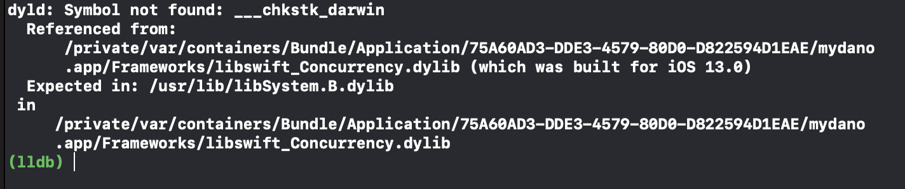
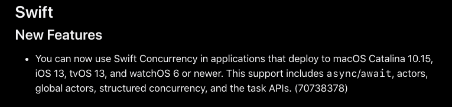
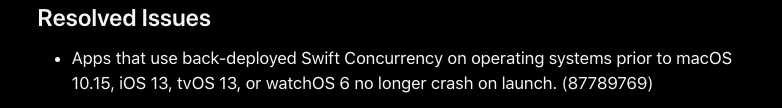

최근 서비스중인 앱의 업데이트를 하고나서 iOS12 이하의 버전을 사용하고 있는 유저들이 앱을 갑자기 사용할 수 없게 되었다는 이슈가 들어왔습니다. (앱 진입시 크래시 발생)

해당 이슈를 재현하기 위해 해당 버전의 디바이스를 통해 확인을 해보니 발생했던 이슈는 다음과 같았습니다. 

 

이슈의 원인은 `Xcode13.X` 버전부터 concurrency 지원이 기본으로 들어갔는데, 
해당 기능은 `13.2` 버전에서부터 `iOS13` 이상의 기기에서 사용할 수 있도록 신규 기능이 추가 되었습니다.  

 

해당 기능이 추가되어 iOS13 이하의 기기에서는 해당 기능을 지원하는 모듈인 `libswift_Concurrency.dylib`을 찾을 수가 없어 `iOS12.x` 기기에서는 크래시가 발생합니다.

해당 이슈에 대한 논의가 스위프트 포럼에서도 진행 되었던것 같습니다. 
[관련논의](https://forums.swift.org/t/swift-concurrency-back-deploy-issue/53917)

대응을 하기 위해서는 해당 이슈가 개선된 버전인 `Xcode13.3`을 통해 빌드를 하면 해결됩니다. 

 

기존에 사용중이던 버전은 `Xcode13.2.1` 이었는데 `iOS12` 이하의 기기를 지원하는 앱을 관리하고 계신다면 한번쯤 테스트 해보시면 좋을 것 같습니다 

## References 
- [https://developer.apple.com/documentation/xcode-release-notes/xcode-13_2-release-notes](https://developer.apple.com/documentation/xcode-release-notes/xcode-13_2-release-notes)
- [https://developer.apple.com/documentation/xcode-release-notes/xcode-13_3-release-notes](https://developer.apple.com/documentation/xcode-release-notes/xcode-13_3-release-notes)